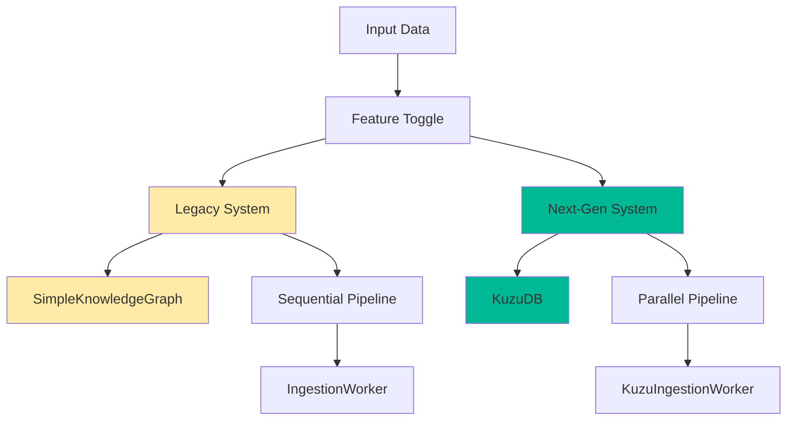
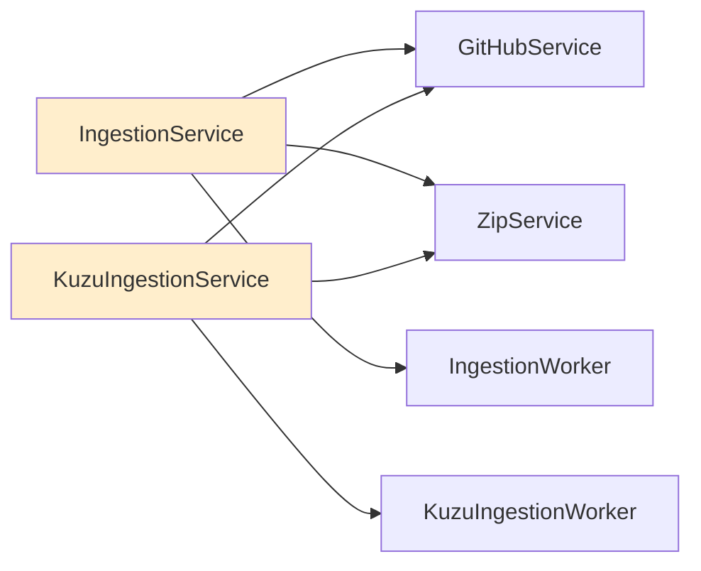
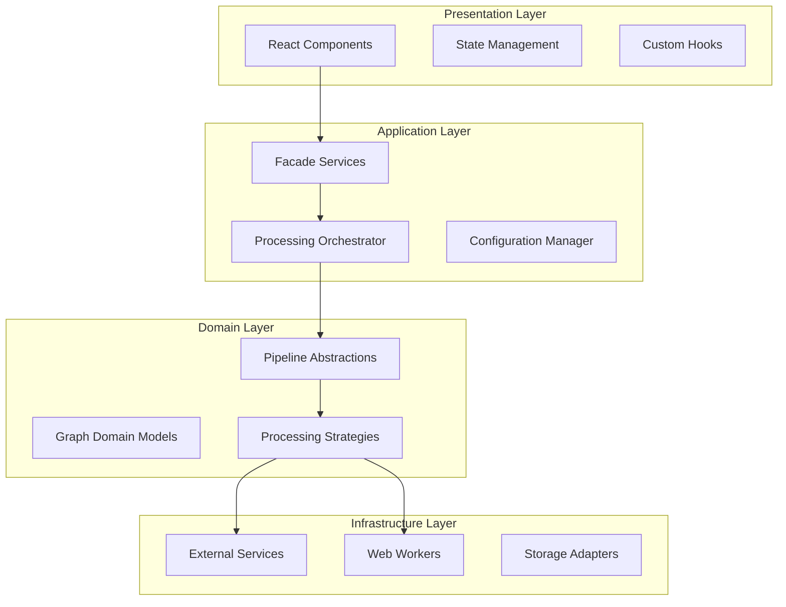
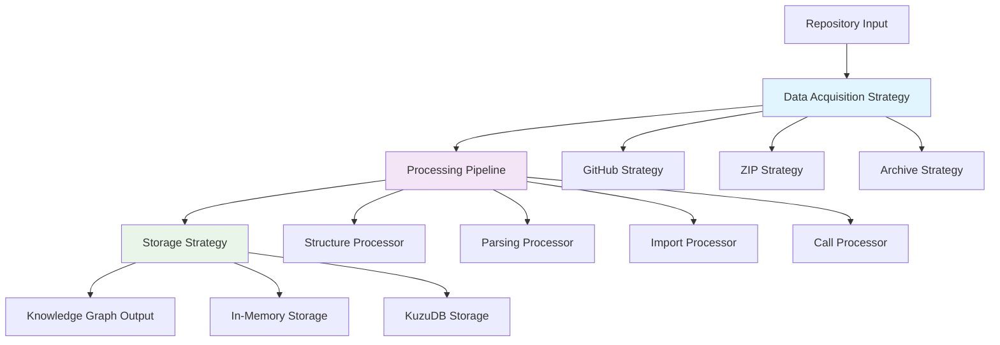
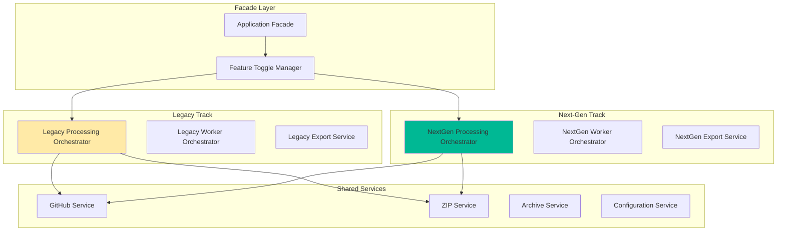
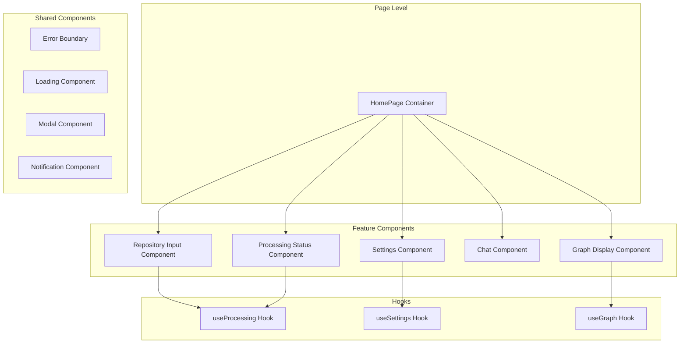

# GitNexus Codebase Refactoring Analysis

## TLDR - What We'll Do

### 🎯 Main Goals
1. **Dual-Track System**: Keep Legacy (Sequential+InMemory) and Next-Gen (Parallel+KuzuDB) completely separate
2. **Feature Toggle**: Easy switching between engines via config/UI
3. **Monolithic UI Fix**: Break down 700+ line HomePage into focused components
4. **Clean Architecture**: Proper separation of concerns with clear layers

### 📁 Proposed Directory Structure
```
src/
├── config/
│   ├── feature-flags.ts        # Engine switching & feature toggles
│   ├── system-config.ts        # Centralized configuration
│   └── engine-config.ts        # Engine-specific settings
├── core/
│   ├── engines/
│   │   ├── legacy/
│   │   │   ├── legacy-engine.ts           # Wrapper for current system
│   │   │   ├── legacy-storage.ts          # SimpleKnowledgeGraph ops
│   │   │   └── legacy-pipeline.ts         # Current GraphPipeline
│   │   ├── nextgen/
│   │   │   ├── nextgen-engine.ts          # Wrapper for parallel+kuzu
│   │   │   ├── nextgen-storage.ts         # KuzuDB operations
│   │   │   └── nextgen-pipeline.ts        # ParallelGraphPipeline
│   │   └── engine-interface.ts    # Common interface both engines implement
│   ├── orchestration/
│   │   ├── engine-manager.ts      # Handles engine selection/switching
│   │   ├── processing-orchestrator.ts # Routes to correct engine
│   │   └── performance-monitor.ts # Compare engine performance
│   └── types/
│       ├── engine-types.ts        # Engine-specific types
│       └── processing-types.ts     # Shared processing types
├── services/
│   ├── facade/
│   │   └── gitnexus-facade.ts     # Simplified API for UI
│   ├── github.ts                  # Keep as-is
│   ├── zip.ts                     # Keep as-is
│   └── export.ts                  # Engine-aware export
├── ui/
│   ├── pages/
│   │   └── HomePage/
│   │       ├── HomePage.tsx       # Lightweight container (50 lines)
│   │       ├── useHomePage.ts     # Extract state logic
│   │       └── HomePage.styles.ts # Extract styles
│   ├── components/
│   │   ├── engine/
│   │   │   ├── EngineSelector.tsx     # Switch between engines
│   │   │   └── ProcessingStatus.tsx   # Engine-aware status
│   │   ├── repository/
│   │   │   ├── RepositoryInput.tsx    # GitHub/ZIP input
│   │   │   └── RepositorySettings.tsx # Filters, options
│   │   ├── graph/
│   │   │   ├── GraphDisplay.tsx       # Graph visualization
│   │   │   └── GraphControls.tsx      # Graph interaction
│   │   ├── chat/
│   │   │   └── ChatInterface.tsx      # AI chat (engine-aware)
│   │   └── shared/
│   │       ├── LoadingSpinner.tsx
│   │       ├── ErrorDisplay.tsx
│   │       └── Modal.tsx
│   ├── hooks/
│   │   ├── useEngine.ts           # Engine management
│   │   ├── useProcessing.ts       # Processing state
│   │   ├── useGraph.ts            # Graph state
│   │   └── useSettings.ts         # Settings management
│   └── contexts/
│       ├── AppContext.tsx         # Global app state
│       └── EngineContext.tsx      # Engine state
├── lib/
│   ├── error-handling/
│   │   ├── error-types.ts         # Standardized errors
│   │   ├── error-handler.ts       # Global error handling
│   │   └── error-boundary.tsx     # React error boundaries
│   ├── logging/
│   │   ├── logger.ts              # Structured logging
│   │   └── performance-logger.ts  # Performance metrics
│   └── utils/
│       ├── validation.ts          # Input validation
│       └── storage-utils.ts       # Storage helpers
└── workers/
    ├── legacy/
    │   └── ingestion.worker.ts     # Keep current worker
    └── nextgen/
        └── kuzu-ingestion.worker.ts # Keep KuzuDB worker
```

### ⚙️ Configuration Strategy

**1. Feature Flags (`config/feature-flags.ts`)**
```typescript
interface FeatureFlags {
  processingEngine: 'legacy' | 'nextgen';     // Main engine toggle
  enableParallelProcessing: boolean;          // Enable parallel features
  enableKuzuDB: boolean;                      // Enable KuzuDB storage
  autoFallback: boolean;                      // Auto fallback on errors
  performanceComparison: boolean;             // Side-by-side comparison
}

// Usage: Toggle in UI or environment variable
```

**2. System Config (`config/system-config.ts`)**
```typescript
interface SystemConfig {
  engines: {
    legacy: LegacyEngineConfig;
    nextgen: NextGenEngineConfig;
  };
  ui: UIConfig;
  performance: PerformanceConfig;
}

// Centralized configuration for all systems
```

### 🔧 Monolithic UI Fixes

**Current Problem**: HomePage.tsx is 700+ lines handling everything

**Solution**: Break into focused components

```typescript
// OLD: Monolithic HomePage (700+ lines)
const HomePage = () => {
  // 12 different state variables
  // Service instantiation
  // Error handling
  // Settings management
  // Processing logic
  // UI rendering
};

// NEW: Lightweight container (50 lines)
const HomePage = () => {
  return (
    <AppLayout>
      <EngineSelector />      {/* Engine switching */}
      <RepositoryInput />     {/* GitHub/ZIP input */}
      <ProcessingStatus />    {/* Progress display */}
      <GraphDisplay />        {/* Graph visualization */}
      <ChatInterface />       {/* AI chat */}
    </AppLayout>
  );
};

// Extract logic to custom hooks
const useHomePage = () => {
  const engine = useEngine();
  const processing = useProcessing();
  const graph = useGraph();
  const settings = useSettings();
  
  return { engine, processing, graph, settings };
};
```

### 🚀 Implementation Plan (3 Steps)

**Step 1: Foundation (Week 1)**
- Create directory structure
- Add feature flag system
- Extract engine interfaces
- Basic configuration management

**Step 2: Engine Separation (Week 2)**
- Wrap current system as "Legacy Engine"
- Wrap parallel+kuzu as "Next-Gen Engine"
- Create engine manager with switching logic
- Add performance monitoring

**Step 3: UI Refactor (Week 3)**
- Break down HomePage into components
- Add custom hooks for state management
- Create engine selector UI
- Add context providers

### 🎛️ How Engine Switching Works

**UI Toggle**:
```typescript
<EngineSelector 
  current="legacy" 
  onChange={(engine) => switchEngine(engine)}
  options={[
    { value: 'legacy', label: 'Stable (Sequential + In-Memory)' },
    { value: 'nextgen', label: 'Advanced (Parallel + KuzuDB)' }
  ]}
/>
```

**Behind the Scenes**:
```typescript
// User selects Next-Gen engine
switchEngine('nextgen')
  → FeatureFlags.processingEngine = 'nextgen'
  → ProcessingOrchestrator routes to NextGenEngine
  → ParallelGraphPipeline + KuzuDB storage
  → UI shows "🚀 Advanced Pipeline Active"

// If Next-Gen fails and autoFallback=true
NextGenEngine.process() throws error
  → Auto-fallback to LegacyEngine
  → UI shows "⚠️ Fallback to Stable Pipeline"
  → User gets results, no data loss
```

### 📊 What Users See

1. **Engine Selector**: Dropdown to choose processing engine
2. **Status Indicator**: Shows which engine is active
3. **Performance Metrics**: Compare speed between engines
4. **Automatic Fallback**: Seamless fallback if advanced engine fails
5. **Clean UI**: No more overwhelming 700-line interface

### 🎯 Key Benefits

- ✅ **Safe Migration**: Legacy always works, Next-Gen opt-in
- ✅ **No Code Mixing**: Complete separation of engines
- ✅ **Better UX**: Clean, focused UI components
- ✅ **Easy Maintenance**: Clear separation of concerns
- ✅ **Performance Validation**: Real-world engine comparison

---

## Implementation Code

### Step 1: Enhanced Feature Flags (Update `src/config/feature-flags.ts`)

Add these types and update the interface:

```typescript
export type ProcessingEngine = 'legacy' | 'nextgen';

// Add to existing FeatureFlags interface:
interface FeatureFlags {
  // Processing Engine Selection (ADD THESE)
  processingEngine: ProcessingEngine;
  autoFallbackOnError: boolean;
  enablePerformanceComparison: boolean;
  
  // ... existing flags remain the same
}

// Update DEFAULT_FEATURE_FLAGS:
export const DEFAULT_FEATURE_FLAGS: FeatureFlags = {
  // Processing Engine - Start with legacy as default for safety
  processingEngine: 'legacy',
  autoFallbackOnError: true,
  enablePerformanceComparison: false,
  
  // ... rest of existing flags remain the same
};

// Add these methods to the existing FeatureFlagManager class:
class FeatureFlagManager {
  // ... existing code ...
  
  /**
   * Get the current processing engine
   */
  getProcessingEngine(): ProcessingEngine {
    return this.flags.processingEngine;
  }

  /**
   * Switch to legacy engine (sequential + in-memory)
   */
  switchToLegacyEngine(): void {
    this.setFlags({
      processingEngine: 'legacy',
      enableKuzuDB: false,
      enableParallelProcessing: false,
      enableWorkerPool: false
    });
  }

  /**
   * Switch to next-gen engine (parallel + KuzuDB)
   */
  switchToNextGenEngine(): void {
    this.setFlags({
      processingEngine: 'nextgen',
      enableKuzuDB: true,
      enableParallelProcessing: true,
      enableWorkerPool: true
    });
  }

  /**
   * Check if next-gen engine is enabled
   */
  isNextGenEngineEnabled(): boolean {
    return this.flags.processingEngine === 'nextgen';
  }

  /**
   * Get engine capabilities based on current selection
   */
  getEngineCapabilities(): string[] {
    if (this.isNextGenEngineEnabled()) {
      return ['parallel-processing', 'kuzu-db', 'advanced-queries'];
    } else {
      return ['sequential-processing', 'in-memory', 'basic-queries'];
    }
  }
}
```

### Step 2: Create Engine Interfaces (`src/core/engines/engine-interface.ts`)

```typescript
import type { KnowledgeGraph } from '../graph/types';

export interface ProcessingInput {
  type: 'github' | 'zip';
  url?: string;
  file?: File;
  options?: {
    directoryFilter?: string;
    fileExtensions?: string;
    useParallelProcessing?: boolean;
    maxWorkers?: number;
  };
}

export interface ProcessingResult {
  engine: 'legacy' | 'nextgen';
  graph: KnowledgeGraph;
  fileContents: Map<string, string>;
  metadata: {
    processingTime: number;
    nodeCount: number;
    relationshipCount: number;
    engineCapabilities: string[];
  };
  // Engine-specific data
  kuzuInstance?: any; // For next-gen engine
}

export interface ProcessingCallbacks {
  onEngineSelected?: (engine: 'legacy' | 'nextgen') => void;
  onProgress?: (progress: string) => void;
  onEngineFailure?: (failed: string, fallback: string) => void;
}

export interface ProcessingEngine {
  readonly name: string;
  readonly version: string;
  readonly capabilities: string[];
  
  process(input: ProcessingInput, callbacks?: ProcessingCallbacks): Promise<ProcessingResult>;
  validate(): boolean;
  cleanup(): Promise<void>;
}
```

### Step 3: Legacy Engine Wrapper (`src/core/engines/legacy/legacy-engine.ts`)

```typescript
import { IngestionService } from '../../../services/ingestion.service';
import type { ProcessingEngine, ProcessingInput, ProcessingResult, ProcessingCallbacks } from '../engine-interface';

export class LegacyProcessingEngine implements ProcessingEngine {
  readonly name = 'legacy';
  readonly version = '1.0';
  readonly capabilities = ['sequential-processing', 'in-memory', 'basic-queries'];
  
  private ingestionService: IngestionService;
  
  constructor(githubToken?: string) {
    this.ingestionService = new IngestionService(githubToken);
  }
  
  async process(input: ProcessingInput, callbacks?: ProcessingCallbacks): Promise<ProcessingResult> {
    callbacks?.onEngineSelected?.('legacy');
    
    const startTime = performance.now();
    
    try {
      let result;
      
      if (input.type === 'github' && input.url) {
        result = await this.ingestionService.processGitHubRepo(input.url, {
          directoryFilter: input.options?.directoryFilter,
          fileExtensions: input.options?.fileExtensions,
          onProgress: callbacks?.onProgress
        });
      } else if (input.type === 'zip' && input.file) {
        result = await this.ingestionService.processZipFile(input.file, {
          directoryFilter: input.options?.directoryFilter,
          fileExtensions: input.options?.fileExtensions,
          onProgress: callbacks?.onProgress
        });
      } else {
        throw new Error('Invalid input for legacy engine');
      }
      
      const endTime = performance.now();
      
      return {
        engine: 'legacy',
        graph: result.graph,
        fileContents: result.fileContents,
        metadata: {
          processingTime: endTime - startTime,
          nodeCount: result.graph.nodes.length,
          relationshipCount: result.graph.relationships.length,
          engineCapabilities: this.capabilities
        }
      };
    } catch (error) {
      console.error('Legacy engine processing failed:', error);
      throw error;
    }
  }
  
  validate(): boolean {
    return true; // Legacy engine is always available
  }
  
  async cleanup(): Promise<void> {
    // Legacy engine cleanup if needed
  }
}
```

### Step 4: Next-Gen Engine Wrapper (`src/core/engines/nextgen/nextgen-engine.ts`)

```typescript
import { KuzuIngestionService } from '../../../services/kuzu-ingestion.service';
import type { ProcessingEngine, ProcessingInput, ProcessingResult, ProcessingCallbacks } from '../engine-interface';

export class NextGenProcessingEngine implements ProcessingEngine {
  readonly name = 'nextgen';
  readonly version = '2.0';
  readonly capabilities = ['parallel-processing', 'kuzu-db', 'advanced-queries', 'performance-monitoring'];
  
  private kuzuIngestionService: KuzuIngestionService;
  
  constructor(githubToken?: string) {
    this.kuzuIngestionService = new KuzuIngestionService(githubToken);
  }
  
  async process(input: ProcessingInput, callbacks?: ProcessingCallbacks): Promise<ProcessingResult> {
    callbacks?.onEngineSelected?.('nextgen');
    
    const startTime = performance.now();
    
    try {
      let result;
      
      if (input.type === 'github' && input.url) {
        result = await this.kuzuIngestionService.processGitHubRepo(input.url, {
          directoryFilter: input.options?.directoryFilter,
          fileExtensions: input.options?.fileExtensions,
          onProgress: callbacks?.onProgress
        });
      } else if (input.type === 'zip' && input.file) {
        result = await this.kuzuIngestionService.processZipFile(input.file, {
          directoryFilter: input.options?.directoryFilter,
          fileExtensions: input.options?.fileExtensions,
          onProgress: callbacks?.onProgress
        });
      } else {
        throw new Error('Invalid input for next-gen engine');
      }
      
      const endTime = performance.now();
      
      return {
        engine: 'nextgen',
        graph: result.graph,
        fileContents: result.fileContents,
        metadata: {
          processingTime: endTime - startTime,
          nodeCount: result.graph.nodes.length,
          relationshipCount: result.graph.relationships.length,
          engineCapabilities: this.capabilities
        },
        kuzuInstance: (result as any).kuzuInstance // Type cast for now
      };
    } catch (error) {
      console.error('Next-gen engine processing failed:', error);
      throw error;
    }
  }
  
  validate(): boolean {
    // Check if KuzuDB and parallel processing are available
    return typeof Worker !== 'undefined' && 
           typeof WebAssembly !== 'undefined';
  }
  
  async cleanup(): Promise<void> {
    // Cleanup KuzuDB connections and worker pools
  }
}
```

### Step 5: Engine Manager (`src/core/orchestration/engine-manager.ts`)

```typescript
import { featureFlagManager } from '../../config/feature-flags';
import { LegacyProcessingEngine } from '../engines/legacy/legacy-engine';
import { NextGenProcessingEngine } from '../engines/nextgen/nextgen-engine';
import type { ProcessingEngine, ProcessingInput, ProcessingResult, ProcessingCallbacks } from '../engines/engine-interface';

export class EngineManager {
  private legacyEngine: LegacyProcessingEngine;
  private nextGenEngine: NextGenProcessingEngine;
  
  constructor(githubToken?: string) {
    this.legacyEngine = new LegacyProcessingEngine(githubToken);
    this.nextGenEngine = new NextGenProcessingEngine(githubToken);
  }
  
  /**
   * Get the current active engine
   */
  getCurrentEngine(): ProcessingEngine {
    const engineType = featureFlagManager.getProcessingEngine();
    return engineType === 'nextgen' ? this.nextGenEngine : this.legacyEngine;
  }
  
  /**
   * Process input with the current engine, with fallback capability
   */
  async process(input: ProcessingInput, callbacks?: ProcessingCallbacks): Promise<ProcessingResult> {
    const engineType = featureFlagManager.getProcessingEngine();
    
    console.info('🎯 ENGINE SELECTION:', {
      selectedEngine: engineType,
      inputType: input.type,
      autoFallbackEnabled: featureFlagManager.getFlag('autoFallbackOnError'),
      timestamp: new Date().toISOString()
    });
    
    try {
      if (engineType === 'nextgen') {
        return await this.processWithNextGen(input, callbacks);
      } else {
        return await this.processWithLegacy(input, callbacks);
      }
    } catch (error) {
      return await this.handleEngineFailure(error, input, callbacks);
    }
  }
  
  private async processWithNextGen(
    input: ProcessingInput,
    callbacks?: ProcessingCallbacks
  ): Promise<ProcessingResult> {
    console.info('🚀 NEXT-GEN ENGINE: Starting advanced processing (Parallel + KuzuDB)');
    
    if (!this.nextGenEngine.validate()) {
      const validationError = new Error('Next-gen engine validation failed - WebAssembly or Worker support unavailable');
      console.error('❌ VALIDATION FAILED: Next-gen engine cannot run in current environment');
      console.error('🔧 Validation Details:', {
        webAssemblySupport: typeof WebAssembly !== 'undefined',
        workerSupport: typeof Worker !== 'undefined',
        timestamp: new Date().toISOString()
      });
      throw validationError;
    }
    
    const startTime = performance.now();
    const result = await this.nextGenEngine.process(input, callbacks);
    const endTime = performance.now();
    
    console.info('✅ NEXT-GEN SUCCESS: Advanced processing completed successfully');
    console.info('📊 Next-Gen Performance:', {
      engine: 'nextgen',
      processingTime: endTime - startTime,
      nodeCount: result.metadata.nodeCount,
      relationshipCount: result.metadata.relationshipCount,
      capabilities: result.metadata.engineCapabilities,
      timestamp: new Date().toISOString()
    });
    
    return result;
  }
  
  private async processWithLegacy(
    input: ProcessingInput,
    callbacks?: ProcessingCallbacks
  ): Promise<ProcessingResult> {
    console.info('⚡ LEGACY ENGINE: Starting stable processing (Sequential + In-Memory)');
    
    const startTime = performance.now();
    const result = await this.legacyEngine.process(input, callbacks);
    const endTime = performance.now();
    
    console.info('✅ LEGACY SUCCESS: Stable processing completed successfully');
    console.info('📊 Legacy Performance:', {
      engine: 'legacy',
      processingTime: endTime - startTime,
      nodeCount: result.metadata.nodeCount,
      relationshipCount: result.metadata.relationshipCount,
      capabilities: result.metadata.engineCapabilities,
      timestamp: new Date().toISOString()
    });
    
    return result;
  }
  
  private async handleEngineFailure(
    error: Error,
    input: ProcessingInput,
    callbacks?: ProcessingCallbacks
  ): Promise<ProcessingResult> {
    const currentEngine = featureFlagManager.getProcessingEngine();
    const autoFallback = featureFlagManager.getFlag('autoFallbackOnError');
    
    if (currentEngine === 'nextgen' && autoFallback) {
      // Enhanced logging for fallback scenario
      console.warn('🔄 ENGINE FALLBACK: Next-gen engine failed, automatically falling back to legacy engine');
      console.warn('📋 Fallback Details:', {
        failedEngine: 'nextgen',
        fallbackEngine: 'legacy',
        error: error.message,
        timestamp: new Date().toISOString(),
        inputType: input.type,
        autoFallbackEnabled: true
      });
      
      callbacks?.onEngineFailure?.('nextgen', 'legacy');
      
      try {
        const result = await this.processWithLegacy(input, callbacks);
        
        // Success log after successful fallback
        console.info('✅ FALLBACK SUCCESS: Legacy engine completed processing after next-gen failure');
        console.info('📊 Fallback Result:', {
          fallbackEngine: 'legacy',
          processingTime: result.metadata.processingTime,
          nodeCount: result.metadata.nodeCount,
          relationshipCount: result.metadata.relationshipCount,
          timestamp: new Date().toISOString()
        });
        
        return result;
      } catch (fallbackError) {
        // Critical error: both engines failed
        console.error('❌ CRITICAL: Both engines failed! Next-gen failed, then legacy also failed.');
        console.error('🚨 Dual Failure Details:', {
          originalError: error.message,
          fallbackError: fallbackError.message,
          timestamp: new Date().toISOString(),
          inputType: input.type
        });
        throw new Error(`Both engines failed. Next-gen: ${error.message}, Legacy: ${fallbackError.message}`);
      }
    }
    
    // No fallback available or fallback disabled
    console.error(`❌ ENGINE FAILURE: ${currentEngine} engine failed and no fallback available`);
    console.error('🔧 Failure Details:', {
      failedEngine: currentEngine,
      error: error.message,
      autoFallbackEnabled: autoFallback,
      fallbackAvailable: currentEngine === 'nextgen',
      timestamp: new Date().toISOString()
    });
    
    throw error;
  }
  
  /**
   * Switch to legacy engine
   */
  switchToLegacy(): void {
    featureFlagManager.switchToLegacyEngine();
  }
  
  /**
   * Switch to next-gen engine
   */
  switchToNextGen(): void {
    featureFlagManager.switchToNextGenEngine();
  }
  
  /**
   * Get current engine type
   */
  getCurrentEngineType(): 'legacy' | 'nextgen' {
    return featureFlagManager.getProcessingEngine();
  }
  
  /**
   * Get engine capabilities
   */
  getCurrentEngineCapabilities(): string[] {
    return this.getCurrentEngine().capabilities;
  }
  
  /**
   * Cleanup both engines
   */
  async cleanup(): Promise<void> {
    await Promise.all([
      this.legacyEngine.cleanup(),
      this.nextGenEngine.cleanup()
    ]);
  }
}
```

### Step 6: GitNexus Facade (`src/services/facade/gitnexus-facade.ts`)

```typescript
import { EngineManager } from '../../core/orchestration/engine-manager';
import type { ProcessingInput, ProcessingResult } from '../../core/engines/engine-interface';

export interface AnalysisOptions {
  directoryFilter?: string;
  fileExtensions?: string;
  onProgress?: (progress: string) => void;
  onEngineSelected?: (engine: 'legacy' | 'nextgen') => void;
  onEngineFailure?: (failed: string, fallback: string) => void;
}

export interface AnalysisResult {
  engine: 'legacy' | 'nextgen';
  graph: any; // KnowledgeGraph type
  fileContents: Map<string, string>;
  metadata: {
    processingTime: number;
    nodeCount: number;
    relationshipCount: number;
    engineCapabilities: string[];
  };
}

export class GitNexusFacade {
  private engineManager: EngineManager;
  
  constructor(githubToken?: string) {
    this.engineManager = new EngineManager(githubToken);
  }
  
  /**
   * Analyze GitHub repository
   */
  async analyzeRepository(url: string, options?: AnalysisOptions): Promise<AnalysisResult> {
    const input: ProcessingInput = {
      type: 'github',
      url,
      options: {
        directoryFilter: options?.directoryFilter,
        fileExtensions: options?.fileExtensions
      }
    };
    
    const result = await this.engineManager.process(input, {
      onEngineSelected: options?.onEngineSelected,
      onProgress: options?.onProgress,
      onEngineFailure: options?.onEngineFailure
    });
    
    return this.convertToAnalysisResult(result);
  }
  
  /**
   * Analyze ZIP file
   */
  async analyzeZipFile(file: File, options?: AnalysisOptions): Promise<AnalysisResult> {
    const input: ProcessingInput = {
      type: 'zip',
      file,
      options: {
        directoryFilter: options?.directoryFilter,
        fileExtensions: options?.fileExtensions
      }
    };
    
    const result = await this.engineManager.process(input, {
      onEngineSelected: options?.onEngineSelected,
      onProgress: options?.onProgress,
      onEngineFailure: options?.onEngineFailure
    });
    
    return this.convertToAnalysisResult(result);
  }
  
  /**
   * Switch to legacy engine
   */
  switchToLegacyEngine(): void {
    this.engineManager.switchToLegacy();
  }
  
  /**
   * Switch to next-gen engine
   */
  switchToNextGenEngine(): void {
    this.engineManager.switchToNextGen();
  }
  
  /**
   * Get current engine type
   */
  getCurrentEngine(): 'legacy' | 'nextgen' {
    return this.engineManager.getCurrentEngineType();
  }
  
  /**
   * Get current engine capabilities
   */
  getCurrentEngineCapabilities(): string[] {
    return this.engineManager.getCurrentEngineCapabilities();
  }
  
  private convertToAnalysisResult(result: ProcessingResult): AnalysisResult {
    return {
      engine: result.engine,
      graph: result.graph,
      fileContents: result.fileContents,
      metadata: result.metadata
    };
  }
  
  /**
   * Cleanup resources
   */
  async cleanup(): Promise<void> {
    await this.engineManager.cleanup();
  }
}
```

### Step 7: Engine Selector UI Component (`src/ui/components/engine/EngineSelector.tsx`)

```typescript
import React from 'react';

interface EngineSelectorProps {
  currentEngine: 'legacy' | 'nextgen';
  onEngineChange: (engine: 'legacy' | 'nextgen') => void;
  isProcessing?: boolean;
  capabilities?: string[];
}

export const EngineSelector: React.FC<EngineSelectorProps> = ({
  currentEngine,
  onEngineChange,
  isProcessing = false,
  capabilities = []
}) => {
  const getEngineIcon = (engine: 'legacy' | 'nextgen') => {
    return engine === 'nextgen' ? '🚀' : '⚡';
  };
  
  const getEngineLabel = (engine: 'legacy' | 'nextgen') => {
    return engine === 'nextgen' 
      ? 'Advanced (Parallel + KuzuDB)' 
      : 'Stable (Sequential + In-Memory)';
  };
  
  const getEngineStatus = (engine: 'legacy' | 'nextgen') => {
    return engine === 'nextgen' ? 'Advanced' : 'Stable';
  };
  
  return (
    <div className="engine-selector">
      <div className="engine-selector-header">
        <label className="engine-selector-label">
          Processing Engine:
        </label>
        <span className={`engine-status ${currentEngine}`}>
          {getEngineIcon(currentEngine)} {getEngineStatus(currentEngine)}
        </span>
      </div>
      
      <select 
        value={currentEngine}
        onChange={(e) => onEngineChange(e.target.value as 'legacy' | 'nextgen')}
        disabled={isProcessing}
        className="engine-selector-dropdown"
      >
        <option value="legacy">
          ⚡ {getEngineLabel('legacy')}
        </option>
        <option value="nextgen">
          🚀 {getEngineLabel('nextgen')}
        </option>
      </select>
      
      {capabilities.length > 0 && (
        <div className="engine-capabilities">
          <span className="capabilities-label">Features:</span>
          <div className="capabilities-list">
            {capabilities.map((capability, index) => (
              <span key={index} className="capability-badge">
                {capability.replace('-', ' ')}
              </span>
            ))}
          </div>
        </div>
      )}
      
      <style jsx>{`
        .engine-selector {
          background: #f8f9fa;
          border: 1px solid #e9ecef;
          border-radius: 8px;
          padding: 16px;
          margin-bottom: 16px;
        }
        
        .engine-selector-header {
          display: flex;
          justify-content: space-between;
          align-items: center;
          margin-bottom: 12px;
        }
        
        .engine-selector-label {
          font-weight: 600;
          color: #495057;
        }
        
        .engine-status {
          padding: 4px 8px;
          border-radius: 4px;
          font-size: 0.875rem;
          font-weight: 500;
        }
        
        .engine-status.legacy {
          background: #e3f2fd;
          color: #1976d2;
        }
        
        .engine-status.nextgen {
          background: #e8f5e8;
          color: #388e3c;
        }
        
        .engine-selector-dropdown {
          width: 100%;
          padding: 8px 12px;
          border: 1px solid #ced4da;
          border-radius: 4px;
          font-size: 0.875rem;
          background: white;
        }
        
        .engine-selector-dropdown:disabled {
          background: #f8f9fa;
          color: #6c757d;
        }
        
        .engine-capabilities {
          margin-top: 12px;
        }
        
        .capabilities-label {
          font-size: 0.75rem;
          color: #6c757d;
          text-transform: uppercase;
          font-weight: 600;
          margin-bottom: 4px;
          display: block;
        }
        
        .capabilities-list {
          display: flex;
          flex-wrap: wrap;
          gap: 4px;
        }
        
        .capability-badge {
          background: #dee2e6;
          color: #495057;
          padding: 2px 6px;
          border-radius: 3px;
          font-size: 0.75rem;
          text-transform: capitalize;
        }
      `}</style>
    </div>
  );
};
```

### Step 8: Update HomePage to Use New Architecture (`src/ui/pages/HomePage/HomePage.tsx`)

```typescript
import React, { useState, useCallback } from 'react';
import { GitNexusFacade } from '../../../services/facade/gitnexus-facade';
import { EngineSelector } from '../../components/engine/EngineSelector';
import { GraphExplorer } from '../../components/graph';
import { ChatInterface } from '../../components/chat';
import type { KnowledgeGraph } from '../../../core/graph/types';

const HomePage: React.FC = () => {
  // State
  const [facade] = useState(() => new GitNexusFacade());
  const [currentEngine, setCurrentEngine] = useState<'legacy' | 'nextgen'>('legacy');
  const [capabilities, setCapabilities] = useState<string[]>([]);
  const [graph, setGraph] = useState<KnowledgeGraph | null>(null);
  const [fileContents, setFileContents] = useState<Map<string, string>>(new Map());
  const [isProcessing, setIsProcessing] = useState(false);
  const [progress, setProgress] = useState('');
  const [error, setError] = useState<string | null>(null);
  const [githubUrl, setGithubUrl] = useState('');
  
  // Engine management
  const handleEngineChange = useCallback((engine: 'legacy' | 'nextgen') => {
    if (engine === 'nextgen') {
      facade.switchToNextGenEngine();
    } else {
      facade.switchToLegacyEngine();
    }
    setCurrentEngine(engine);
    setCapabilities(facade.getCurrentEngineCapabilities());
  }, [facade]);
  
  // Repository processing
  const handleGitHubProcess = useCallback(async () => {
    if (!githubUrl.trim()) {
      setError('Please enter a GitHub repository URL');
      return;
    }
    
    setIsProcessing(true);
    setError(null);
    setProgress('Starting analysis...');
    
    try {
      const result = await facade.analyzeRepository(githubUrl, {
        onEngineSelected: (engine) => {
          setCurrentEngine(engine);
          setProgress(`🎯 Using ${engine === 'nextgen' ? '🚀 Advanced' : '⚡ Stable'} engine...`);
          console.info(`🔄 Engine Selected: ${engine}`);
        },
        onProgress: (progressMsg) => {
          setProgress(progressMsg);
        },
        onEngineFailure: (failed, fallback) => {
          const fallbackMsg = `🔄 Engine switched: ${failed} → ${fallback}`;
          setProgress(fallbackMsg);
          setCurrentEngine(fallback);
          
          // Show user-friendly notification
          console.warn(`📊 ENGINE FALLBACK: Switched from ${failed} to ${fallback} engine`);
          
          // Optional: Show toast notification to user
          if (failed === 'nextgen') {
            console.info('💬 User Notice: Advanced engine encountered an issue, using stable engine instead');
          }
        }
      });
      
      setGraph(result.graph);
      setFileContents(result.fileContents);
      setProgress('');
    } catch (err) {
      setError(err instanceof Error ? err.message : 'Processing failed');
      setProgress('');
    } finally {
      setIsProcessing(false);
    }
  }, [githubUrl, facade]);
  
  // File upload processing
  const handleFileUpload = useCallback(async (file: File) => {
    setIsProcessing(true);
    setError(null);
    setProgress('Processing ZIP file...');
    
    try {
      const result = await facade.analyzeZipFile(file, {
        onEngineSelected: (engine) => {
          setCurrentEngine(engine);
          setProgress(`🎯 Using ${engine === 'nextgen' ? '🚀 Advanced' : '⚡ Stable'} engine...`);
          console.info(`🔄 Engine Selected: ${engine}`);
        },
        onProgress: (progressMsg) => {
          setProgress(progressMsg);
        },
        onEngineFailure: (failed, fallback) => {
          const fallbackMsg = `🔄 Engine switched: ${failed} → ${fallback}`;
          setProgress(fallbackMsg);
          setCurrentEngine(fallback);
          
          // Show user-friendly notification
          console.warn(`📊 ENGINE FALLBACK: Switched from ${failed} to ${fallback} engine`);
          
          // Optional: Show toast notification to user
          if (failed === 'nextgen') {
            console.info('💬 User Notice: Advanced engine encountered an issue, using stable engine instead');
          }
        }
      });
      
      setGraph(result.graph);
      setFileContents(result.fileContents);
      setProgress('');
    } catch (err) {
      setError(err instanceof Error ? err.message : 'Processing failed');
      setProgress('');
    } finally {
      setIsProcessing(false);
    }
  }, [facade]);
  
  return (
    <div className="homepage">
      <header className="homepage-header">
        <h1>🔍 GitNexus</h1>
        <EngineSelector
          currentEngine={currentEngine}
          onEngineChange={handleEngineChange}
          isProcessing={isProcessing}
          capabilities={capabilities}
        />
      </header>
      
      <main className="homepage-main">
        <div className="input-section">
          <div className="github-input">
            <input
              type="text"
              value={githubUrl}
              onChange={(e) => setGithubUrl(e.target.value)}
              placeholder="Enter GitHub repository URL"
              disabled={isProcessing}
            />
            <button onClick={handleGitHubProcess} disabled={isProcessing}>
              {isProcessing ? 'Processing...' : 'Analyze Repository'}
            </button>
          </div>
          
          <div className="file-input">
            <input
              type="file"
              accept=".zip"
              onChange={(e) => e.target.files?.[0] && handleFileUpload(e.target.files[0])}
              disabled={isProcessing}
            />
          </div>
        </div>
        
        {progress && (
          <div className="progress-section">
            <div className="progress-message">{progress}</div>
          </div>
        )}
        
        {error && (
          <div className="error-section">
            <div className="error-message">{error}</div>
          </div>
        )}
        
        {graph && (
          <div className="results-section">
            <div className="graph-section">
              <GraphExplorer graph={graph} />
            </div>
            <div className="chat-section">
              <ChatInterface graph={graph} />
            </div>
          </div>
        )}
      </main>
    </div>
  );
};

export default HomePage;
```

## Implementation Instructions

1. **Start with Feature Flags**: Update the existing `src/config/feature-flags.ts` with the new engine selection capabilities

2. **Create Directory Structure**: Create the new directories as shown in the structure above

3. **Implement Engine Interfaces**: Start with the base interfaces and engine wrappers

4. **Create Engine Manager**: Implement the orchestration layer for switching between engines

5. **Build Facade**: Create the simplified GitNexusFacade for the UI layer

6. **Update UI Components**: Decompose HomePage and add engine selection UI

7. **Test Thoroughly**: Ensure both engines work independently and switching works correctly

This approach gives you a clean dual-track system where you can safely develop and test the Next-Gen engine while keeping the Legacy engine stable for production use! 🚀

## Overview

GitNexus is a sophisticated code knowledge graph generator that analyzes repositories and creates interactive visualizations. After deep analysis of the codebase, several architectural inconsistencies and maintainability issues have been identified that require systematic refactoring to improve separation of concerns, reduce coupling, and enhance maintainability.

## Current Architecture Analysis

### Repository Type
**Full-Stack Application** with React frontend, TypeScript backend processing, and WebAssembly integration for code parsing.

### Technology Stack
- **Frontend**: React 18, TypeScript, Vite
- **Visualization**: Cytoscape.js with dagre layout  
- **Code Parsing**: WebAssembly (Tree-sitter)
- **Concurrency**: Web Workers with Comlink
- **Build Tools**: Vite with React plugin
- **Testing**: Jest for unit tests

### Current Architecture Issues

#### 1. Dual Processing Systems (Migration Strategy)
The codebase currently has **two complete processing systems** as part of a planned migration strategy:



**Current Situation:**
- Legacy: Sequential processing with in-memory storage
- Next-Gen: Parallel processing with KuzuDB storage
- Migration Goal: Gradually replace legacy with next-gen
- Challenge: Keep systems completely separate during transition

#### 2. Inconsistent Service Layer Responsibilities
Services have overlapping concerns and unclear boundaries:



**Problems:**
- Duplicate orchestration logic
- Mixed responsibilities (data fetching + orchestration)
- Tight coupling between services and workers

#### 3. Monolithic UI Component
The `HomePage.tsx` component has grown into a 700+ line monolith handling:
- State management (12 different state properties)
- Service orchestration
- UI rendering
- Error handling
- Settings management

#### 4. Inconsistent Error Handling
Error handling patterns vary across layers:
- Some components use try-catch
- Others rely on error boundaries
- Services have different error propagation strategies

#### 5. Mixed Abstraction Levels
The codebase mixes low-level implementation details with high-level business logic:
- UI components directly instantiate services
- Processing logic mixed with data access
- Configuration scattered across modules

## Proposed Refactored Architecture

### High-Level Architecture



### 1. Unified Processing Pipeline Architecture

Replace dual systems with a single, configurable pipeline:



**Key Principles:**
- Strategy pattern for data acquisition
- Template method for processing pipeline
- Adapter pattern for storage backends
- Factory pattern for component creation

### 2. Dual-Track Service Architecture



### 3. Component-Based UI Architecture

Break down the monolithic HomePage into focused components:



## Detailed Refactoring Plan

### Phase 1: Foundation Layer Refactoring

#### 1.1 Configuration Management System
Create centralized configuration management:

```typescript
interface SystemConfiguration {
  processing: ProcessingConfig;
  storage: StorageConfig;
  ui: UIConfig;
  api: ApiConfig;
}

class ConfigurationManager {
  private static instance: ConfigurationManager;
  private config: SystemConfiguration;
  
  static getInstance(): ConfigurationManager;
  getProcessingConfig(): ProcessingConfig;
  getStorageConfig(): StorageConfig;
  updateConfig(partial: Partial<SystemConfiguration>): void;
}
```

#### 1.2 Error Handling System
Implement consistent error handling:

```typescript
abstract class ApplicationError extends Error {
  abstract code: string;
  abstract severity: 'low' | 'medium' | 'high' | 'critical';
}

class ErrorHandler {
  static handle(error: ApplicationError): ErrorResponse;
  static recover(error: ApplicationError): RecoveryAction;
  static report(error: ApplicationError): void;
}

interface ErrorBoundaryConfig {
  fallbackComponent: React.ComponentType;
  onError: (error: Error) => void;
  retryStrategy: RetryStrategy;
}
```

#### 1.3 Logging and Monitoring
Add structured logging:

```typescript
interface LogEntry {
  level: 'debug' | 'info' | 'warn' | 'error';
  timestamp: number;
  component: string;
  message: string;
  metadata?: Record<string, any>;
}

class Logger {
  static debug(component: string, message: string, metadata?: any): void;
  static info(component: string, message: string, metadata?: any): void;
  static warn(component: string, message: string, metadata?: any): void;
  static error(component: string, message: string, metadata?: any): void;
}
```

### Phase 2: Dual-Track Domain Architecture

#### 2.1 Feature-Toggle Pipeline Architecture
Maintain separate pipelines with clean toggling mechanism:

```typescript
interface ProcessingEngine {
  name: string;
  version: string;
  process(input: ProcessingInput): Promise<ProcessingResult>;
  validate(): boolean;
  cleanup(): Promise<void>;
}

class LegacyProcessingEngine implements ProcessingEngine {
  name = 'legacy';
  version = '1.0';
  
  async process(input: ProcessingInput): Promise<ProcessingResult> {
    // Current sequential pipeline with SimpleKnowledgeGraph
    const pipeline = new GraphPipeline();
    return pipeline.run(input);
  }
}

class NextGenProcessingEngine implements ProcessingEngine {
  name = 'nextgen';
  version = '2.0';
  
  async process(input: ProcessingInput): Promise<ProcessingResult> {
    // New parallel pipeline with KuzuDB
    const pipeline = new ParallelGraphPipeline();
    return pipeline.run(input);
  }
}

class ProcessingEngineManager {
  private engines: Map<string, ProcessingEngine>;
  
  constructor(private featureFlags: FeatureFlagService) {
    this.engines = new Map([
      ['legacy', new LegacyProcessingEngine()],
      ['nextgen', new NextGenProcessingEngine()]
    ]);
  }
  
  async process(input: ProcessingInput): Promise<ProcessingResult> {
    const engineType = this.featureFlags.getProcessingEngine();
    const engine = this.engines.get(engineType);
    
    if (!engine) {
      throw new Error(`Unknown processing engine: ${engineType}`);
    }
    
    return engine.process(input);
  }
}
```

#### 2.2 Dual Storage Architecture
Maintain separate storage implementations without abstraction leakage:

```typescript
// Legacy storage (current implementation)
interface LegacyStorageOps {
  createInMemoryGraph(): SimpleKnowledgeGraph;
  exportToJSON(graph: SimpleKnowledgeGraph): GraphExport;
  queryInMemory(graph: SimpleKnowledgeGraph, query: string): QueryResult;
}

// Next-gen storage (KuzuDB implementation)
interface NextGenStorageOps {
  initializeKuzuDB(): Promise<KuzuDBInstance>;
  persistToKuzu(graph: KuzuKnowledgeGraph): Promise<void>;
  queryKuzu(query: string): Promise<KuzuQueryResult>;
  exportFromKuzu(): Promise<GraphExport>;
}

// Storage factory based on processing engine
class StorageFactory {
  static createLegacyStorage(): LegacyStorageOps {
    return new InMemoryStorageOps();
  }
  
  static createNextGenStorage(): NextGenStorageOps {
    return new KuzuStorageOps();
  }
}

// Engine-specific result types
type LegacyProcessingResult = {
  engine: 'legacy';
  graph: SimpleKnowledgeGraph;
  fileContents: Map<string, string>;
};

type NextGenProcessingResult = {
  engine: 'nextgen';
  graph: KuzuKnowledgeGraph;
  fileContents: Map<string, string>;
  kuzuInstance: KuzuDBInstance;
};

type ProcessingResult = LegacyProcessingResult | NextGenProcessingResult;
```

#### 2.3 Graph Domain Models
Enhance graph abstractions:

```typescript
interface GraphOperations {
  addNode(node: GraphNode): void;
  addRelationship(relationship: Relationship): void;
  findNode(predicate: (node: GraphNode) => boolean): GraphNode | null;
  findRelationships(nodeId: string): Relationship[];
  validateIntegrity(): ValidationResult;
}

class KnowledgeGraphBuilder {
  private operations: GraphOperations;
  
  constructor(storage: StorageAdapter) {}
  
  build(input: ProcessingInput): Promise<KnowledgeGraph>;
  validate(): ValidationResult;
  optimize(): OptimizationResult;
}
```

### Phase 3: Application Layer Refactoring

#### 3.1 Feature Flag System
Create a robust feature flagging system to safely toggle between processing engines:

```typescript
interface FeatureFlags {
  processingEngine: 'legacy' | 'nextgen';
  enableParallelProcessing: boolean;
  enableKuzuDB: boolean;
  enablePerformanceComparison: boolean;
  rollbackOnError: boolean;
}

class FeatureFlagService {
  private flags: FeatureFlags;
  
  constructor() {
    this.flags = this.loadFromStorage();
  }
  
  getProcessingEngine(): 'legacy' | 'nextgen' {
    return this.flags.processingEngine;
  }
  
  enableNextGenEngine(): void {
    this.flags.processingEngine = 'nextgen';
    this.flags.enableParallelProcessing = true;
    this.flags.enableKuzuDB = true;
    this.persistFlags();
  }
  
  fallbackToLegacy(): void {
    this.flags.processingEngine = 'legacy';
    this.flags.enableParallelProcessing = false;
    this.flags.enableKuzuDB = false;
    this.persistFlags();
  }
  
  isNextGenEnabled(): boolean {
    return this.flags.processingEngine === 'nextgen';
  }
  
  shouldComparePerformance(): boolean {
    return this.flags.enablePerformanceComparison;
  }
}
```

#### 3.2 Dual-Track Processing Orchestrator
Orchestrate both systems while keeping them isolated:

```typescript
class DualTrackProcessingOrchestrator {
  constructor(
    private featureFlags: FeatureFlagService,
    private legacyEngine: LegacyProcessingEngine,
    private nextGenEngine: NextGenProcessingEngine,
    private performanceMonitor: PerformanceMonitor
  ) {}
  
  async process(
    input: ProcessingInput,
    callbacks?: ProcessingCallbacks
  ): Promise<ProcessingResult> {
    const engine = this.featureFlags.getProcessingEngine();
    
    try {
      if (engine === 'nextgen') {
        return await this.processWithNextGen(input, callbacks);
      } else {
        return await this.processWithLegacy(input, callbacks);
      }
    } catch (error) {
      return await this.handleEngineFailure(error, input, callbacks);
    }
  }
  
  private async processWithNextGen(
    input: ProcessingInput,
    callbacks?: ProcessingCallbacks
  ): Promise<NextGenProcessingResult> {
    callbacks?.onEngineSelected?.('nextgen');
    
    const startTime = performance.now();
    const result = await this.nextGenEngine.process(input);
    const endTime = performance.now();
    
    this.performanceMonitor.recordNextGenPerformance(endTime - startTime);
    
    return {
      engine: 'nextgen',
      graph: result.graph as KuzuKnowledgeGraph,
      fileContents: result.fileContents,
      kuzuInstance: result.kuzuInstance
    };
  }
  
  private async processWithLegacy(
    input: ProcessingInput,
    callbacks?: ProcessingCallbacks
  ): Promise<LegacyProcessingResult> {
    callbacks?.onEngineSelected?.('legacy');
    
    const startTime = performance.now();
    const result = await this.legacyEngine.process(input);
    const endTime = performance.now();
    
    this.performanceMonitor.recordLegacyPerformance(endTime - startTime);
    
    return {
      engine: 'legacy',
      graph: result.graph as SimpleKnowledgeGraph,
      fileContents: result.fileContents
    };
  }
  
  private async handleEngineFailure(
    error: Error,
    input: ProcessingInput,
    callbacks?: ProcessingCallbacks
  ): Promise<ProcessingResult> {
    const currentEngine = this.featureFlags.getProcessingEngine();
    
    if (currentEngine === 'nextgen' && this.featureFlags.flags.rollbackOnError) {
      callbacks?.onEngineFailure?.('nextgen', 'legacy');
      return this.processWithLegacy(input, callbacks);
    }
    
    throw error;
  }
}
```

#### 3.3 GitNexus Facade with Engine Awareness
Provide a clean interface that handles engine selection transparently:

```typescript
class GitNexusFacade {
  constructor(
    private orchestrator: DualTrackProcessingOrchestrator,
    private featureFlags: FeatureFlagService,
    private exportService: ExportService
  ) {}
  
  async analyzeRepository(
    url: string, 
    options?: AnalysisOptions
  ): Promise<AnalysisResult> {
    const result = await this.orchestrator.process(
      { type: 'github', url, options },
      {
        onEngineSelected: (engine) => options?.onEngineSelected?.(engine),
        onProgress: (progress) => options?.onProgress?.(progress)
      }
    );
    
    return this.createAnalysisResult(result);
  }
  
  async analyzeZipFile(
    file: File, 
    options?: AnalysisOptions
  ): Promise<AnalysisResult> {
    const result = await this.orchestrator.process(
      { type: 'zip', file, options },
      {
        onEngineSelected: (engine) => options?.onEngineSelected?.(engine),
        onProgress: (progress) => options?.onProgress?.(progress)
      }
    );
    
    return this.createAnalysisResult(result);
  }
  
  async exportGraph(format: ExportFormat): Promise<ExportResult> {
    // Export handling aware of current engine
    const engine = this.featureFlags.getProcessingEngine();
    return this.exportService.export(format, engine);
  }
  
  async queryGraph(query: string): Promise<QueryResult> {
    // Query handling based on current storage type
    const engine = this.featureFlags.getProcessingEngine();
    if (engine === 'nextgen') {
      return this.queryKuzuGraph(query);
    } else {
      return this.queryInMemoryGraph(query);
    }
  }
  
  // Engine management methods
  switchToNextGen(): void {
    this.featureFlags.enableNextGenEngine();
  }
  
  switchToLegacy(): void {
    this.featureFlags.fallbackToLegacy();
  }
  
  getCurrentEngine(): 'legacy' | 'nextgen' {
    return this.featureFlags.getProcessingEngine();
  }
  
  private createAnalysisResult(result: ProcessingResult): AnalysisResult {
    return {
      engine: result.engine,
      graph: result.graph,
      fileContents: result.fileContents,
      metadata: {
        processingTime: performance.now(),
        nodeCount: result.graph.nodes.length,
        relationshipCount: result.graph.relationships.length
      }
    };
  }
}
```

### Phase 4: Presentation Layer Refactoring

#### 4.1 Engine-Aware Component Decomposition
Break down HomePage with engine awareness:

```typescript
// Container component with engine management
const HomePage: React.FC = () => {
  const processing = useProcessing();
  const graph = useGraph();
  const settings = useSettings();
  const engineManager = useEngineManager();
  
  return (
    <AppLayout>
      <EngineSelector 
        currentEngine={engineManager.current}
        onEngineChange={engineManager.switch}
        isProcessing={processing.isActive}
      />
      <RepositoryInput onSubmit={processing.start} />
      <ProcessingStatus 
        status={processing.status}
        engine={engineManager.current}
      />
      <GraphDisplay 
        graph={graph.current}
        engine={engineManager.current}
      />
      <ChatInterface 
        graph={graph.current}
        engine={engineManager.current}
      />
      <SettingsPanel 
        config={settings.current}
        engineSettings={engineManager.settings}
      />
    </AppLayout>
  );
};

// Engine selector component
const EngineSelector: React.FC<EngineSelectorProps> = ({ 
  currentEngine, 
  onEngineChange, 
  isProcessing 
}) => {
  return (
    <div className="engine-selector">
      <label>Processing Engine:</label>
      <select 
        value={currentEngine} 
        onChange={(e) => onEngineChange(e.target.value as 'legacy' | 'nextgen')}
        disabled={isProcessing}
      >
        <option value="legacy">Legacy (Sequential + In-Memory)</option>
        <option value="nextgen">Next-Gen (Parallel + KuzuDB)</option>
      </select>
      <span className={`status ${currentEngine}`}>
        {currentEngine === 'nextgen' ? '🚀 Advanced' : '⚡ Stable'}
      </span>
    </div>
  );
};

// Processing status with engine awareness
const ProcessingStatus: React.FC<ProcessingStatusProps> = ({ status, engine }) => {
  const getEngineIcon = () => engine === 'nextgen' ? '🔬' : '⚙️';
  const getEngineLabel = () => engine === 'nextgen' ? 'Next-Gen Pipeline' : 'Legacy Pipeline';
  
  return (
    <div className="processing-status">
      <div className="engine-info">
        {getEngineIcon()} {getEngineLabel()}
      </div>
      <div className="status-details">
        {/* Status details specific to engine */}
      </div>
    </div>
  );
};
```

#### 4.2 Engine-Aware Custom Hooks
Extract state management with engine awareness:

```typescript
const useEngineManager = () => {
  const [currentEngine, setCurrentEngine] = useState<'legacy' | 'nextgen'>('legacy');
  const [featureFlags, setFeatureFlags] = useState<FeatureFlags>();
  const featureFlagService = useMemo(() => new FeatureFlagService(), []);
  
  const switchEngine = useCallback((engine: 'legacy' | 'nextgen') => {
    if (engine === 'nextgen') {
      featureFlagService.enableNextGenEngine();
    } else {
      featureFlagService.fallbackToLegacy();
    }
    setCurrentEngine(engine);
  }, [featureFlagService]);
  
  const getEngineCapabilities = useCallback(() => {
    return currentEngine === 'nextgen' 
      ? ['parallel-processing', 'kuzu-db', 'advanced-queries']
      : ['sequential-processing', 'in-memory', 'basic-queries'];
  }, [currentEngine]);
  
  return {
    current: currentEngine,
    switch: switchEngine,
    capabilities: getEngineCapabilities(),
    settings: featureFlags
  };
};

const useProcessing = () => {
  const [status, setStatus] = useState<ProcessingStatus>('idle');
  const [progress, setProgress] = useState<ProcessingProgress>(null);
  const [error, setError] = useState<string | null>(null);
  const [activeEngine, setActiveEngine] = useState<'legacy' | 'nextgen' | null>(null);
  
  const start = useCallback(async (input: ProcessingInput) => {
    try {
      setStatus('running');
      const facade = new GitNexusFacade(/* dependencies */);
      
      await facade.analyzeRepository(input.url, {
        onEngineSelected: (engine) => setActiveEngine(engine),
        onProgress: (progress) => setProgress(progress),
        onEngineFailure: (failed, fallback) => {
          console.warn(`Engine ${failed} failed, falling back to ${fallback}`);
          setActiveEngine(fallback);
        }
      });
      
      setStatus('completed');
    } catch (err) {
      setStatus('error');
      setError(err.message);
    }
  }, []);
  
  return { 
    status, 
    progress, 
    error, 
    activeEngine,
    start, 
    isActive: status === 'running'
  };
};

const useGraph = () => {
  const [graph, setGraph] = useState<KnowledgeGraph | null>(null);
  const [selectedNode, setSelectedNode] = useState<string | null>(null);
  const [engine, setEngine] = useState<'legacy' | 'nextgen'>('legacy');
  
  const selectNode = useCallback((nodeId: string) => {
    setSelectedNode(nodeId);
  }, []);
  
  const updateGraph = useCallback((newGraph: ProcessingResult) => {
    setGraph(newGraph.graph);
    setEngine(newGraph.engine);
  }, []);
  
  return { 
    current: graph, 
    selectedNode, 
    engine,
    selectNode, 
    updateGraph
  };
};
```

#### 4.3 Dual-Engine Context Providers
Manage dual-engine state globally:

```typescript
interface AppContextType {
  facade: GitNexusFacade;
  engineManager: EngineManager;
  config: SystemConfiguration;
  theme: ThemeConfiguration;
}

interface EngineContextType {
  currentEngine: 'legacy' | 'nextgen';
  featureFlags: FeatureFlags;
  switchEngine: (engine: 'legacy' | 'nextgen') => void;
  performanceMetrics: PerformanceMetrics;
}

const AppContext = React.createContext<AppContextType | null>(null);
const EngineContext = React.createContext<EngineContextType | null>(null);

const AppProvider: React.FC<{ children: React.ReactNode }> = ({ children }) => {
  const facade = useMemo(() => createGitNexusFacade(), []);
  const engineManager = useMemo(() => new EngineManager(), []);
  const config = useConfiguration();
  const theme = useTheme();
  
  return (
    <AppContext.Provider value={{ facade, engineManager, config, theme }}>
      <EngineProvider>
        {children}
      </EngineProvider>
    </AppContext.Provider>
  );
};

const EngineProvider: React.FC<{ children: React.ReactNode }> = ({ children }) => {
  const [currentEngine, setCurrentEngine] = useState<'legacy' | 'nextgen'>('legacy');
  const [featureFlags, setFeatureFlags] = useState<FeatureFlags>(defaultFlags);
  const [performanceMetrics, setPerformanceMetrics] = useState<PerformanceMetrics>({});
  
  const switchEngine = useCallback((engine: 'legacy' | 'nextgen') => {
    setCurrentEngine(engine);
    // Update feature flags based on engine
    const updatedFlags = engine === 'nextgen' 
      ? { ...featureFlags, processingEngine: 'nextgen', enableKuzuDB: true }
      : { ...featureFlags, processingEngine: 'legacy', enableKuzuDB: false };
    setFeatureFlags(updatedFlags);
  }, [featureFlags]);
  
  return (
    <EngineContext.Provider value={{
      currentEngine,
      featureFlags,
      switchEngine,
      performanceMetrics
    }}>
      {children}
    </EngineContext.Provider>
  );
};

// Custom hooks for contexts
const useAppContext = () => {
  const context = useContext(AppContext);
  if (!context) throw new Error('useAppContext must be used within AppProvider');
  return context;
};

const useEngineContext = () => {
  const context = useContext(EngineContext);
  if (!context) throw new Error('useEngineContext must be used within EngineProvider');
  return context;
};
```

## Testing Strategy

### Unit Testing
- **Component Testing**: React Testing Library for UI components
- **Hook Testing**: Custom hook testing utilities
- **Service Testing**: Mock external dependencies
- **Pipeline Testing**: Test processing strategies independently

### Integration Testing
- **API Integration**: Test GitHub/ZIP service integration
- **Worker Integration**: Test worker communication
- **Storage Integration**: Test storage adapter implementations

### End-to-End Testing
- **User Workflows**: Test complete analysis workflows
- **Error Scenarios**: Test error handling and recovery
- **Performance Testing**: Validate processing performance

## Dual-Track Migration Strategy

### Phase 1: Foundation & Feature Flags (Weeks 1-2)
1. **Feature Flag System**: Implement robust feature flagging for engine selection
2. **Configuration Management**: Centralized config with engine-aware settings
3. **Error Handling**: Consistent error handling across both engines
4. **Logging Infrastructure**: Structured logging with engine identification
5. **Testing Setup**: Dual-track testing infrastructure

### Phase 2: Engine Isolation & Interfaces (Weeks 3-4)
1. **Engine Abstraction**: Create ProcessingEngine interface
2. **Legacy Engine Wrapper**: Wrap existing sequential pipeline
3. **Next-Gen Engine Wrapper**: Wrap parallel/KuzuDB pipeline  
4. **Storage Isolation**: Separate storage interfaces without shared abstractions
5. **Performance Monitoring**: Add metrics collection for both engines

### Phase 3: Orchestration Layer (Weeks 5-6)
1. **Engine Manager**: Implement engine selection and switching logic
2. **Dual-Track Orchestrator**: Route requests to appropriate engine
3. **Failure Handling**: Automatic fallback mechanisms
4. **Export Compatibility**: Handle exports from both storage types
5. **Query Routing**: Route queries based on active storage type

### Phase 4: UI Integration (Weeks 7-8)
1. **Engine Selector Component**: UI for switching between engines
2. **Status Indicators**: Show which engine is active
3. **Component Updates**: Make components engine-aware
4. **Custom Hooks**: Add engine management hooks
5. **Context Providers**: Dual-engine state management

### Phase 5: Testing & Validation (Weeks 9-10)
1. **Comprehensive Testing**: Test both engines independently
2. **Switching Testing**: Validate engine switching functionality
3. **Performance Comparison**: Side-by-side performance analysis
4. **Regression Testing**: Ensure legacy engine still works
5. **Documentation**: Update docs for dual-engine system

### Phase 6: Gradual Rollout (Weeks 11-12)
1. **Default Engine Selection**: Keep legacy as default initially
2. **Beta Testing**: Allow users to opt into next-gen engine
3. **Performance Monitoring**: Monitor both engines in production
4. **Issue Resolution**: Fix any issues found during rollout
5. **Feedback Collection**: Gather user feedback on both engines

### Phase 7: Migration Completion (Future)
1. **Next-Gen as Default**: Switch default to next-gen engine
2. **Legacy Deprecation**: Begin deprecation process for legacy
3. **Feature Parity**: Ensure next-gen has all legacy features
4. **Legacy Removal**: Eventually remove legacy engine code
5. **Architecture Cleanup**: Clean up dual-track infrastructure

## Expected Benefits of Dual-Track Approach

### Safe Migration
- **Zero Downtime**: Users can continue using stable legacy system
- **Gradual Rollout**: Next-gen features can be tested incrementally
- **Quick Rollback**: Easy fallback if issues are discovered
- **Risk Mitigation**: Reduces risk of breaking existing functionality

### Development Velocity
- **Parallel Development**: Teams can work on both systems simultaneously
- **Feature Validation**: New features can be tested without disrupting legacy
- **Performance Comparison**: Real-world performance data from both engines
- **User Choice**: Power users can opt into advanced features early

### System Reliability
- **Fault Tolerance**: Automatic fallback to legacy on next-gen failures
- **Battle Testing**: Next-gen system gets real-world testing before full rollout
- **Stability Preservation**: Legacy system remains untouched during migration
- **Confidence Building**: Team and users gain confidence in next-gen system

### Technical Benefits
- **Clean Separation**: No mixing of legacy and next-gen code
- **Independent Evolution**: Each system can evolve independently
- **Clear Boundaries**: Well-defined interfaces between systems
- **Easier Maintenance**: Clear separation makes debugging easier

## Risk Assessment

### High Risk
- **Breaking Changes**: Significant architectural changes
- **Migration Complexity**: Large codebase refactoring
- **Feature Regression**: Potential loss of existing functionality

### Medium Risk
- **Performance Impact**: Initial performance degradation during migration
- **Team Learning Curve**: New architectural patterns

### Low Risk
- **Configuration Issues**: Minor configuration adjustments needed
- **Documentation Updates**: Updating existing documentation

## Success Metrics for Dual-Track Migration

### Engine Isolation Quality
- **Code Separation**: 0% shared code between engines (except interfaces)
- **Independent Testing**: Both engines testable in isolation
- **Clean Switching**: Engine switching without data loss or corruption
- **Interface Compliance**: Both engines implement same interfaces correctly

### Migration Safety
- **Legacy Stability**: No regressions in legacy engine performance
- **Fallback Reliability**: 100% successful fallbacks when next-gen fails
- **Data Integrity**: No data loss during engine switching
- **Feature Parity**: Next-gen engine matches legacy functionality

### Performance Comparison
- **Processing Speed**: Next-gen engine shows improved performance
- **Memory Usage**: KuzuDB storage provides better memory efficiency
- **Scalability**: Parallel processing handles larger repositories better
- **Resource Utilization**: Better CPU and memory utilization in next-gen

### Developer Experience
- **Feature Flag Usability**: Easy engine switching for developers
- **Debugging Clarity**: Clear indication of which engine is active
- **Development Speed**: Faster feature development in next-gen engine
- **Code Maintainability**: Easier maintenance due to clean separation

### User Adoption
- **Opt-in Rate**: Percentage of users trying next-gen engine
- **User Satisfaction**: User feedback on next-gen vs legacy
- **Issue Reports**: Number of issues reported for each engine
- **Performance Perception**: User-perceived performance improvements