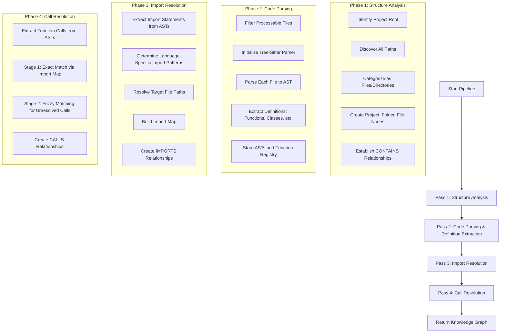
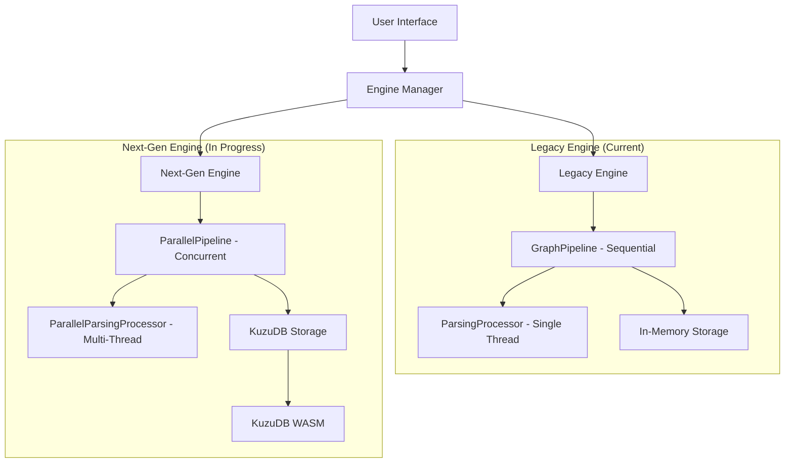

# GitNexus - Edge Knowledge Graph Creator with Graph RAG

**Transform any codebase into an interactive knowledge graph in your browser. No servers, no setup - just instant Graph RAG-powered code intelligence.**

GitNexus is a client-side knowledge graph creator that runs entirely in your browser. Drop in a GitHub repo or ZIP file, and get an interactive knowledge graph with AI-powered chat interface. Perfect for code exploration, documentation, and understanding complex codebases through Graph RAG (Retrieval-Augmented Generation).

## ✨ Features

### 📊 **Code Analysis & Visualization**
- **GitHub Integration**: Analyze any public GitHub repository directly from URL
- **ZIP File Support**: Upload and analyze local code archives
- **Interactive Knowledge Graph**: Visualize code structure with D3.js
- **Multi-language Support**: TypeScript, JavaScript, Python, and more with extensible architecture
- **Smart Filtering**: Directory and file pattern filters to focus analysis scope
- **Performance Optimization**: Configurable file limits with confirmation dialogs for large repositories

### 🤖 **AI-Powered Chat Interface**
- **Multiple LLM Providers**: OpenAI, Anthropic (Claude), Google Gemini, Azure OpenAI
- **ReAct Agent Pattern**: Uses proper LangChain ReAct implementation for reasoning
- **Tool-Augmented Responses**: Graph queries, code retrieval, file search
- **Context-Aware**: Maintains conversation history with configurable memory

### 🔧 **Advanced Processing Pipeline**
- **Four-Pass Ingestion System**:
  1. **Structure Analysis**: Project hierarchy and file organization
  2. **Code Parsing**: AST-based extraction using Tree-sitter
  3. **Import Resolution**: Module and import relationship mapping
  4. **Call Resolution**: Function/method call relationship mapping
- **Parallel Processing**: Multi-threaded processing using Web Worker Pool
- **Intelligent Caching**: AST and processing result optimization
- **Error Resilience**: Comprehensive error boundaries and recovery mechanisms

### 🎨 **Modern UI/UX**
- **Responsive Design**: Adaptive layout for different screen sizes
- **Real-time Progress**: Live updates during repository processing
- **Interactive Graph**: Node selection, zooming, panning
- **Split-Panel Layout**: Graph visualization + AI chat interface
- **Settings Management**: Persistent configuration for API keys and preferences
- **Export Functionality**: Download knowledge graphs as JSON/CSV with metadata
- **Performance Controls**: File limits, filtering, and optimization settings

## 🏗️ Architecture

### **Frontend Stack**
- **React 18** with TypeScript
- **Vite** for fast development and building
- **D3.js** for graph visualization
- **Custom CSS** with modern design patterns
- **Error Boundaries** for robust error handling

### **Processing Engine**
- **Tree-sitter WASM** for syntax parsing
- **Web Worker Pool** for parallel processing
- **Comlink** for worker communication
- **LRU Cache** for performance optimization

### **AI Integration**
- **LangChain.js** with proper ReAct agent implementation
- **Multiple LLM Support**: OpenAI, Anthropic, Gemini, Azure OpenAI
- **Tool-based Architecture**: Graph queries, code retrieval, file search
- **Cypher Query Generation**: Natural language to graph queries

### **Graph Database**
- **KuzuDB WASM**: Embedded graph database running in the browser
- **Cypher Queries**: Powerful graph querying capabilities
- **Persistent Storage**: Data stored in browser's IndexedDB
- **Performance**: Significantly faster queries than in-memory objects

### **Four-Pass Ingestion Pipeline**
The GitNexus processing pipeline follows a consistent four-phase execution model:



### **Dual-Engine Architecture**
GitNexus implements a dual-engine architecture to support both current stable and next-generation processing:



### **Services Layer**
```
src/
├── services/              # External API integrations
│   ├── github.ts         # GitHub REST API client
│   └── zip.ts            # ZIP file processing
├── core/                 # Core processing logic
│   ├── graph/            # Knowledge graph types and engines
│   ├── ingestion/        # Multi-pass processing pipeline
│   └── tree-sitter/      # Syntax parsing infrastructure
├── ai/                   # AI and RAG components
│   ├── llm-service.ts    # Multi-provider LLM client
│   ├── cypher-generator.ts # NL to Cypher translation
│   └── kuzu-rag-orchestrator.ts # KuzuDB-enhanced RAG
├── workers/              # Web Worker implementations
├── ui/                   # React components and pages
│   ├── components/       # Reusable UI components
│   │   ├── ErrorBoundary.tsx
│   │   ├── graph/        # Graph visualization components
│   │   └── chat/         # Chat interface components
│   └── pages/            # Application pages
├── lib/                  # Shared utilities
│   ├── web-worker-pool.ts # Worker pool implementation
│   ├── export.ts         # Graph export functionality
│   └── lru-cache-service.ts # Caching service
└── App.tsx               # Main application entry point
```

## 🚀 Getting Started

### Prerequisites
- **Node.js 18+** and **npm/yarn**
- **API Keys** for AI features (OpenAI, Anthropic, or Gemini)

### Installation

1. **Clone the repository**
   ```bash
   git clone <repository-url>
   cd gitnexus
   ```

2. **Install dependencies**
   ```bash
   npm install
   ```

3. **Start development server**
   ```bash
   npm run dev
   ```

4. **Open in browser**
   ```
   http://localhost:5173
   ```

### Configuration

1. **GitHub Token (Optional)**
   - Increases rate limit from 60 to 5,000 requests/hour
   - Generate at: https://github.com/settings/tokens
   - Requires no special permissions for public repos

2. **AI API Keys**
   - **OpenAI**: Get from https://platform.openai.com/api-keys
   - **Anthropic**: Get from https://console.anthropic.com/
   - **Gemini**: Get from https://makersuite.google.com/app/apikey
   - **Azure OpenAI**: Configure endpoint and deployment settings

3. **Performance Settings**
   - **File Limit**: Configure maximum files to process (default: 500)
   - **Directory Filters**: Focus on specific directories (e.g., "src", "lib")
   - **File Patterns**: Filter by file types (e.g., "*.ts", "*.js", "*.py")

## 💡 Usage

### Analyzing a Repository

1. **GitHub Repository**
   ```
   1. Enter GitHub URL: https://github.com/owner/repo
   2. Optional: Set directory/file filters to focus analysis
   3. Click "Analyze"
   4. For large repos: Confirm processing or adjust filters
   5. Wait for processing (structure → parsing → import → call resolution)
   6. Explore the interactive graph
   ```

2. **ZIP File Upload**
   ```
   1. Click "Choose File" and select a .zip file
   2. Optional: Configure filters before processing
   3. Click "Analyze"
   4. Processing will extract and analyze text files
   5. Explore results in the graph visualization
   ```

### Engine Selection
GitNexus supports both legacy (stable) and next-gen (parallel/KuzuDB) processing engines:
- Use the engine selector in the UI to switch between engines
- Next-gen engine provides parallel processing and KuzuDB storage
- Legacy engine provides stable, in-memory processing
- System automatically falls back to legacy engine if next-gen fails

### Using the AI Chat

1. **Configure API Key**
   ```
   1. Click the ⚙️ settings button
   2. Choose your preferred LLM provider
   3. Enter your API key
   4. Select model (e.g., gpt-4o-mini, claude-3-haiku)
   ```

2. **Ask Questions**
   ```
   - "What functions are in the main.py file?"
   - "Show me all classes that inherit from BaseClass"
   - "How does the authentication system work?"
   - "Find all functions that call the database"
   ```

### Exporting Data

1. **Export Knowledge Graph**
   ```
   1. Click the 📥 Export button after processing
   2. Choose format (JSON or CSV)
   3. Downloads file with graph data and metadata
   4. File size shown in UI before export
   ```

## 🔄 Work in Progress

GitNexus is currently operating with a dual-engine architecture that supports both stable and next-generation processing:

### Current Architecture (Stable - Default)
- **Single-threaded Processing**: Code analysis runs on the main browser thread using sequential processing
- **In-Memory Storage**: Knowledge graph stored as JSON objects in memory
- **Four-Pass Ingestion Pipeline**: Structure analysis → Code parsing → Import resolution → Call resolution
- **Limited Scalability**: Performance degrades with large codebases (500+ files)

### Next-Gen Architecture (Feature Flag Enabled)
- **Parallel Processing**: Multi-threaded analysis using Web Worker Pool for massive performance gains
- **KuzuDB Integration**: Embedded graph database for persistent, high-performance graph queries
- **Cypher Queries**: AI agents can directly query the knowledge graph using Cypher, enabling more sophisticated analysis
- **Enhanced Scalability**: Handles larger repositories with better memory management

### Transition Status
The project currently defaults to the stable legacy engine but has the next-generation engine available through feature flags. The next-gen engine includes:

1. **Worker Pool Infrastructure**: Fully implemented Web Worker Pool for parallel processing
2. **KuzuDB Integration**: Complete implementation of KuzuDB WASM with Cypher query support
3. **Parallel Pipeline**: ParallelGraphPipeline with ParallelParsingProcessor ready for use
4. **Feature Flags**: All next-gen features enabled by default in feature flags

Users can switch between engines using the engine selection interface, with automatic fallback to the legacy engine if issues occur.

### Benefits of Next-Gen Architecture
- **4-8x faster processing** for large codebases through parallel execution
- **Persistent storage** that survives browser refreshes using IndexedDB
- **More powerful AI analysis** through direct database queries with Cypher
- **Better memory management** for large repositories through database storage

## 🧪 Testing & Quality Assurance

### Error Handling
- **Error Boundaries**: Catch and display JavaScript errors gracefully
- **User Recovery**: Allow users to reset component state after errors
- **Detailed Logging**: Console logging for debugging and error reporting
- **Fallback UI**: User-friendly error messages with recovery options

### Performance Testing
1. **Large Repository Handling**
   - Test with repositories containing 1000+ files
   - Verify confirmation dialogs for file limits
   - Monitor memory usage during processing
   - Test filtering effectiveness

2. **UI Responsiveness**
   - Ensure non-blocking processing with Web Workers
   - Verify progress indicators update correctly
   - Test error recovery mechanisms
   - Validate export functionality with large graphs

## 🚀 Deployment

### Production Build
```bash
npm run build
npm run preview
```

### Environment Variables
```env
# Optional: Pre-configure API keys
VITE_OPENAI_API_KEY=sk-...
VITE_ANTHROPIC_API_KEY=sk-ant-...
VITE_GEMINI_API_KEY=...

# Performance settings
VITE_DEFAULT_MAX_FILES=500
VITE_ENABLE_DEBUG_LOGGING=false
```

## 🔒 Security & Privacy

- **Client-Side Processing**: All analysis happens in your browser
- **API Keys**: Stored locally, never transmitted to our servers
- **GitHub Access**: Uses public API, respects repository permissions
- **Data Privacy**: No code or analysis results are stored remotely
- **Error Logging**: Sensitive data excluded from error reports
- **Export Security**: User-controlled data export with no server interaction

## 🤝 Contributing

### Development Setup
1. Fork the repository
2. Create feature branch: `git checkout -b feature/amazing-feature`
3. Make changes and test thoroughly
4. Run the testing checklist
5. Commit: `git commit -m 'Add amazing feature'`
6. Push: `git push origin feature/amazing-feature`
7. Open a Pull Request

### Code Style
- **TypeScript**: Strict mode enabled
- **ESLint**: Follow configured rules
- **Prettier**: Auto-formatting
- **Comments**: Minimal, only when necessary
- **Error Handling**: Comprehensive error boundaries and recovery
- **Performance**: Consider memory usage and processing time

## 📄 License

This project is licensed under the MIT License - see the [LICENSE](LICENSE) file for details.

## 🙏 Acknowledgments

- **Tree-sitter**: Syntax parsing infrastructure
- **LangChain.js**: AI agent framework
- **D3.js**: Graph visualization
- **React**: UI framework with error boundaries
- **Vite**: Build tool and dev server
- **KuzuDB**: Embedded graph database