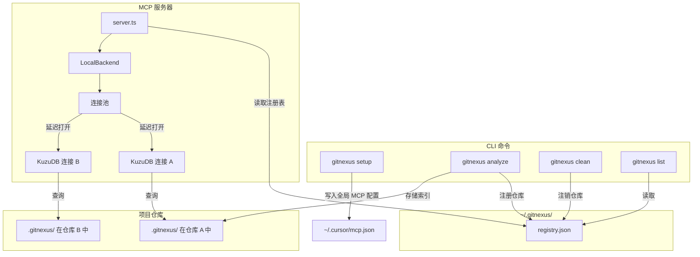
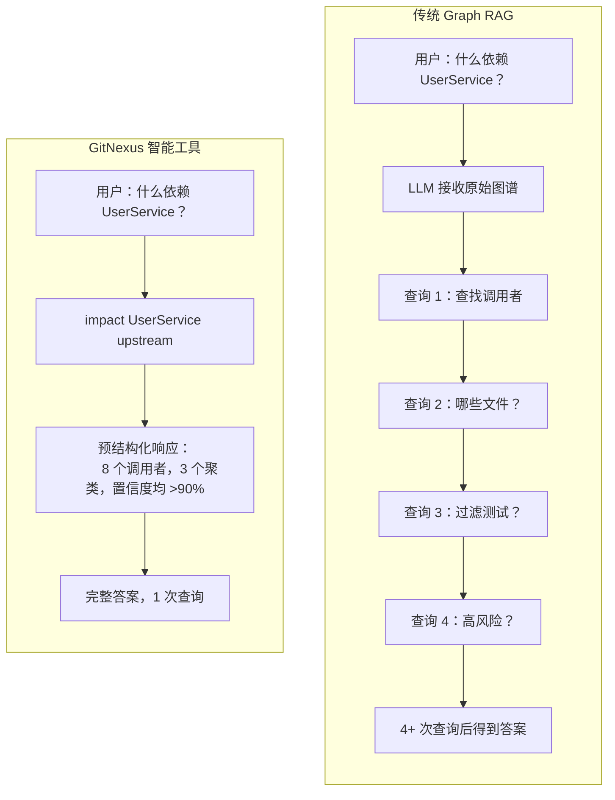

# GitNexus

[English](README.md) | 中文

<div align="center">

  <a href="https://trendshift.io/repositories/19809" target="_blank">
    
  </a>

  <h2>加入官方 Discord 讨论想法和问题!</h2>

  <a href="https://discord.gg/AAsRVT6fGb">
    
  </a>
  <a href="https://www.npmjs.com/package/gitnexus">
    
  </a>
  <a href="https://polyformproject.org/licenses/noncommercial/1.0.0/">
    
  </a>

</div>

**为 AI Agent 构建代码神经系统。**

将任意代码库索引为知识图谱——涵盖每个依赖关系、调用链、聚类和执行流程——然后通过智能工具暴露给 AI Agent，确保不遗漏任何代码。

https://github.com/user-attachments/assets/172685ba-8e54-4ea7-9ad1-e31a3398da72

> *类似 DeepWiki，但更深入。* DeepWiki 帮你 *理解* 代码，GitNexus 让你 *分析* 代码——因为知识图谱追踪每一个关系，而不仅仅是描述。

**简而言之:** **Web UI** 是快速与任何仓库对话的方式。**CLI + MCP** 让你的 AI Agent 真正可靠——它为 Cursor、Claude Code 等工具提供代码库的深层架构视图，避免遗漏依赖、破坏调用链和盲目编辑。即使较小的模型也能获得完整的架构理解。

---

## 两种使用方式

|                   | **CLI + MCP**                                            | **Web UI**                                             |
| ----------------- | -------------------------------------------------------------- | ------------------------------------------------------------ |
| **用途**    | 本地索引仓库，通过 MCP 连接 AI Agent                 | 浏览器中的可视化图谱浏览器 + AI 对话                   |
| **适用场景**     | 使用 Cursor、Claude Code、Windsurf、OpenCode 进行日常开发 | 快速探索、演示、一次性分析                   |
| **规模**   | 完整仓库，任意大小                                           | 受浏览器内存限制（约 5k 文件），后端模式下不受限 |
| **安装** | `npm install -g gitnexus`                                    | 无需安装 — [gitnexus.vercel.app](https://gitnexus.vercel.app) |
| **存储** | KuzuDB 原生（快速、持久）                               | KuzuDB WASM（内存中、按会话）                         |
| **解析** | Tree-sitter 原生绑定                                    | Tree-sitter WASM                                             |
| **隐私** | 完全本地，无网络通信                                   | 完全在浏览器中，无服务器                             |

> **桥接模式:** `gitnexus serve` 连接两者——Web UI 自动检测本地服务器，可浏览所有 CLI 索引的仓库，无需重新上传或重新索引。

---

## CLI + MCP（推荐）

CLI 索引你的代码仓库，并运行 MCP 服务器，为 AI Agent 提供深度代码库感知能力。

### 快速开始

```bash
# 索引你的仓库（在仓库根目录运行）
npx gitnexus analyze
```

就是这么简单。这会索引代码库、安装 Agent 技能、注册 Claude Code 钩子，并创建 `AGENTS.md` / `CLAUDE.md` 上下文文件——一个命令完成所有操作。

要为编辑器配置 MCP，运行一次 `npx gitnexus setup`——或按下面的说明手动设置。

### MCP 设置

`gitnexus setup` 自动检测你的编辑器并写入正确的全局 MCP 配置。只需运行一次。

### 编辑器支持

| 编辑器                | MCP | Skills | Hooks（自动增强） | 支持程度        |
| --------------------- | --- | ------ | -------------------- | -------------- |
| **Claude Code** | 是 | 是    | 是（PreToolUse）     | **完整** |
| **Cursor**      | 是 | 是    | —                   | MCP + Skills   |
| **Windsurf**    | 是 | —     | —                   | MCP            |
| **OpenCode**    | 是 | 是    | —                   | MCP + Skills   |

> **Claude Code** 拥有最深度的集成：MCP 工具 + Agent 技能 + PreToolUse 钩子，自动用知识图谱上下文丰富 grep/glob/bash 调用。

如果你偏好手动配置：

**Claude Code**（完整支持——MCP + skills + hooks）：

```bash
claude mcp add gitnexus -- npx -y gitnexus@latest mcp
```

**Cursor**（`~/.cursor/mcp.json`——全局配置，适用于所有项目）：

```json
{
  "mcpServers": {
    "gitnexus": {
      "command": "npx",
      "args": ["-y", "gitnexus@latest", "mcp"]
    }
  }
}
```

**OpenCode**（`~/.config/opencode/config.json`）：

```json
{
  "mcp": {
    "gitnexus": {
      "command": "npx",
      "args": ["-y", "gitnexus@latest", "mcp"]
    }
  }
}
```

### CLI 命令

```bash
gitnexus setup                    # 为编辑器配置 MCP（一次性）
gitnexus analyze [path]           # 索引仓库（或更新过期索引）
gitnexus analyze --force          # 强制完全重新索引
gitnexus analyze --skip-embeddings  # 跳过嵌入生成（更快）
gitnexus mcp                     # 启动 MCP 服务器（stdio）——服务所有已索引仓库
gitnexus serve                   # 启动本地 HTTP 服务器（多仓库）供 Web UI 连接
gitnexus list                    # 列出所有已索引仓库
gitnexus status                  # 显示当前仓库的索引状态
gitnexus clean                   # 删除当前仓库的索引
gitnexus clean --all --force     # 删除所有索引
gitnexus wiki [path]             # 从知识图谱生成仓库文档
gitnexus wiki --model <model>    # 使用自定义 LLM 模型（默认：gpt-4o-mini）
gitnexus wiki --base-url <url>   # 使用自定义 LLM API 地址
gitnexus wiki --language zh-CN   # 生成中文文档（或 ja、ko 等）
```

### AI Agent 获得什么

通过 MCP 暴露 **7 个工具**：

| 工具               | 功能                                                      | `repo` 参数 |
| ------------------ | ----------------------------------------------------------------- | -------------- |
| `list_repos`     | 发现所有已索引仓库                                 | —             |
| `query`          | 基于流程分组的混合搜索（BM25 + 语义 + RRF）             | 可选       |
| `context`        | 360度符号视图——分类引用、流程参与 | 可选       |
| `impact`         | 影响范围分析，含深度分组和置信度          | 可选       |
| `detect_changes` | Git diff 影响——将变更行映射到受影响的流程       | 可选       |
| `rename`         | 多文件协调重命名，结合图谱 + 文本搜索            | 可选       |
| `cypher`         | 原始 Cypher 图查询                                          | 可选       |

> 当只有一个仓库被索引时，`repo` 参数可选。有多个仓库时，指定目标仓库：`query({query: "auth", repo: "my-app"})`。

**资源**，用于即时上下文：

| 资源                                  | 用途                                              |
| ----------------------------------------- | ---------------------------------------------------- |
| `gitnexus://repos`                      | 列出所有已索引仓库（首先读取此项）      |
| `gitnexus://repo/{name}/context`        | 代码库统计、过期检查和可用工具 |
| `gitnexus://repo/{name}/clusters`       | 所有功能聚类及内聚分数         |
| `gitnexus://repo/{name}/cluster/{name}` | 聚类成员和详情                          |
| `gitnexus://repo/{name}/processes`      | 所有执行流程                                  |
| `gitnexus://repo/{name}/process/{name}` | 完整流程追踪及步骤                        |
| `gitnexus://repo/{name}/schema`         | 用于 Cypher 查询的图谱 Schema                      |

**2 个 MCP 提示词**，用于引导工作流：

| 提示词            | 功能                                                              |
| ----------------- | ------------------------------------------------------------------------- |
| `detect_impact` | 提交前变更分析——范围、受影响流程、风险等级       |
| `generate_map`  | 从知识图谱生成架构文档及 Mermaid 图表 |

**4 个 Agent 技能**自动安装到 `.claude/skills/`：

- **探索** — 使用知识图谱导航不熟悉的代码
- **调试** — 通过调用链追踪 Bug
- **影响分析** — 在修改前分析影响范围
- **重构** — 使用依赖映射规划安全的重构

---

## 多仓库 MCP 架构

GitNexus 使用**全局注册表**，一个 MCP 服务器可以服务多个已索引的仓库。无需针对每个项目配置 MCP——设置一次，处处可用。



**工作原理:** 每次 `gitnexus analyze` 将索引存储在仓库内的 `.gitnexus/` 中（可移植，已 gitignore），并在 `~/.gitnexus/registry.json` 中注册一个指针。当 AI Agent 启动时，MCP 服务器读取注册表，可以服务任何已索引的仓库。KuzuDB 连接在首次查询时延迟打开，闲置 5 分钟后被回收（最多 5 个并发）。如果只索引了一个仓库，所有工具的 `repo` 参数可选——Agent 无需做任何改动。

---

## Web UI（基于浏览器）

完全客户端的图谱浏览器和 AI 对话。无服务器、无需安装——你的代码永远不会离开浏览器。

**立即试用:** [gitnexus.vercel.app](https://gitnexus.vercel.app) — 拖放 ZIP 文件即可开始探索。


或本地运行：

```bash
git clone https://github.com/abhigyanpatwari/gitnexus.git
cd gitnexus/gitnexus-web
npm install
npm run dev
```

Web UI 使用与 CLI 相同的索引流程，但完全运行在 WebAssembly 中（Tree-sitter WASM、KuzuDB WASM、浏览器内嵌入）。适合快速探索，但大型仓库受浏览器内存限制。

**本地后端模式:** 运行 `gitnexus serve` 并在本地打开 Web UI——它会自动检测服务器并显示所有已索引的仓库，完全支持 AI 对话。无需重新上传或重新索引。Agent 的工具（Cypher 查询、搜索、代码导航）会自动通过后端 HTTP API 路由。

---

## GitNexus 解决什么问题

**Cursor**、**Claude Code**、**Cline**、**Roo Code** 和 **Windsurf** 等工具很强大——但它们并不真正了解你的代码库结构。

**问题场景:**

1. AI 编辑了 `UserService.validate()`
2. 不知道有 47 个函数依赖其返回类型
3. **破坏性变更被提交**

### 传统 Graph RAG vs GitNexus

传统方法将原始图谱边给 LLM，期望它探索足够多。GitNexus **在索引时预计算结构**——聚类、追踪、评分——因此工具在一次调用中返回完整上下文：



**核心创新：预计算关系智能**

- **可靠性** — LLM 不会遗漏上下文，它已经在工具响应中
- **Token 效率** — 无需 10 次查询链来理解一个函数
- **模型民主化** — 小模型也能工作，因为工具承担了繁重的计算

---

## 工作原理

GitNexus 通过多阶段索引流程构建代码库的完整知识图谱：

1. **结构** — 遍历文件树，映射文件夹/文件关系
2. **解析** — 使用 Tree-sitter AST 提取函数、类、方法和接口
3. **解析** — 使用语言感知逻辑解析跨文件的导入和函数调用
4. **聚类** — 将相关符号分组为功能社区
5. **流程** — 从入口点通过调用链追踪执行流程
6. **搜索** — 构建混合搜索索引以实现快速检索

### 支持的语言

TypeScript、JavaScript、Python、Java、Kotlin、C、C++、C#、Go、Rust、PHP、Swift

---

## 工具示例

### 影响分析

```
impact({target: "UserService", direction: "upstream", minConfidence: 0.8})

TARGET: Class UserService (src/services/user.ts)

UPSTREAM（依赖于此的代码）:
  深度 1（会中断）:
    handleLogin [CALLS 90%] -> src/api/auth.ts:45
    handleRegister [CALLS 90%] -> src/api/auth.ts:78
    UserController [CALLS 85%] -> src/controllers/user.ts:12
  深度 2（可能受影响）:
    authRouter [IMPORTS] -> src/routes/auth.ts
```

选项: `maxDepth`、`minConfidence`、`relationTypes`（`CALLS`、`IMPORTS`、`EXTENDS`、`IMPLEMENTS`）、`includeTests`

### 基于流程分组的搜索

```
query({query: "authentication middleware"})

processes:
  - summary: "LoginFlow"
    priority: 0.042
    symbol_count: 4
    process_type: cross_community
    step_count: 7

process_symbols:
  - name: validateUser
    type: Function
    filePath: src/auth/validate.ts
    process_id: proc_login
    step_index: 2

definitions:
  - name: AuthConfig
    type: Interface
    filePath: src/types/auth.ts
```

### Context（360度符号视图）

```
context({name: "validateUser"})

symbol:
  uid: "Function:validateUser"
  kind: Function
  filePath: src/auth/validate.ts
  startLine: 15

incoming:
  calls: [handleLogin, handleRegister, UserController]
  imports: [authRouter]

outgoing:
  calls: [checkPassword, createSession]

processes:
  - name: LoginFlow (step 2/7)
  - name: RegistrationFlow (step 3/5)
```

### 变更检测（提交前）

```
detect_changes({scope: "all"})

summary:
  changed_count: 12
  affected_count: 3
  changed_files: 4
  risk_level: medium

changed_symbols: [validateUser, AuthService, ...]
affected_processes: [LoginFlow, RegistrationFlow, ...]
```

### 重命名（多文件）

```
rename({symbol_name: "validateUser", new_name: "verifyUser", dry_run: true})

status: success
files_affected: 5
total_edits: 8
graph_edits: 6     （高置信度）
text_search_edits: 2  （请仔细审查）
changes: [...]
```

### Cypher 查询

```cypher
-- 查找高置信度调用认证函数的代码
MATCH (c:Community {heuristicLabel: 'Authentication'})<-[:CodeRelation {type: 'MEMBER_OF'}]-(fn)
MATCH (caller)-[r:CodeRelation {type: 'CALLS'}]->(fn)
WHERE r.confidence > 0.8
RETURN caller.name, fn.name, r.confidence
ORDER BY r.confidence DESC
```

---

## Wiki 生成

从知识图谱生成 LLM 驱动的文档：

```bash
# 需要 LLM API 密钥（OPENAI_API_KEY 等）
gitnexus wiki

# 使用自定义模型或提供商
gitnexus wiki --model gpt-4o
gitnexus wiki --base-url https://api.anthropic.com/v1

# 强制完全重新生成
gitnexus wiki --force

# 生成指定语言的文档
gitnexus wiki --language zh-CN
gitnexus wiki --language ja
```

Wiki 生成器读取已索引的图谱结构，通过 LLM 将文件分组为模块，生成每个模块的文档页面，并创建概览页面——所有内容都包含对知识图谱的交叉引用。

---

## 技术栈

| 层                     | CLI                                   | Web                                     |
| ------------------------- | ------------------------------------- | --------------------------------------- |
| **运行时**         | Node.js（原生）                      | 浏览器（WASM）                          |
| **解析**         | Tree-sitter 原生绑定           | Tree-sitter WASM                        |
| **数据库**        | KuzuDB 原生                         | KuzuDB WASM                             |
| **嵌入**      | HuggingFace transformers.js（GPU/CPU） | transformers.js（WebGPU/WASM）           |
| **搜索**          | BM25 + 语义 + RRF                 | BM25 + 语义 + RRF                   |
| **Agent 接口** | MCP（stdio）                           | LangChain ReAct Agent                   |
| **可视化**   | —                                    | Sigma.js + Graphology（WebGL）           |
| **前端**        | —                                    | React 18、TypeScript、Vite、Tailwind v4 |
| **聚类**      | Graphology                            | Graphology                              |
| **并发**     | Worker 线程 + 异步                | Web Workers + Comlink                   |

---

## 路线图

### 正在开发

- [ ] **LLM 聚类增强** — 通过 LLM API 生成语义聚类名称
- [ ] **AST 装饰器检测** — 解析 @Controller、@Get 等
- [ ] **增量索引** — 只重新索引变更的文件

### 最近完成

- [X] Wiki 生成、多文件重命名、Git Diff 影响分析
- [X] 基于流程分组的搜索、360度上下文、Claude Code 钩子
- [X] 多仓库 MCP、零配置设置、11 种语言支持
- [X] 社区检测、流程检测、置信度评分
- [X] 混合搜索、向量索引

---

## 安全与隐私

- **CLI**: 一切在本地机器运行。无网络调用。索引存储在 `.gitnexus/`（已 gitignore）。全局注册表在 `~/.gitnexus/`，仅存储路径和元数据。
- **Web**: 一切在浏览器中运行。代码不会上传到任何服务器。API 密钥仅存储在 localStorage 中。
- 开源——你可以自行审计代码。

---

## 致谢

- [Tree-sitter](https://tree-sitter.github.io/) — AST 解析
- [KuzuDB](https://kuzudb.com/) — 支持向量的嵌入式图数据库
- [Sigma.js](https://www.sigmajs.org/) — WebGL 图渲染
- [transformers.js](https://huggingface.co/docs/transformers.js) — 浏览器端 ML
- [Graphology](https://graphology.github.io/) — 图数据结构
- [MCP](https://modelcontextprotocol.io/) — 模型上下文协议
