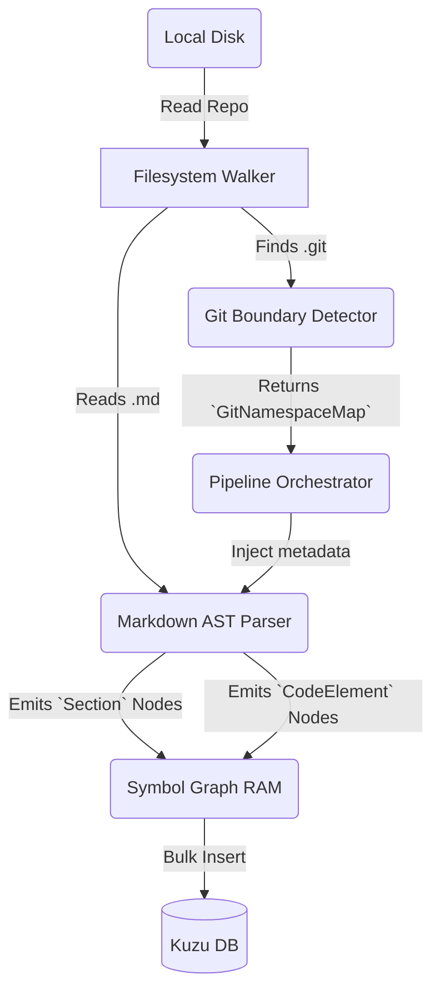

# Container Level: Ingestion & Parsing Data Pipeline

**System:** Namespace Isolation & Markdown Integration
**Type:** Background Process (Engine Service)

This L2 document encompasses the "Ingestion Pipeline" Deployment Unit. This is a massive standalone machine orchestrated by the Node.js Service Worker, processing the continuous transformation of Source Code and Markdown into a Network Graph.

## Container Responsibilities

1. **Walking & Boundary Setting:** Scans the hard drive File System, invokes Detectors to divide and isolate segments (Namespace Isolation).
2. **Semantic Extraction:** Controls Processors (such as `markdown-processor` or `typescript-processor`) to translate hard text files into AST Tree arrays.
3. **Graph Assembly:** Establishes the foundation for the internal RDBMS (here being KuzuDB), bonding hundreds of thousands of Nodes and Edges together.

## Internal Subordinate Components

1. **Git Boundary Detector** (`git-namespace-detector.ts`): The defense wall for RAG Isolation. Confirms which repository's space a node belongs to.
2. **Markdown AST Parser** (`markdown-processor.ts`): The digester of human-written design language document files.
3. *(Out of scope for this document)*: TypeScript Processor, Python Processor...

## Data Flow

## Communication & Interaction (Inter-process)
The container mostly operates in an Isolated manner, only interacting locally with RAM and Disk IO. In the final stage, it interacts with the Disk Block (Database) using IPC Storage.

**Risk Note:** This Ingestion module is heavily I/O and CPU Bound (scanning Markdown AST consumes Regex loops). Every processor must be cautious not to lock the Event Loop too tightly.
