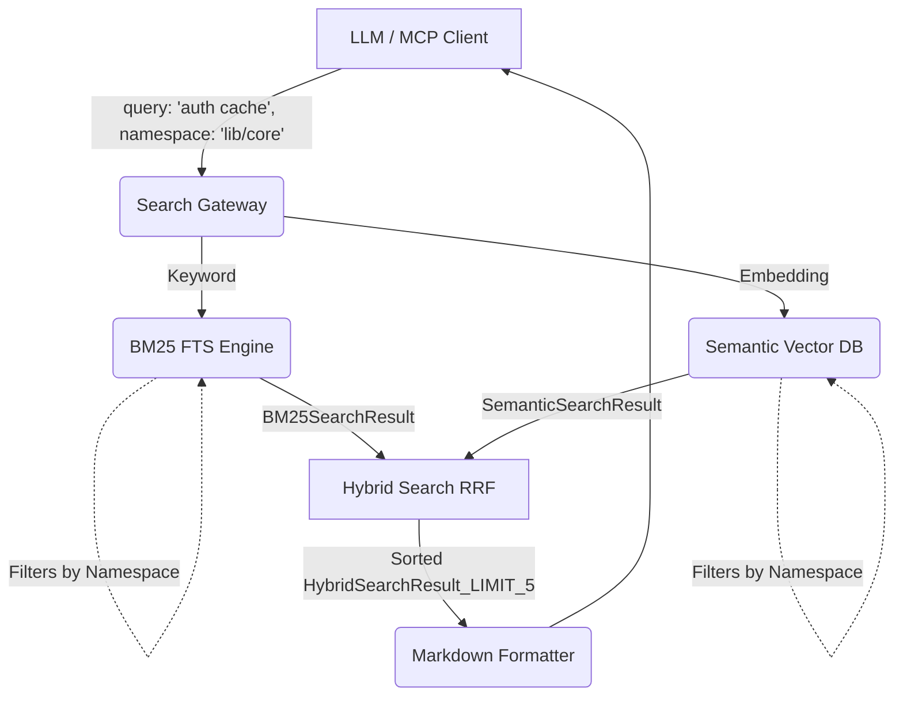

# Container Level: Search & Query Engine

**System:** Namespace Isolation & Markdown Integration
**Type:** API Gateway / Search Server Layer

This L2 document encompasses the "Search & Query Engine" Deployment Unit. It provisions the API Endpoint communicating with the MCP Server, receiving the LLM's Prompt commands, and returning the knowledge stream.

## Container Responsibilities

1. **Routing Query:** Determines whether an LLM (Agent) query should branch into Full-Text-Search or dive into the RAG Semantic stream.
2. **Context Restriction:** Applies the "Git Namespace" metadata as a firewall, purging any Node or Sub-tree not under the jurisdiction of the queried Repo. Consequently, the Monorepo is protected from cross-context pollution.
3. **Execution Plan:** Aggregates results, builds Graph Nodes into Process Flow sequences, and packages them into a Markdown response format suitable for the LLM token-limit.

## Internal Subordinate Components

1. **Hybrid Search** (`hybrid-search.ts` / `hybrid.md`): The computation engine for RRF ranking, fusing Semantic & BM25 with `git_namespace` filtering.
2. **FTS BM25** (`bm25-index.ts`): The bridge invoking SQL MATCH commands to the KuzuDB FTS Extension.
3. *(Out of scope for this document)*: Semantic Vector Engine (Pinecone/Local).

## Data Flow

