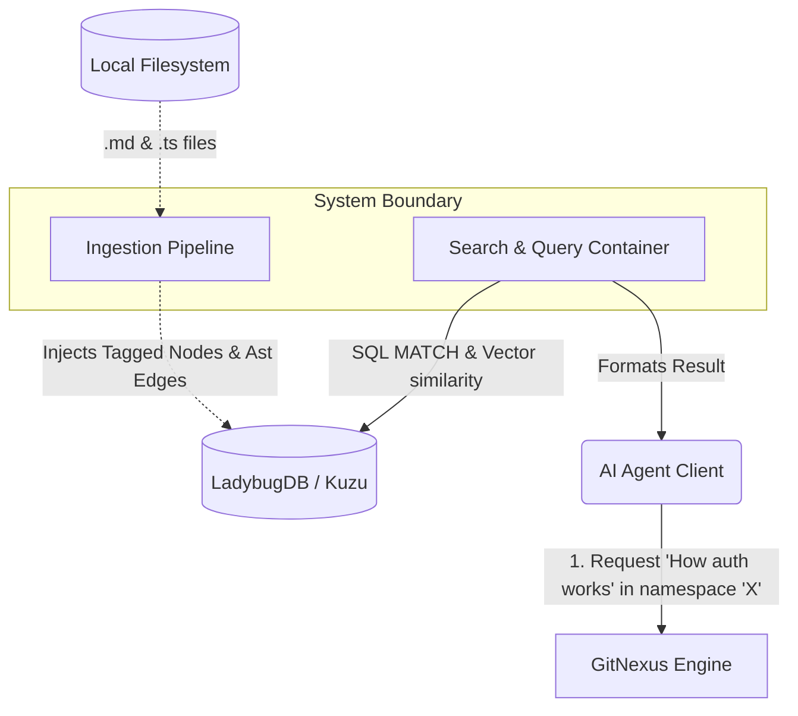

# System Context: Namespace Isolation & Markdown Integration

**Level:** System Context (L1)

This is the most overarching document (The 10,000ft picture), explaining why the two features "Namespace Isolation" and "Markdown Integration" must be fused together, and what pain points of the AI Agent they solve.

## Introduction: The Extension Context

It is critical to note that **the native GitNexus engine exclusively supports parsing and indexing codebase files** (e.g., `.ts`, `.py`, `.js`). By default, it completely ignores `.md` files. We have architecturally extended the core GitNexus capabilities by implementing a custom business logic layer to natively support parsing Markdown documentation into the Knowledge Graph.

## The "Why" Combination

The standard GitNexus system suffers from the risk of "RAG Hallucination" when indexing a massive Monorepo (For example: System A and System B both have an `authenticate()` function but the code is entirely different). Without **Namespace Isolation**, an Agent asking about System A might get the LLM hallucinated with System B's function injected into its brain.

However, isolating the Source Code alone is insufficient. **Markdown** documentation (Specs, Design doc) also contains algorithms and business logic. Since we extended GitNexus to parse Markdown into Knowledge Graph Nodes natively, we must also ensure that these documentation nodes are strictly tagged with Metadata by Namespace. If not, the documentation of System B will still bleed into System A's RAG.

This custom extension simultaneously combines the Git-level isolation mechanism and Markdown AST Parser to completely resolve this.

## Actors & Personas

- **AI Agent (Personas):** Acts as the customer of GitNexus. The Agent needs to send the `/query` command to fetch code context and design documentation but demands no Token Limit Overflow or Context Noise.
- **Git Repository (External System):** The hard drive storing source code and `.git` folders. Where GitNexus reads the structure.
- **Knowledge Graph RDBMS (KuzuDB):** Where the graph state (Nodes, Edges) and fast-retrieval FTS indices are stored.

## System Boundary & Trust

## User Journeys (Practical Application)

1. **User (Dev) clones a Monorepo project:** 
   For instance, the directory has `libs/frontend` (with .git) and `libs/backend` (with .git).
2. **GitNexus Ingestion triggers:** 
   Runs the `buildGitNamespaceMap()` algorithm. Scans and detects 2 implicit .git folders.
3. **Parse Code & Docs:**
   The Markdown Processor processes the `libs/backend/design.md` file. At this point, it attaches nodes onto the graph and tags the Property `git_namespace: "libs/backend"` to all Sections and Code Blocks.
4. **Agent queries:**
   The Agent calls the MCP tool `gitnexus_query({ query: "JWT token", git_namespace: "libs/frontend" })`. Hybrid Search runs, BM25 and Semantic execute filters. The `libs/backend/design.md` file will be **completely disabled**, securing the context from bleeding out.
