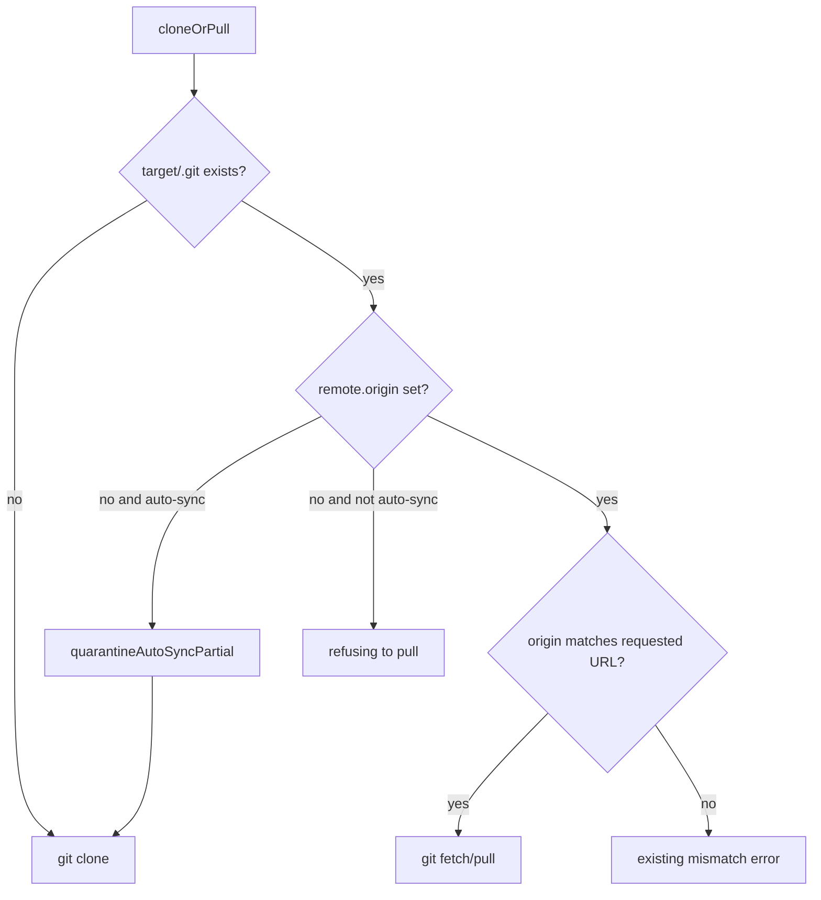

# Auto-sync image SSH and clone recovery

## Goal Capsule

- **Objective:** An operator running `gitnexus auto-sync` in the published CLI image can clone configured remotes, recover from a timed-out clone without deleting directories by hand, and get embeddings on auto-synced indexes when the cloned repo already asks for them.
- **Means:** Install OpenSSH in the CLI runtime image, accept HTTPS remotes on the same host allowlist, quarantine-and-reclone invalid clone dirs, and pass `.gitnexusrc` analyze options into the auto-sync worker (KTD1–KTD4).
- **Authority:** Requirements win on product behavior. KTDs win on mechanism. Where #3372 suggestions conflict with this tree (especially the reported `analyze_timeout` half-interval cap), Key Decisions and Scope Boundaries win.
- **Stop conditions:** Stop if the work would drop the github.com / gitlab.com / gitee.com allowlist, install a trixie `ssh` into the bookworm runtime, or add an `analyze_timeout` upper bound of half `sync_interval_minutes`. Stop if embeddings would require a new `watch_config.yml` key as the only enablement path.
- **Execution profile:** Test-first on clone recovery and URL validation (existing suites already pin the broken behaviors). Smoke-first on the Dockerfile package list (parity test parses the file; do not require a full image build in unit CI).
- **Tail ownership:** Ends at merged code, the verification commands in this plan, and close criteria for #3372. A release bump and GHCR republish are out of scope for the PR; they follow the usual release process.

---

## Product Contract

### Summary

Make auto-sync work in the image it ships in. Today the validator requires SSH remotes and the runtime image has no `ssh` binary, so every clone fails. A timed-out clone then leaves a `.git`-only directory that every later tick refuses to pull. Auto-sync analyze also ignores `.gitnexusrc` embeddings, so semantic search silently degrades. Document the real timeout rules; do not invent a half-interval cap this tree does not have.

### Problem Frame

#3372 reports a Kubernetes pod of `ghcr.io/abhigyanpatwari/gitnexus:1.6.12` where `serve` is healthy and `auto-sync` never produces an index. Evidence: `ssh: not found` on clone; HTTPS remotes rejected with `must use an SSH URL`; after a `repo_git_timeout` failure, `Existing clone at … has no remote.origin — refusing to pull`; a committed `.gitnexusrc` with `embeddings: true` produced 0 `CodeEmbedding` rows. A secondary note claimed `analyze_timeout must not exceed half of sync_interval_minutes`; that error string is not in this repository — current code defaults `analyze_timeout` to half the interval and **allows** a longer explicit value.

### Requirements

- **R1.** The CLI runtime image (`Dockerfile.cli` runtime stage) provides an `ssh` client that Debian bookworm's `git` can invoke, so `git@github.com:owner/repo.git` clones succeed when keys/known_hosts are supplied by the operator.
- **R2.** `watch_config.yml` `remote_urls` accept HTTPS URLs on the same three hosts as SSH (`github.com`, `gitlab.com`, `gitee.com`), so a public repo does not require SSH keys.
- **R3.** When the clone path exists but is not a usable repository (no `remote.origin`, or equivalent failed-clone residue), auto-sync quarantines that path and clones again instead of failing every subsequent tick. Error text still names the original directory.
- **R4.** Auto-sync analysis honors the cloned repository's `.gitnexusrc` the same way `gitnexus analyze` does for embeddings-related keys (CLI flags remain absent on this path; file config is the enablement).
- **R5.** `query` (MCP and HTTP) reports when the searched index holds no embedding vectors, instead of looking like a working semantic search.
- **R6.** Auto-sync docs state the real `analyze_timeout` rule (default half of `sync_interval_minutes`, explicit values may exceed the interval, `sync_interval_minutes` floor is 5) and that an invalid `watch_config.yml` skips auto-sync immediately with the validation line as the only clue.

### Key Decisions

- **Ship OpenSSH in the image, not HTTPS-only.** Private remotes still need SSH; the image must match the validator. Governs R1.
- **Also accept allowlisted HTTPS remotes.** Complementary to R1; public clones should work with the git+ca-certificates already in the image. Governs R2.
- **Reuse auto-sync quarantine for stuck clones.** The refusal without origin is correct for a live repo; the missing piece is classifying a failed clone as not live. Governs R3.
- **Enable embeddings via `.gitnexusrc`, not a new `watch_config.yml` key.** That file is already the documented project-local analyze config. A watch-file override is follow-up. Governs R4.
- **Do not add a half-interval `analyze_timeout` cap.** This tree documents and tests the opposite. Governs R6.

### Actors

- **A1.** Operator running `gitnexus auto-sync` in the published CLI image (K8s, Compose, or ad-hoc container).
- **A2.** Reader using `gitnexus serve` / MCP `query` against an auto-synced index.

### Flows

- **F1.** Auto-sync tick clones an SSH remote in the CLI image and analyzes it.
- **F2.** Auto-sync tick clones an HTTPS remote on an allowed host without SSH keys.
- **F3.** Auto-sync tick finds a previous failed clone directory, quarantines it, clones fresh, continues.
- **F4.** Auto-sync analyze of a repo whose `.gitnexusrc` sets `embeddings: true` writes vectors when the embedding stack is available in that environment.
- **F5.** `query` against an index with zero embedding rows surfaces a no-vector warning.

### Acceptance Examples

- **AE1.** Runtime `apt-get` line in `Dockerfile.cli` includes `openssh-client`. A unit test that parses that stage fails if it is removed. Covers R1.
- **AE2.** `projects[0].remote_urls[0]: https://github.com/owner/repo.git` loads; the same host over `http://` or a non-allowlisted host still fails. Covers R2.
- **AE3.** A target dir containing only `.git` with no `remote.origin` is quarantined and `git clone` runs again; the next tick does not log `refusing to pull`. Covers R3.
- **AE4.** Auto-sync `runAnalysis` options include embeddings enabled when the clone's `.gitnexusrc` has `"embeddings": true`. Covers R4.
- **AE5.** `query` result includes a warning when `CodeEmbedding` has no rows. Covers R5.

### Success Criteria

- Auto-sync in the CLI image is no longer mutually exclusive with its own remote URL rules.
- A single timed-out clone does not permanently poison that repo's watch slot.
- Operators can turn on embeddings for auto-synced repos without a CLI they never invoke.
- Docs match `parseAutoSyncConfig` rather than the reporter's half-interval error.

### Scope Boundaries

#### In scope

- `Dockerfile.cli` runtime packages and a file-parse regression test.
- Auto-sync remote URL validation, clone/pull recovery, analyze option merge, query no-vector warning, README / help / init template updates.

#### Deferred to Follow-Up Work

- `watch_config.yml` `embeddings` key and analyze-flag passthrough.
- Baking a local embedding model into the CLI image (runtime has no npm; HTTP embeddings remain the container path).
- Operator-facing SSH key / `known_hosts` volume cookbook beyond a short README note.
- GHCR republish of 1.6.12; this PR lands on main and ships in the next release.

#### Out of scope

- Changing `repo_git_timeout` default (10s) for NFS-slow clones; operators raise it. Recovery is the code fix; the default remains a documented footgun.
- Accepting `ssh://` URLs, arbitrary hosts, or dropping the three-host allowlist.
- Installing `openssh-client` from Debian trixie into the bookworm image.
- Adding `analyze_timeout must not exceed half of sync_interval_minutes`.

### Dependencies

- Existing `quarantineAutoSyncPartial` (`gitnexus/src/core/auto-sync/path-security.ts`).
- Existing `.gitnexusrc` load/merge (`gitnexus/src/cli/analyze-config.ts`) used by `gitnexus analyze`.
- Bookworm `openssh-client` on `node:22-bookworm-slim` (issue author verified shared libs already present).

### Outstanding Questions

- **Deferred:** Whether HTTP `GET /api/...` query surfaces the same no-vector warning as MCP. Implement both if they share one helper; otherwise MCP + local backend first, HTTP if the same code path.

### Sources

- https://github.com/abhigyanpatwari/GitNexus/issues/3372
- `Dockerfile.cli`, `gitnexus/src/core/auto-sync/config.ts`, `gitnexus/src/server/git-clone.ts`, `gitnexus/src/core/auto-sync/runner.ts`
- `gitnexus/README.md` § `gitnexus auto-sync`

---

## Planning Contract

### Assumptions

- Pipeline planning inferred: ship all four themes from #3372 in one PR, with the timeout item as documentation of **current** rules rather than the reporter's cap.
- Pipeline planning inferred: HTTPS is in-scope alongside OpenSSH because the issue showed HTTPS rejected and public clones otherwise still need keys.
- Pipeline planning inferred: embeddings enablement is `.gitnexusrc` only in this PR.
- The reporter's `analyze_timeout must not exceed half of sync_interval_minutes` string is from another revision, a misread of `repo_git_timeout` caps, or a downstream patch — it is absent from this tree (`gitnexus/src/core/auto-sync/config.ts` allows 30m analyze with 5m poll; `gitnexus/test/unit/auto-sync.test.ts` pins that).

### Key Technical Decisions

- **KTD1. Add `openssh-client` to the runtime `apt-get` in `Dockerfile.cli`.** Bookworm client; do not copy a trixie binary. Extend `gitnexus/test/unit/dockerfile-runtime-asset-parity.test.ts` (or a sibling in that file) to assert the runtime install line contains `openssh-client` plus the existing packages. Update the comment above the `RUN` that currently lists curl/git/procps/ca-certificates.
- **KTD2. Extend `validateAutoSyncRemoteUrl` to HTTPS on the same hosts.** Keep SCP `git@host:path` as today. Add `https://host/owner/repo.git` (no userinfo, no query/fragment, same charset/traversal rules). Reject `http://`. Auto-sync already calls this validator from `cloneOrPull` when `allowAutoSyncSsh` is set, so HTTPS clones use git's HTTPS transport once the validator accepts them. Keep using auto-sync credential helpers already in `git-clone.ts` for token hosts; do not switch auto-sync onto generic `validateGitUrl` (that would drop the three-host allowlist). `extractRepoNameFromRemoteUrl` must derive `host/namespace/repo` from HTTPS the same way it does from SCP. Update README, i18n help, and `defaultSyncConfig()` comments with one HTTPS example.
- **KTD3. Treat missing `remote.origin` as a failed clone when `allowAutoSyncSsh` (auto-sync) is set.** In `cloneOrPull`, if `.git` exists but `getRemoteOriginUrl()` is null, call `quarantineAutoSyncPartial` (when `quarantineRoot` is set) then fall through to clone. Do not auto-delete a directory that has a configured origin pointing at a different URL — that path already errors. Keep the `refusing to pull` message for non-auto-sync callers (`gitnexus/test/unit/git-clone.test.ts` currently expects it).
- **KTD4. Merge `.gitnexusrc` into auto-sync `runAnalysis` options without core importing CLI.** `gitnexus/src/core/` currently has no `cli/` imports. Extract the shared `.gitnexusrc` load/merge used by `gitnexus/src/cli/analyze-config.ts` into a core-reachable module (or move that file under `src/core/` and leave a CLI re-export) so `runner.ts` can call it. Map embeddings fields onto core `AnalyzeOptions` using the same enablement rules as `gitnexus/src/cli/analyze.ts`. Do not invent a watch_config key. Docker images still need `GITNEXUS_EMBEDDING_URL` (or a bind-mounted stack) because npm is stripped; document that.
- **KTD5. No-vector query warning.** When the hybrid query path skips the semantic lane because the index has no vectors, attach a user-visible warning (once per query result, not a log-only note). Reuse embedding-count helpers; do not import the embedder. Prefer the shared query construction already used by MCP local backend.

### High-Level Technical Design

Clone recovery (auto-sync only):



Remote URL acceptance:

```mermaid
flowchart LR
  url[remote_urls entry] --> ssh{git@host:path?}
  url --> https{https://host/path?}
  ssh --> allow{host in github gitlab gitee?}
  https --> allow
  allow -->|yes| ok[accept]
  allow -->|no| reject[validation error]
```

### Implementation Constraints

- Shared ingestion code must stay language-agnostic (not in this diff's path).
- Do not weaken `url-guard` SSRF rules for generic git; only auto-sync's three-host validator changes.
- `ops-snapshot` redacts `no remote.origin` paths; keep that pattern if the message is reused.

### Sequencing

U1 (image) and U2 (HTTPS) are independent. U3 (recovery) is independent of U1/U2. U4 depends on knowing analyze option shape only. U5 is independent. U6 last so docs match shipped behavior.

### Sources and Research

- Graph MCP for `/workspace` was unavailable (Ladybug storage version mismatch). Grounding is source + unit tests.
- No `docs/solutions/` corpus. Institutional notes: `Dockerfile.cli` comments, auto-sync README, embedding cache plan (`docs/plans/2026-09-17-0654-fix-embedding-cache-oom-plan.md`) reminding auto-sync workers share `run-analyze`.
- External research skipped: local Dockerfile and auto-sync tests are the pattern; issue author already verified `ldd` on bookworm `ssh`.

---

## Implementation Units

### U1. Install OpenSSH in the CLI runtime image

- **Goal:** The published image's `git` can spawn `ssh`.
- **Requirements:** R1, AE1
- **Files:** `Dockerfile.cli`, `gitnexus/test/unit/dockerfile-runtime-asset-parity.test.ts`
- **Approach:** Add `openssh-client` to the runtime `apt-get install` line. Assert it in the existing Dockerfile parser test. Do not change `Dockerfile.web`.
- **Execution note:** Smoke-first — the unit test parses the Dockerfile; a full `docker build` is not required for this unit.
- **Test scenarios:**
  - Happy: runtime stage install list includes `openssh-client`, `curl`, `git`, `procps`, `ca-certificates`.
  - Edge: builder-stage `git` install is not mistaken for the runtime line.
  - Error: removing `openssh-client` fails the test.
- **Verification:** `cd gitnexus && npx vitest run test/unit/dockerfile-runtime-asset-parity.test.ts`
- **Dependencies:** none

### U2. Accept allowlisted HTTPS auto-sync remotes

- **Goal:** Public HTTPS remotes load and clone.
- **Requirements:** R2, AE2, KTD2
- **Files:** `gitnexus/src/core/auto-sync/config.ts`, `gitnexus/src/core/auto-sync/repo.ts`, `gitnexus/src/cli/auto-sync.ts`, `gitnexus/src/cli/i18n/en.ts`, `gitnexus/src/cli/i18n/zh-CN.ts`, `gitnexus/README.md`, `README.md`, `gitnexus/test/unit/auto-sync.test.ts`, `gitnexus/test/unit/auto-sync-runner.test.ts`, `gitnexus/test/unit/cli-index-help.test.ts`
- **Approach:** Extend `validateAutoSyncRemoteUrl` and `extractRepoNameFromRemoteUrl`. `cloneOrPull` already validates auto-sync URLs through that function; do not retarget auto-sync at `validateGitUrl`. Keep host allowlist. Flip tests that currently expect HTTPS rejection at config. Leave non-allowlisted HTTPS rejected.
- **Test scenarios:**
  - Happy: `https://github.com/owner/repo.git` parses to identity `github.com/owner/repo`.
  - Edge: trailing `.git` optional if SSH path already allows it — match existing SSH basename rules.
  - Error: `https://evil.example/owner/repo.git` still rejected; `http://github.com/owner/repo.git` rejected.
- **Verification:** `cd gitnexus && npx vitest run test/unit/auto-sync.test.ts test/unit/auto-sync-runner.test.ts test/unit/cli-index-help.test.ts`
- **Dependencies:** none

### U3. Recover failed clones with no `remote.origin`

- **Goal:** A timed-out clone does not permanently block the repo.
- **Requirements:** R3, AE3, KTD3
- **Files:** `gitnexus/src/server/git-clone.ts`, `gitnexus/test/unit/git-clone.test.ts`, `gitnexus/test/unit/auto-sync-runner.test.ts` if the runner must observe retry
- **Approach:** Auto-sync `cloneOrPull` path: missing origin → quarantine → clone. Preserve non-auto-sync refusal. Keep the original path in logs/errors.
- **Execution note:** Characterization-first — extend the existing `rejects when the directory has no remote.origin` case rather than deleting it; split auto-sync vs generic callers.
- **Test scenarios:**
  - Happy: auto-sync options + empty-origin `.git` dir → quarantine called, clone invoked.
  - Edge: quarantineRoot unset → still do not pull forever; fail with a message that names the directory to remove (issue's one-line hint) if quarantine cannot run.
  - Error: origin present but wrong URL still refuses (no data loss).
- **Verification:** `cd gitnexus && npx vitest run test/unit/git-clone.test.ts test/unit/ops-snapshot.test.ts`
- **Dependencies:** none

### U4. Honor `.gitnexusrc` embeddings on auto-sync analyze

- **Goal:** A committed `embeddings: true` reaches `runFullAnalysis`.
- **Requirements:** R4, AE4, KTD4
- **Files:** shared analyze-config module (today `gitnexus/src/cli/analyze-config.ts`, moved or split per KTD4), `gitnexus/src/core/auto-sync/runner.ts`, `gitnexus/src/core/auto-sync/analysis-worker-launch.ts` if IPC options must include embeddings fields, `gitnexus/src/cli/analyze.ts` if import paths move, `gitnexus/test/unit/auto-sync-runner.test.ts`, `gitnexus/test/unit/analyze-gitnexusrc.test.ts`
- **Approach:** Load rc from `targetDir` at analyze time via the core-reachable helper. Map `embeddings` and related keys onto core options. Invalid rc should fail that repo's analyze the same way CLI analyze fails fast — do not swallow. Do not add `import` from `src/core` to `src/cli` in the reverse of the existing direction only; core must not import CLI.
- **Test scenarios:**
  - Happy: rc `{ "embeddings": true }` → `runAnalysis` options have embeddings enabled.
  - Edge: no rc file → embeddings remain unset/false (current default).
  - Error: invalid rc JSON → analyze error, not silent keyword-only index.
- **Verification:** `cd gitnexus && npx vitest run test/unit/auto-sync-runner.test.ts test/unit/analyze-gitnexusrc.test.ts`
- **Dependencies:** none

### U5. Warn when query has no vectors

- **Goal:** Readers can tell semantic search is not available.
- **Requirements:** R5, AE5, KTD5
- **Files:** `gitnexus/src/mcp/local/local-backend.ts` and/or shared query helper, HTTP query handler if it is a separate path, corresponding unit tests (search existing query-warning tests)
- **Approach:** After deciding the semantic lane produced nothing because the table is empty, push a warning string onto the query result's existing warning list. Do not change ranking when vectors exist.
- **Test scenarios:**
  - Happy: index with graph but 0 embeddings → query warnings include a no-vector sentence.
  - Edge: index with vectors → no such warning.
  - Error: missing CodeEmbedding table treated as no vectors, not a crash.
- **Verification:** targeted vitest files for local-backend / query warnings discovered during implementation
- **Dependencies:** none

### U6. Document image SSH, HTTPS remotes, timeouts, embeddings

- **Goal:** Operators are not surprised by validation exits or missing vectors.
- **Requirements:** R6, plus R1–R4 doc surface
- **Files:** `gitnexus/README.md`, `README.md`, `gitnexus/src/cli/auto-sync.ts` default template comments, i18n strings if help text still says SSH-only
- **Approach:** State OpenSSH is in the CLI image; keys/`known_hosts` remain operator-mounted. Show SSH and HTTPS examples. Keep `analyze_timeout` may-exceed-interval wording. Mention invalid config skips auto-sync immediately. Mention auto-sync reads `.gitnexusrc` embeddings and that the image still needs HTTP embeddings env or a bind mount.
- **Test expectation:** none — docs/help snapshots only if `cli-index-help.test.ts` golden strings change (then update that test in this unit).
- **Verification:** `cd gitnexus && npx vitest run test/unit/cli-index-help.test.ts` if help strings change
- **Dependencies:** U1–U5 so the docs describe shipped behavior

---

## Verification Contract

From `gitnexus/`:

- `npx vitest run test/unit/dockerfile-runtime-asset-parity.test.ts test/unit/auto-sync.test.ts test/unit/auto-sync-runner.test.ts test/unit/git-clone.test.ts test/unit/ops-snapshot.test.ts test/unit/cli-index-help.test.ts`
- `npx tsc --noEmit`
- Optional: `npx vitest run test/unit/auto-sync-analysis-worker.test.ts` after U4
- Do not require a GHCR publish or Kubernetes repro in CI
- `release:validate` does not apply until maintainers cut a release containing this fix

---

## Definition of Done

- Each unit's tests pass locally as listed.
- No abandoned experiment files in the diff.
- #3372 can be closed when: image has `ssh`, HTTPS remotes validate, failed clones recover, auto-sync respects rc embeddings, query warns on empty vectors, docs match timeout behavior.
- Release notes for the next version mention auto-sync in the CLI image now includes OpenSSH.

---

## Appendix

Issue #3372 also suggested asserting “every external binary auto-sync can invoke.” This plan asserts `openssh-client` on the Dockerfile runtime line. Do not spawn a Docker daemon in unit tests to `command -v ssh`.
