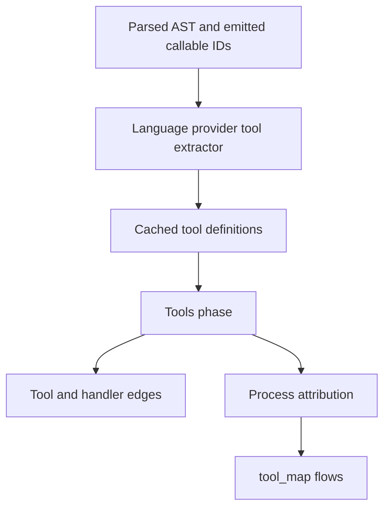

# MCP positional tool discovery - Plan

## Goal Capsule

- Objective: Make SDK tool registrations visible to agents through `tool_map`, with accurate metadata and supported handler attribution.
- Authority: [Issue #3446](https://github.com/abhigyanpatwari/GitNexus/issues/3446), repository guardrails, then this plan.
- Execution: Implement and verify locally; LFG owns review, commits, push, PR creation, and CI follow-up.
- Stop conditions: An unresolved repository guardrail or evidence that invalidates the discovery contract.

---

## Product Contract

### Summary

Discover positional MCP tool registrations in JavaScript and TypeScript through the existing parse pipeline. Preserve object-form tool manifests and Python decorator discovery.

### Problem Frame

The tools phase searches for a `name:` property followed by `description:`. SDK registrations pass the name as a positional argument, so an MCP server can index successfully while `tool_map` reports zero tools.

### Requirements

**Discovery**

- R1. Discover static-name SDK `registerTool(name, config, handler)` calls in parsed JS/TS files, including `src/server.ts`, without requiring `inputSchema` or a description.
- R2. Discover legacy SDK `.tool(...)` overloads with an optional positional description and the callback last.
- R3. Read only static names and top-level description values belonging to the registration; ignore comments, string decoys, dynamic names, and unrelated receivers.
- R4. Preserve existing tool-name deduplication, object manifests, Python decorators, and the public `tool_map` response shape.

**Attribution and cache correctness**

- R5. Link a supported named handler to its existing graph node only when its lexical binding is established; unresolved registrations must not acquire unrelated same-file flows.
- R6. Cold and warm parsing must produce equivalent tool definitions and graph edges after this extraction change.

### Scope Boundaries

Runtime evaluation, wrapper/factory inference, cross-file handler resolution, synthesized anonymous callback nodes, and multi-server tool namespaces are outside this fix. Legacy object-manifest heuristics retain their current behavior.

---

## Planning Contract

### Key Technical Decisions

- KTD1. **Use a language provider hook.** Add AST extraction beside existing provider extraction hooks, implemented in the TypeScript language directory and shared by the JS provider. This follows the language-agnostic shared-ingestion rule and avoids another bounded regex that can cross argument boundaries. Governs R1–R3.
- KTD2. **Require direct SDK receiver evidence.** Support imported `McpServer` aliases, local constructor instances, and directly typed helper parameters. Resolve evidence lexically; a nearer conflicting binding cancels outer evidence. Do not infer arbitrary methods named `tool` or `registerTool` are MCP registrations. Governs R3.
- KTD3. **Use existing callable identities.** Pass an ephemeral declaration-name AST-ID to emitted graph-ID map into the hook, following the worker's `classOwnersByNodeId` pattern. Resolve only immutable local callable bindings or function declarations with unambiguous lexical ownership; parameters, imports, mutations, and unsupported forms remain unresolved. Governs R5.
- KTD4. **Keep uncertainty visible through absent flows.** Unresolved positional handlers retain the existing File-level `HANDLES_TOOL` fallback, but carry an internal opt-out from file-based process attribution. Preserve the legacy manifest fallback. No public API or graph schema change is needed. Governs R4–R5.
- KTD5. **Reuse the toolDefs cache channel.** The worker is the sole parse path, and cached results already serialize `toolDefs`. Advance the parse-cache schema bump and its pin test; no alternate parsing path or second serialization format is needed. Governs R6.

### High-Level Technical Design

### Assumptions

The issue's related legacy-overload and filename gaps belong in the same fix. Static registration metadata is sufficient; dynamic expressions remain outside the indexer's proof. SDK evidence includes the v1 package used by the issue; no dependency upgrade is required.

### Sources and Risks

- Evidence pin: `412446408d0e3f286b9e461fc451c25bf6283b3c`.
- `gitnexus/src/core/ingestion/pipeline-phases/tools.ts` owns graph emission and legacy manifests.
- `gitnexus/src/core/ingestion/languages/typescript.ts` intentionally omits unnamed call-argument functions from callable definitions.
- `gitnexus/src/core/ingestion/route-extractors/data-route-table.ts` provides reusable decoded literal helpers.
- [SDK v1 server reference](https://ts.sdk.modelcontextprotocol.io/server.html) and the installed SDK declaration overloads establish optional configuration fields and callback positions.
- Receiver/handler shadowing is the main false-positive risk; lexical negative cases are required.
- Existing caches omit these registrations. A unique schema bump prevents stale tool results.

---

## Implementation Units

### U1. Extract SDK registration metadata from ASTs

**Goal:** Implement R1–R3 through KTD1–KTD2.

**Dependencies:** None.

**Files:** `gitnexus/src/core/ingestion/languages/typescript/tool-definitions.ts`; `gitnexus/test/unit/typescript-tool-definitions.test.ts`.

**Approach:** Reuse literal decoding; collect direct SDK bindings with lexical ownership, inspect registration argument structure, and return existing tool-definition records. Metadata extraction must not depend on property order or text-distance limits.

**Execution note:** Start with the issue reproducer and negative extraction cases before implementation.

**Test scenarios:**

1. Modern TS and JS registrations in ordinary server filenames return the positional name and description.
2. Empty config and absent schema/description remain discoverable.
3. Legacy overloads with descriptions, schemas, annotations, and callback-last return the correct metadata.
4. Quoted keys, static templates, escaped strings, punctuation, and long/reordered config objects remain bounded to the correct call.
5. Nested schema descriptions do not substitute for the tool description.
6. Dynamic names, interpolated templates, comments, string decoys, unrelated methods, and shadowed SDK/receiver bindings produce no false tools.

**Verification:** Focused tests exercise real TS and JS ASTs and match exact extracted records.

### U2. Integrate discovery and conservative handler attribution

**Goal:** Connect U1 to the pipeline and satisfy R4–R5 through KTD3–KTD4.

**Dependencies:** U1.

**Files:** `gitnexus/src/core/ingestion/language-provider.ts`; `gitnexus/src/core/ingestion/languages/typescript.ts`; `gitnexus/src/core/ingestion/workers/parse-worker.ts`; `gitnexus/src/core/ingestion/pipeline-phases/tools.ts`; `gitnexus/src/core/ingestion/pipeline-phases/processes.ts`; `gitnexus/test/unit/tool-process-linking.test.ts`; `gitnexus/test/integration/resolvers/typescript-mcp-tools.test.ts`; `gitnexus/test/fixtures/lang-resolution/typescript-mcp-tools/`.

**Approach:** Invoke the provider once after callable captures, append to worker `toolDefs`, and reuse existing tools-phase graph emission. Carry unresolved registration attribution into the process phase without altering legacy manifests.

**Patterns to follow:** Existing decorator extraction hooks, `classOwnersByNodeId`, and `python-mcp-tools.test.ts`.

**Test scenarios:**

1. A real pipeline run finds positional and object-form tools together and preserves descriptions.
2. Two named handlers in one file each receive their own HANDLES_TOOL edge and execution flow.
3. Inline or imported callbacks remain discoverable without fabricated handler or unrelated flow attribution.
4. Shadowed, ambiguous, mutable, or noncallable handler bindings do not resolve to an outer same-name function.
5. Existing Python decorator, manifest, and tool-process tests retain their behavior.
6. Existing `tool_map` reads persisted names, paths, descriptions, and flow links without a response-contract change.

**Verification:** Integration assertions inspect actual graph nodes and edges; consumer coverage checks `tool_map` where the existing backend harness permits it.

### U3. Invalidate and verify cached tool extraction

**Goal:** Satisfy R6 through KTD5.

**Dependencies:** U2.

**Files:** `gitnexus/src/storage/parse-cache.ts`; `gitnexus/test/unit/incremental-parse-cache.test.ts`; `gitnexus/test/integration/resolvers/typescript-mcp-tools.test.ts`.

**Approach:** Advance the current schema bump from 125, rechecking upstream for collisions before shipping. Use the existing pipeline cache test patterns.

**Test scenarios:**

1. A warm-cache run retains registration metadata, handler identities, and unresolved-attribution policy.
2. The prior cache version is rejected.
3. Focused parser and tool-process suites remain green after cache changes.

**Verification:** Cold and warm graph outputs agree for the fixture.

---

## Verification Contract

Run the focused extraction, pipeline, process-linking, Python MCP, and cache tests under `gitnexus/`, then `npm test` and `npx tsc --noEmit`. Build the CLI to exercise the issue reproducer through analyze and `tool_map`. Run repository-required upstream impact analysis before symbol edits and graph change analysis before commits. Document environment failures separately from behavioral failures.

## Definition of Done

The issue reproducer exposes both registration forms; the scoped legacy and metadata cases pass; handler links and absent flows reflect supported evidence; caches preserve the same output; and existing discovery remains compatible. The final diff contains no abandoned experiments, unrelated formatting, or dependency changes. LFG produces an open PR with verification evidence and a CI outcome.
