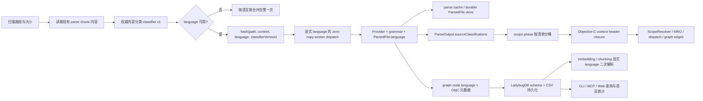

# Objective-C 核心语言支持：生产级技术设计与验收计划

> 状态：设计评审完成；生产代码尚未开始
> 评审日期：2026-08-03
> 仓库证据基线：`561f913a32b9cd515f76756c447beb5c721bd424`
> grammar 初始准入候选：`tree-sitter-grammars/tree-sitter-objc@181a81b8f23a2d593e7ab4259981f50122909fda`
> 实施原则：TDD、最小共享接口、失败关闭、无运行时下载、非 Objective-C 图零回归

## 1. 执行结论

方案技术上可行，推荐进入 **P0 grammar 准入验证**，但在 P0 全部硬门槛通过前，
不得开始大规模 Provider 与 ScopeResolver 实现，也不得对外宣称 Objective-C 已受支持。

最终方案不是“给 `.m` 增加一个扩展名映射”，而是以下四项组合：

1. 内容感知、结果显式传递的源文件分类器，解决 `.h` 的 C/C++/Objective-C 归属和
   `.m` 的 Objective-C/MATLAB 冲突。
2. 独立 `objectiveCProvider` 与 `objectiveCScopeResolver`，通过现有
   `LanguageProvider` / `ScopeResolver` 扩展点接入，不在共享 ingestion 代码中加入语言分支。
3. 从现有 C 实现中提取小型 C-family capture/resolve primitives，保证 Objective-C 文件内
   的 C 声明、函数、调用、静态链接和 include 行为与 C 基线一致。
4. 将语言归属、selector、声明角色和 category 元数据贯穿 worker、缓存、ParsedFile、
   LadybugDB、embedding 二次解析和 Web 展示，避免冷缓存、热缓存和查询结果不一致。

本设计覆盖已知架构决策、数据契约、失败路径、供应链、测试、验收、发布和回滚。
剩余不确定性仅来自 grammar 在真实 corpus 和六个平台上的实测结果，由 P0 硬门槛关闭，
不属于尚未决定的架构问题。

## 2. 目标、范围与边界

### 2.1 目标

- 稳定索引 `.m` 和包含 Objective-C 语义的 `.h`。
- 抽取并关联 class、protocol、category/class extension、property、ivar、method、block、
  C 声明、import/include、继承和 protocol adoption。
- 使用完整 selector 和方法种类建立稳定身份，支持静态可确定的 message dispatch。
- 保证声明/实现、category/宿主类、protocol/实现类在跨文件图中可追踪。
- 在 grammar 缺失、单文件损坏、动态派发或 import 多义时安全降级，不污染其他语言图。
- 通过单元、集成、缓存一致性、六平台安装和真实项目 corpus 验收后进入 production 状态。

### 2.2 本阶段包含

- Objective-C 2.0 核心源码语法：`@interface`、`@implementation`、`@protocol`、
  category、class extension、实例/类方法、property、ivar、blocks、literals、message expression。
- `#import`、`#include`、`@import` 的捕获与项目内确定性解析。
- 单继承、protocol adoption、protocol inheritance、required/optional protocol method。
- ARC/nullability/lightweight generics 等类型修饰符的保留和粗粒度规范化。
- `NS_ENUM`、`NS_OPTIONS`、availability/nullability 宏周边的容错解析。
- property getter/setter、`@synthesize`、`@dynamic` 和 dot syntax 的静态图语义。
- 冷缓存、热缓存、增量、embedding 和 Web/API 语言展示的一致性。

### 2.3 明确不包含

- `.mm` Objective-C++；`.mm` 保持未支持并给出一次明确诊断，不提前按纯 C++ 解析。
- Swift bridging header、generated `-Swift.h`、`@objc` Swift 名称映射和跨语言派发。
- Storyboard/XIB、UIKit 页面跳转、IBOutlet/IBAction、通知/KVO 等应用框架语义。
- 完整 Xcode build-setting 求值、target membership、module map、header map 和编译配置矩阵。
- Clang 级宏展开、条件编译求值、模板化 SDK overlay 或编译器完全一致的类型检查。
- Objective-C CFG/PDG visitor；本阶段只交付稳定 AST、符号、关系和调用图。
- runtime method resolution、swizzling、KVC 字符串派发、`performSelector:`、裸
  `objc_msgSend` 参数解码等运行时动态行为。

这些边界不阻止后续 iOS 全语义支持；它们使本阶段保持可验证、可发布，并为
Objective-C++、Swift 混编和 UIKit 语义提供可靠底座。

## 3. 现有架构审计与约束

| 现状 | 代码位置 | 对设计的约束 |
| --- | --- | --- |
| 文件语言由扩展名唯一决定，`.h` 当前归 C++ | `gitnexus-shared/src/language-detection.ts` | 文件名判断只能作为扫描候选，不能继续作为解析事实 |
| Provider 的扩展名表是一扩展名一 Provider，后写覆盖前写 | `gitnexus/src/core/ingestion/languages/index.ts` | 不能让 Objective-C 与 C++ 同时注册 `.h` |
| parse 主线程在读取内容前按文件名过滤 grammar | `pipeline-phases/parse-impl.ts` | 分类必须移动到内容读取后、缓存计算和 worker dispatch 前 |
| worker 再次按文件名分组 | `workers/parse-worker.ts` | worker 必须信任显式 `language`，禁止重新推断 |
| zero-copy IPC 只保留 `path/content` | `workers/worker-pool.ts` | `buildDispatchMessage` 与 `decodeSubBatchFiles` 必须显式透传 `language` |
| chunk hash 仅包含路径与内容 hash | `storage/parse-cache.ts` | language 与 classifier version 必须进入缓存键，并提升 schema |
| `ParsedFile` 不保存语言 | `gitnexus-shared/src/scope-resolution/parsed-file.ts` | 需要新增语言字段，生产产物强制赋值 |
| scope phase 再按文件名重分桶 | `scope-resolution/pipeline/phase.ts` | 必须消费 parse 输出的权威分类清单 |
| embedding 会按文件名重新选 parser/provider | `embeddings/ast-utils.ts`、`structural-extractor.ts` | 持久化语言并显式传入二次解析；片段内容不能重新分类 |
| LadybugDB CSV/schema 丢弃 node 上的 `language` 和多数 method 元数据 | `core/lbug/schema.ts`、`csv-generator.ts` | 需要同步 schema、CSV、查询类型和增量 schema version |
| 图 node id 含文件路径，MethodRegistry 以 `ownerId + methodName` 为键 | `graph-bridge/ids.ts`、`model/method-registry.ts` | 头声明与实现不能合并节点；方法名必须区分类/实例方法 |
| 同文件同 qualified name/arity 会共享当前 graph id | `parse-worker.ts`、`graph-bridge/node-lookup.ts` | 主类、extension、category 需要额外 source identity，不能靠名称 fallback |
| Class registry 允许同名/同 qualified name 多定义 | `model/type-registry.ts` | 可用逻辑 owner 汇总多个 source-site class，再确定性选择实现 |
| `resolveReceiverMember` 不参与 class-name receiver Case 2 | `receiver-bound-calls.ts` | 共享 hook 需做最小、向后兼容的调用点扩展 |
| `CodeElement` 不是可派发 owner | `graph-bridge/node-lookup.ts` | category 仅作来源容器，派发 owner 必须是宿主 Class |
| worker 在 N-API 调用中被 terminate 会导致进程 abort | `GUARDRAILS.md`、`worker-pool.ts` | 新 grammar 必须沿用 safe-point drain/unref，禁止新增直接 terminate |

### 3.1 不可变设计约束

1. **一次分类，贯穿全链路。** 同一分析运行中，单文件只有一个权威主语言结果。
2. **共享代码不识别语言名。** 语言行为只通过 Provider/Resolver hooks 注入。
3. **source-site 身份与 logical 身份分离。** 图保留源码位置；派发索引使用逻辑键。
4. **不确定即不发边。** 动态 receiver、多实现或 import 多义不写猜测 `CALLS`/`IMPORTS`。
5. **运行时不下载。** grammar、binding、许可证和 checksums 随包发布。
6. **非 Objective-C 零回归。** C/C++ 行为变更必须先由 characterization tests 锁定。
7. **缓存必须语义感知。** 会改变 worker 输出或持久图的输入必须进入相应版本键。
8. **原生 worker 安全优先。** 不以强制结束线程处理超时 grammar。

## 4. 方案比较与最终选择

### 4.1 方案 A：仅增加扩展名和独立 Provider

拒绝。它无法处理 `.h` 多语言、`.m`/MATLAB 冲突、scope 重分桶、热缓存、embedding
片段重解析和 category/声明实现身份。该方案只能通过简单 fixture，无法生产使用。

### 4.2 方案 B：以 Clang/SourceKit 作为核心索引器

本阶段拒绝。它能获得更准确的宏、编译参数和类型信息，但会引入 Xcode/SDK/toolchain
依赖、compile database、平台耦合和显著安装成本，与 GitNexus 当前跨平台、可选 native grammar
模型不一致。Clang 可在后续作为可选高精度增强层，不作为本阶段前置条件。

### 4.3 方案 C：内容分类 + vendored Tree-sitter + Provider/ScopeResolver

采用。该方案最大化复用现有 pipeline、C 语义、缓存、worker 和图模型，同时把
Objective-C 的 selector、message dispatch、category/protocol 语义限制在语言模块内。

### 4.4 方案 D：所有 `.h` 同时用 C++ 与 Objective-C 双解析

拒绝作为主路径。全量双解析放大 CPU、native 内存和重复符号问题，且无法解决哪个结果进入
cache/scope/embedding。仅在 Objective-C scope context 中，对被 Objective-C 文件传递依赖的
纯 C header 做一次临时 Objective-C grammar 解析；这是一条受限、可度量的上下文路径。

## 5. 目标数据流



## 6. 源文件语言分类

### 6.1 API 与数据契约

新增枚举值固定为 `SupportedLanguages.ObjectiveC = 'objective-c'`；CLI/API 持久化使用
`objective-c`，用户展示名为 `Objective-C`，Prism syntax id 单独映射为 `objectivec`，vendor
package 名保持 `tree-sitter-objc`。四个名称不得互相代替。

```ts
export const SOURCE_LANGUAGE_CLASSIFIER_VERSION = 1 as const;

export interface SourceLanguageProjectContext {
  readonly hasXcodeProject: boolean;
}

export interface SourceLanguageClassification {
  readonly language: SupportedLanguages | null;
  readonly confidence: number;
  readonly reason:
    | 'fixed-extension'
    | 'objective-c-syntax'
    | 'xcode-context'
    | 'c-family-header-fallback'
    | 'matlab-syntax'
    | 'ambiguous-m'
    | 'unsupported-objective-cpp';
  readonly classifierVersion: typeof SOURCE_LANGUAGE_CLASSIFIER_VERSION;
}

export type SourceLanguageFilenameCandidate =
  | {
      readonly kind: 'language';
      readonly language: SupportedLanguages;
      readonly requiresContentClassification: boolean;
    }
  | {
      readonly kind: 'unsupported';
      readonly reason: 'objective-cpp';
    };

export function getLanguageCandidateFromFilename(
  filePath: string,
): SourceLanguageFilenameCandidate | null;

export function classifySourceLanguage(input: {
  readonly filePath: string;
  readonly content: string;
  readonly projectContext: SourceLanguageProjectContext;
}): SourceLanguageClassification;
```

无歧义扩展名返回 `kind=language/requiresContentClassification=false`；`.h/.m` 返回相应语言候选
但标记 `true`；`.mm` 返回 `kind=unsupported`，因此既不会误入 C++，也能进入聚合诊断。
`getLanguageFromFilename` 在一个兼容周期内保留，语义明确为“文件名语言候选”，内部委托新 API，
只对 `kind=language` 返回 language。parse、scope、embedding 和 PDG semantic paths 必须迁移到
权威分类或持久化语言；CI 用调用点白名单阻止新的语义路径继续使用文件名推断。

扩展名比较沿用现有小写规范化：`.M` 与 `.m` 走同一歧义分类规则，`.MM` 与 `.mm` 一样明确
跳过；路径本身保留真实大小写用于文件定位和图身份。

分类清单的 key 与 `ScannedFile.path` 完全一致：repo-relative、`/` 分隔、无 `.`/`..` 段、保留
实际大小写。任何绝对路径或越出 repo root 的路径在进入分类前拒绝。

### 6.2 项目上下文

`hasXcodeProject` 仅由扫描路径中存在 `*.xcodeproj/project.pbxproj` 得出。分类阶段不解析
pbxproj，不读取 target membership，也不依赖 Git 状态或文件遍历顺序。该信号只用于没有
Objective-C/MATLAB 直接证据的 `.m`。

### 6.3 确定性分类矩阵

| 输入 | 规则 | 结果 | confidence |
| --- | --- | --- | ---: |
| 非 `.h/.m/.mm` 的已支持扩展名 | 现有固定映射 | 原语言 | 1.00 |
| `.mm` | 本阶段明确未支持 | `null` | 1.00 |
| `.h` 有 Objective-C 主信号 | 内容证据优先 | Objective-C | 0.99 |
| `.h` 无 Objective-C 主信号 | 保持现有基线 | C++ | 0.80 |
| `.m` 有 Objective-C 主信号 | 内容证据优先 | Objective-C | 0.99 |
| `.m` 有 MATLAB 主信号或至少两类独立次信号 | 防止误入图 | `null` | 0.99 |
| `.m` 无直接证据且存在 Xcode 工程 | 项目上下文 | Objective-C | 0.90 |
| `.m` 无直接证据且无 Xcode 工程 | 冲突无法安全判定 | `null` | 0.50 |

confidence 只用于诊断和评估，不参与后续分支；相同输入必须得到相同语言。

### 6.4 信号定义

分类器先以等长空白替换注释、字符串和字符字面量，保留所有字节长度与换行位置；
preprocessor directive 在单独扫描通道中保留。不得使用会改变 offset 的通用预处理器。

Objective-C 主信号：

- `@interface`、`@implementation`、`@protocol`、`@class`、`@property`。
- `@selector`、`@encode`、`@autoreleasepool`、`@synchronized`、`@try`、`@catch`。
- 行首允许空白后的 `- (` 或 `+ (` 方法签名。
- preprocessor 行首的 `#import`，以及模块形式的 `@import`。

MATLAB 主信号：

- 行首允许空白后的 `function` 或 `classdef`。

MATLAB 次信号按类别计数，至少命中两个不同类别才拒绝：

- `%` 行注释或 `%{ ... %}` 块注释。
- `...` 行续接。
- 行首的 MATLAB 控制关键字与配对 `end`。
- 矩阵/逐元素运算的稳定组合特征。

Objective-C 主信号优先于 MATLAB 次信号；MATLAB 主信号优先于 Xcode 上下文。注释和字符串
中的伪关键字不得影响分类。

### 6.5 分类生命周期与进度

1. 扫描阶段用候选 API 选择需要读取的路径，`.h/.m` 都进入候选集，`.mm` 进入未支持统计。
2. `parse-impl` 在现有 chunk 内容读取后分类，不增加第二次整文件 I/O。
3. 分类为 `null` 或 grammar 不可用的文件计入 `classified/skipped`，不计入 worker `fileCount`。
4. 同一语言的 unavailable/skip 告警每次运行只输出一次，包含文件数和修复提示。
5. Objective-C grammar 不可用时，经内容分类为 Objective-C 的 `.h` 不回退到 C++，以免产生
   看似成功但语义错误的图。

## 7. Worker、缓存与 ParsedFile 一致性

### 7.1 IPC 契约

```ts
export interface ParseWorkerInput {
  readonly path: string;
  readonly content: string;
  readonly language: SupportedLanguages;
}
```

- `buildDispatchMessage` 将 `language` 与 `path` 一起复制，只有 content 转为 transferable
  `Uint8Array`。
- `decodeSubBatchFiles` 恢复 content 时保留 language。
- worker 直接按 `file.language` 分组；禁止调用 `getLanguageFromFilename(file.path)`。
- `setLanguage` 仍允许 TypeScript 根据 `.tsx` 选择 grammar 子键；这是同一语言内 grammar variant，
  不重新决定文件语言。
- worker grammar table 对 Objective-C 使用 guarded lazy load，缺失不允许在模块加载阶段崩溃。

### 7.2 ParsedFile 与 ParseOutput

```ts
export interface ParsedFile {
  readonly language?: SupportedLanguages;
  // existing fields...
}

export interface ParseOutput {
  readonly parsedFiles: readonly ParsedFile[];
  readonly sourceClassifications: ReadonlyMap<string, SourceLanguageClassification>;
  // existing fields...
}
```

`ParsedFile.language` 为可选只用于保持手写历史 fixture 的类型兼容；所有生产 tree-sitter
Provider 产物必须赋值，parsedfile-store validator 对新 schema 中缺失 language 的生产 shard
判为无效。standalone Provider 可在迁移完成前使用文件名固定映射填充。

scope phase 必须按 `sourceClassifications` 分桶。warm-cache 命中仍在主线程对当前内容执行分类，
因此分类清单始终存在；cached ParsedFile 的 `language` 必须与清单相同，否则视为 cache miss。

`ImportTargetWorkspace` 同步保存只读 `sourceLanguages`，
`resolveImportTargetAcrossLanguages` 先按 `fromFile` 查询该表，再选择 resolver；只允许无歧义扩展名
在缺表的兼容调用中回退文件名。这样 legacy adapter tests 与 registry-primary 主路径得到同一结果。

### 7.3 缓存版本规则

chunk entry 改为：

```ts
{
  filePath: string;
  contentHash: string;
  language: SupportedLanguages;
  classifierVersion: number;
}
```

hash 串包含四项并保持路径排序。实施分支在合并前读取主线最新 `SCHEMA_BUMP`，将其递增一次，
不得硬编码本设计审计时的值。以下变化都触发 parse cache 全量失效：

- `ParsedFile.language` 或 annotations sidecar 的序列化形状变化。
- 分类器结果进入 worker 输出。
- Objective-C capture side-channel 的首次引入。

classifierVersion 还防止同一开发版本内规则改变时误用旧 chunk。PDG namespace 键保持独立，
不得把只影响主线程图写入的选项塞进 worker cache key。

### 7.4 Scope context 中的双语 header

Objective-C Resolver 的 `collectScopeContextPaths` 从权威 Objective-C 文件出发，沿项目内
`#import/#include` 做传递闭包，把被引用的纯 C `.h` 加入本次 Objective-C scope pass，即使其
主分类仍是 C++。规则如下：

- 主分类不改变；C/C++ pass 仍使用该 header 的权威 ParsedFile。
- Objective-C context pass 发现 cached `ParsedFile.language !== ObjectiveC` 时，必须绕过该
  ParsedFile，用 Objective-C grammar 在主线程临时重提取。
- 临时结果不覆盖主分类 shard，不写回同一路径的 durable cache。
- Objective-C grammar 继承 C grammar；C AST/capture parity test 保证临时定义能桥接到已存在的
  C/C++ graph node。
- closure 使用 `preExtractedByPath.parsedImports` 继续遍历纯 C header；无法解析的边停止扩展，
  不做 basename 猜测。

## 8. Grammar 准入、供应链与原生安全

### 8.1 已核实的初始候选

| 项 | 证据 |
| --- | --- |
| 上游 | [`tree-sitter-grammars/tree-sitter-objc`](https://github.com/tree-sitter-grammars/tree-sitter-objc) |
| 固定提交 | `181a81b8f23a2d593e7ab4259981f50122909fda`，2025-01-31 |
| npm 元数据 | `tree-sitter-objc@3.0.2`，MIT |
| grammar 结构 | `grammar.js` 通过 `grammar(C, ...)` 扩展 `tree-sitter-c` |
| 生成 ABI | `src/parser.c` 的 `LANGUAGE_VERSION` 为 14 |
| 生成工具链 | `tree-sitter-cli 0.24.5`、`tree-sitter-c ^0.23.4` |
| npm peer | `tree-sitter ^0.22.1` |
| 项目运行时 | 当前固定 `tree-sitter 0.21.1` |
| 上游测试缺口 | 上游仅含复制的 C corpus，没有 Objective-C corpus |
| 上游预编译缺口 | 固定提交不含可验收的六平台 `.node` 产物 |

ABI 14 是必要条件，不足以证明与项目 Node binding `0.21.1` 兼容。npm peer 版本差异是 P0
阻断项，必须由真实 `Parser.setLanguage`、query compile 和 parse smoke 关闭，不能凭版本号推断。

### 8.2 Vendor 决策

- 不新增普通运行时 npm dependency；沿用 `tree-sitter-c/dart/proto/swift/kotlin` 的 vendor 模型。
- 固定并记录 upstream SHA、npm version、license、生成器版本和 `tree-sitter-c` 生成输入。
- 发布 `src/parser.c`、binding 源码、许可证、README/provenance、六平台 prebuilds、
  `SHA256SUMS`；正常 install 不重新生成 parser。
- CI 中的可复现 regeneration 使用固定工具链；生成 diff 必须经人工审查。
- `VENDORED_GRAMMAR_PACKAGES`、build registry、optional grammar CLI、prebuild workflow、
  grammar monitor、publish coverage guard 和打包 files 同步登记 Objective-C。
- 运行时严禁网络下载；无匹配 prebuild 且无本地 toolchain 时仅禁用 Objective-C。
- `GITNEXUS_SKIP_OPTIONAL_GRAMMARS=1` 包含 Objective-C，语义与 Swift/Kotlin/Dart 一致。

### 8.3 六平台矩阵

必须逐项构建、checksum、安装 npm pack 并真实加载：

- `darwin-x64`
- `darwin-arm64`
- `linux-x64`
- `linux-arm64`
- `win32-x64`
- `win32-arm64`

每个平台 smoke 必须使用项目固定的 `tree-sitter 0.21.1`，执行：require binding →
`Parser.setLanguage` → 编译全部 C + Objective-C queries → 解析最小 `.h/.m` → 验证根节点和关键
node type → worker dispatch/flush。只检查文件存在不计为通过。

### 8.4 原生 worker 安全

- 不增加任何 `worker.terminate()` 快捷路径。
- 复用现有 safe-point、shutdown drain、timeout quarantine、unref 和 circuit breaker。
- 新增 grammar stall fixture，验证 worker 超时后主进程不 abort、其他语言任务可完成。
- 连续加载/解析/销毁压力测试不少于 1,000 文件和 100 个 worker job，RSS 在预热后不得持续
  线性增长。

### 8.5 P0 失败策略

以下任一项失败即停止 Provider 开发：

- 任一六平台 tuple 无法构建或加载。
- project runtime `tree-sitter 0.21.1` 无法安全 `setLanguage`。
- 核心 query 无法在 pinned grammar 编译。
- 真实 corpus 的 fatal parse 或 ERROR byte ratio 未达第 17 节门槛。
- 许可证、来源、checksum 或 npm pack coverage 不完整。

失败后只允许在隔离 spike 中更换/修补 grammar；不得为 Objective-C 单独推动全项目
tree-sitter 大版本升级。若最终必须升级 runtime，应作为独立、全语言回归项目重新评审。

## 9. C-family 复用设计

上游 Objective-C grammar 直接扩展 C grammar，C node types 保持存在，因此选择组合而不是复制。

### 9.1 要提取的最小共享接口

1. 从 `languages/c/query.ts` 导出 `C_SCOPE_QUERY_SOURCE`。
2. 将 `emitCScopeCaptures` 拆为：
   - C wrapper：负责 C parser/query 获取，外部行为不变。
   - `processCFamilyScopeMatches`：消费已经执行的 matches，负责 C declarations、imports、
     arity、type bindings、references、callable-flow 和 static linkage 标记。
3. Objective-C 模块用 Objective-C grammar 编译
   `C_SCOPE_QUERY_SOURCE + OBJECTIVE_C_SCOPE_QUERY_SOURCE`，再调用同一 match processor 和
   Objective-C postprocessor。
4. side-channel 使用语言私有组合对象：

```ts
interface ObjectiveCCaptureSideChannel {
  readonly cStatic: CCaptureSideChannel;
  readonly objectiveC: ObjectiveCSideChannel;
}
```

共享 pipeline 只传递 `unknown`，不解析其中字段。

### 9.2 可直接复用

- C class/type/field/variable/function extractors针对实际 C AST 节点的行为。
- C include、free function call、arity、builtins、export 和 file-local `static` 规则。
- `allowGlobalFreeCallFallback`、`isFileLocalDef`、C callable-flow primitives。

### 9.3 必须由 Objective-C 自己实现

- interface/implementation/protocol/category/property/ivar/method/message captures。
- selector normalization、receiver kind、`self/super`、protocol/category MRO。
- Objective-C import target 和 context header closure。
- declaration/implementation/category source-role side-channel。
- property accessor、subscript sugar和 Objective-C blocks 的补充语义。

### 9.4 C 基线保护

在提取共享接口前先建立 C characterization goldens。重构后以下输出必须 byte-equivalent：

- C query captures。
- 节点 id、标签、名称、arity、static、declaredType。
- `DEFINES/HAS_PROPERTY/CALLS/IMPORTS`。
- C static linkage side-channel。
- 冷/热 cache ParsedFile JSON。

Objective-C grammar 对纯 C fixture 也必须产生相同的 C-family captures；差异必须有逐项白名单和
语言理由，不能以整文件 golden 更新掩盖。

## 10. Objective-C Provider 结构

新增结构：

```text
gitnexus/src/core/ingestion/languages/
├── objective-c.ts
└── objective-c/
    ├── query.ts
    ├── captures.ts
    ├── interpret.ts
    ├── selector.ts
    ├── method-extractor.ts
    ├── field-extractor.ts
    ├── call-extractor.ts
    ├── import-decomposer.ts
    ├── import-target.ts
    ├── capture-side-channel.ts
    ├── receiver-member.ts
    ├── mro.ts
    ├── scope-resolver.ts
    └── index.ts
```

文件可在实现时按职责合并，但不允许形成一个同时处理 query、身份、import 和分派的巨型模块。

### 10.1 Provider 组合

- `id = SupportedLanguages.ObjectiveC`。
- `treeSitterQueries = C_QUERIES + OBJECTIVE_C_QUERIES`。
- C AST 节点使用 C extractors；Objective-C AST 节点使用专用 extractors。
- call extractor 同时处理 `call_expression` 和 `message_expression`。
- export 对项目内 Objective-C 类型/方法按头文件公开声明判定；`.m` 私有定义不自动 exported。
- preprocessing 只允许等长、保换行的宏兼容修复。
- Objective-C 模式可确定 `__cplusplus=false`：对结构平衡的 `#ifdef __cplusplus`、
  `#if defined(__cplusplus)` 及其 `#else/#endif` 做等长 branch masking，保留 Objective-C 分支和
  公共声明。未知条件、嵌套表达式或不平衡 directive 不求值；该规则不把 `.mm` 伪装成 `.m`。

### 10.2 需覆盖的语法实体

| 语法 | 图节点/事实 |
| --- | --- |
| `@interface Foo : Bar <P>` | Class、EXTENDS、IMPLEMENTS |
| `@implementation Foo` | 独立 Class implementation source-site |
| `@protocol P <Q>` | Interface、protocol inheritance、required/optional methods |
| `@interface Foo (Cat)` | CodeElement category + host Class anchor |
| `@interface Foo ()` | CodeElement class-extension + host Class anchor |
| `@property (...) T name` | Property、attributes、getter/setter declarations |
| ivar block | Variable + declaredType + HAS_PROPERTY |
| `-` / `+` method | Method、signed selector、参数/返回类型、sourceRole |
| block typedef/variable/literal | Typedef/Variable/anonymous Function/callable-flow facts |
| `#import/#include/@import` | ParsedImport + deterministic target/unresolved |
| message expression | signed selector Callsite + receiver facts |
| `@selector(name:)` | selector reference fact，不产生 CALLS |
| dot syntax | Property ACCESSES read/write，不重复生成 accessor CALLS |
| Objective-C subscripting | 候选 selector，唯一匹配时生成 CALLS |

Foundation/UIKit 等外部 SDK 未随仓库提供源码时保留 unresolved import/type/call，不创建伪 SDK
实现节点。

### 10.3 Blocks

- block typedef、变量、property、参数和返回类型保留 `returnType + parameterTypes + variadic` 的
  callable signature；`void (^)(Item *)` 不降级为无类型变量。
- block literal 生成位置稳定的匿名 Function，identity 使用现有 row/column local identity；
  block 内调用的 sourceId 指向该 Function，不错误归到外层 Method。
- block 赋值、参数传递和返回进入现有 callable-flow captures；只有赋值链能唯一指向本地 block/
  function 时才生成 invocation CALLS。
- `__weak`、`__strong`、`__block` 保存为 annotation/type qualifier；本阶段不推断 retain cycle。
- 外部 API 回调、escaping 生命周期和 GCD runtime 调度保持 unresolved/runtime boundary。

### 10.4 类型规范化

- 原始类型文本完整保留；lookup key 去除 pointer、nullability、covariant/contravariant 和轻量
  generics 外壳，仅保留可解析 base type 与协议约束。
- `instancetype` 在实例/类方法 return propagation 中绑定当前 logical owner。
- `id<P>` 规范为 protocol-constrained dynamic type；可调用唯一 protocol contract，但不声称唯一
  concrete implementation。裸 `id` 始终动态。
- `Class<Foo>` 规范为 Foo 的 class-object receiver；裸 `Class` 始终动态。
- `SEL`、`Protocol *`、`BOOL`、`NSInteger` 等平台 typedef 在无 SDK 源码时视为 builtin/type leaf，
  不创建伪定义。

## 11. 符号身份与图模型

### 11.1 Source-site 与 logical identity

现有 graph id 包含 `filePath`，因此头文件声明和实现文件定义天然是不同节点。保留这一事实，
另建不进入 graph id 的逻辑键：

```text
keyV1(parts)            = "objc:v1:" + canonicalJsonArray(parts)
class declarationKey   = keyV1(["type", className])
protocol declarationKey= keyV1(["protocol", protocolName])
method declarationKey  = keyV1(["method", logicalOwner, declarationScope, signedSelector])
method dispatchKey     = keyV1(["dispatch", logicalOwner, signedSelector])
property declarationKey= keyV1(["property", logicalOwner, declarationScope, propertyName])
category declarationKey= keyV1(["category", host, categoryOrExtension])
sourceIdentity         = keyV1(["source", label, owner, declarationScope, sourceRole, member])
```

Objective-C 没有源代码 namespace；本阶段 logical owner 使用规范化 class/protocol 名称。空白、
generics、pointer/nullability 修饰不进入 owner key。主 interface/implementation 与 class extension
的 `declaration-scope` 都规范为 `<primary>`，因为 extension 中声明的方法由主 implementation
实现；命名 category 使用 category 名。这样 declarationKey 只连接对应声明/实现，dispatchKey
仍能把所有 category 方法纳入宿主类派发集合。

`canonicalJsonArray` 使用固定数组顺序和标准 JSON escaping；每个 identifier/selector 先做 Unicode
NFC，不做大小写转换。该编码不含 NUL 等控制分隔符，可安全进入 JSON、structured clone、CSV 和
LadybugDB。版本前缀保证未来规则变化能显式迁移。

`sourceIdentity` 是源码实体精确身份：member 对方法为 signed selector，对 type/property 为名称。
graph id 在现有 qualified/arity 后追加完整的 `~src:<sha256(sourceIdentity)>`；node 的
name/qualifiedName 仍为逻辑名称。合法代码中的主声明、主实现、extension 和各 category 因
scope/role 不同而不碰撞。
同一 sourceIdentity 在同一文件重复出现属于重复源码，预扫描以 `@row:column` 作为仅冲突时的
稳定后缀并记录 duplicate 诊断，不允许 first-write-wins 覆盖。

`SymbolDefinition.sourceIdentity` 与 graph node property 使用同一 Objective-C utility 生成。
`buildGraphNodeLookup` 增加语言无关的 source-identity key，`resolveDefGraphId` 在 position/name fallback
前先做精确 join；现有语言不设置该字段时行为不变。generic id parser 同时剥离 `~src:` tag，避免
逻辑 qualified-name fallback 被物理身份污染。

### 11.2 方法名称

图和 MethodRegistry 中的 `Method.name` 直接使用 Objective-C 习惯的 signed selector：

- `-save:completion:`：实例方法，selector=`save:completion:`，arity=2。
- `+sharedInstance`：类方法，selector=`sharedInstance`，arity=0。

selector 中冒号数量等于固定参数数量；variadic 尾参数由 `parameterTypes` 的 `...` 和
arity compatibility 处理。使用 signed name 可在不改 MethodRegistry key 结构的情况下，保证
类方法与实例方法永不碰撞。

`@class Foo;` 与 forward `@protocol P;` 生成轻量 Class/Interface source-site，标记
`objc:site:forward-declaration`。它们参与类型名和 declaration linking，但没有成员、继承或
implementation 优先级，永不单独作为 CALLS target。

### 11.3 Source role 元数据

扩展 `SymbolDefinition`，传递现有 worker 已具备但当前丢弃的通用字段：

```ts
interface SymbolDefinition {
  readonly isStatic?: boolean;
  readonly annotations?: readonly string[];
  readonly sourceIdentity?: string;
}
```

`ScopeExtractor` 新增 `@declaration.is-static`、`@declaration.annotations` 与
`@declaration.source-identity` 解析，
`parsing-processor` 将 worker symbol 上的 `isStatic/annotations/sourceIdentity` 转交
SymbolTable。共享代码只运输通用字段；Objective-C Provider 拥有以下 tag 词汇：

- `objc:site:declaration`
- `objc:site:implementation`
- `objc:site:synthesized`
- `objc:site:category-host`
- `objc:site:forward-declaration`
- `objc:method-kind:class` / `objc:method-kind:instance`
- `objc:owner:<name>`
- `objc:category:<name>` / `objc:class-extension`
- `objc:protocol:required` / `objc:protocol:optional`
- `objc:property:dynamic`

### 11.4 声明与实现关系

- 头 Class declaration → `.m` Class implementation：`DECLARES`，reason
  `objective-c: declaration-to-definition`。
- 头 Method declaration → `.m` Method implementation：同类型 `DECLARES`。
- Property/accessor declaration → synthesized 或显式 implementation：`DECLARES`。
- `IMPLEMENTS` 只表示 Class/Interface 对 protocol 的 adoption。
- `METHOD_IMPLEMENTS` 只表示 concrete method 对 protocol method contract 的实现。
- `DEFINES` 继续表示 File/Scope 对源码节点的结构归属，不承担声明实现匹配。

`emitHeritageEdges` 在共享 `buildMro` 之前，把唯一匹配 interface declaration 上的 `EXTENDS` 和
`IMPLEMENTS` 镜像到 implementation Class source-site；否则 concrete methods 的 `super` 和
protocol dispatch 会看不到继承链。多个声明给出冲突 superclass/protocol 集合时记录 ambiguity，
不按文件顺序选择。implementation 源码显式写出的 superclass 必须与声明一致，否则不发冲突边。

声明/实现匹配只能按 declarationKey；路径相邻、basename、遍历顺序都不是身份依据。派发候选
按 dispatchKey 聚合。一个 declarationKey 出现多个 concrete implementation，或一个 dispatchKey
出现多个运行时顺序不可判定的 concrete implementation 时记录 ambiguity，不任选一个。

### 11.5 Category 与 class extension

- category/extension 源码实体是 `CodeElement`，保存 `categoryName`、`hostClassName`、
  `sourceRole`。
- 宿主 Class → category CodeElement：`DECLARES`，reason `objective-c: category-extension`。
- category CodeElement → category Method：`DECLARES`；为此显式增加
  `FROM CodeElement TO Method` schema pair 和覆盖测试。
- category Method 同时通过 `HAS_METHOD` 归属宿主 Class source-site，派发 owner 不是
  CodeElement。
- category 文件中没有本地 Class 节点时，创建 `sourceRole=category-host` 的 Class anchor；
  它只证明源码声明了宿主名，不产生继承或“类已定义”结论。
- category-host anchor 不作为独立 MRO 根；`self/super` 查找按 logical owner 重定向到唯一主类
  declaration/implementation 的 heritage。主类缺失或 heritage 多义时保持 unresolved。
- unnamed category 规范为 `<extension>`；命名 category 保留原名。
- 同一 signed selector 有多个 concrete category/class implementation 时，运行时 load order
  无法静态确定，CALLS 保持 unresolved/ambiguous。

### 11.6 Protocol

- `@protocol` 使用 Interface。
- required/optional 保存到 method annotation；缺省为 required。
- Class declaration 的 protocol adoption 生成 `IMPLEMENTS`。
- 对应 implementation Class 按第 11.4 节镜像同一 adoption edge，使共享 MRO 能从 concrete
  methods 生成 `METHOD_IMPLEMENTS`。
- protocol inheritance 进入共享 heritage/MRO；同名 contract 多路径合并按 declarationKey 去重。

### 11.7 Property 与 ivar

- `@property` 生成 Property 和 `HAS_PROPERTY`，保留 atomicity、memory ownership、readonly、
  class、nullable、custom getter/setter 等 attributes。
- getter 默认 signed selector 为 `-name`；setter 为 `-setName:`。`class` property 使用 `+`。
- `readonly` 不生成 setter declaration；自定义 `getter=`/`setter=` 覆盖默认 selector。
- property 声明隐含真实 accessor contract，因此生成 `sourceRole=declaration` 的 Method。
- `@synthesize` 在没有显式 accessor implementation 时生成 `sourceRole=synthesized` 的 accessor
  implementation；显式 implementation 优先。
- 主 interface 或 class extension 的 property 在对应 Class implementation 中既无 `@dynamic`、
  又无显式 accessor/`@synthesize` 时，按现代 Objective-C 规则生成
  `sourceRole=synthesized` 的隐式 accessor 和默认 `_name` ivar；显式 backing ivar 或 accessor
  始终优先。protocol-only property 和命名 category property 不自动合成。
- `@dynamic` 只标记 property/runtime 提供，不生成 implementation 或猜测 CALLS target。
- ivar 使用 Variable，class→ivar 使用现有 `HAS_PROPERTY`，读写通过 `ACCESSES`。
- dot syntax 只发 `ACCESSES`，避免同时发 getter/setter CALLS 导致图计数翻倍；显式 message
  expression 正常发 CALLS。

### 11.8 LadybugDB 持久化

File schema/CSV 增加 `language STRING`、`languageReason STRING` 和
`languageClassifierVersion INT32`；parse 分类完成后回填已存在的 File graph node。这样无符号仓库
的 File fallback embedding、语言统计和诊断也使用权威结果。所有 embeddable code node
schema/CSV 同时增加 `language STRING`，包括通用 code-element base 和 Function、Class、
Interface、Method、CodeElement、Property；这些表同时增加通用 `sourceIdentity STRING`，支持
增量加载旧图节点后的精确 scope bridge。Objective-C 额外持久化：

- Class/Interface：`sourceRole`、`declarationKey`。
- Method：`selector`、`isStatic`、`sourceRole`、`declarationKey`、`dispatchKey`、`categoryName`、
  `parameterTypes`、`annotations`。
- Property：`sourceRole`、`declarationKey`、`getterSelector`、`setterSelector`、`annotations`。
- CodeElement：`sourceRole`、`categoryName`、`hostClassName`、`declarationKey`。

CSV header、row serialization、COPY schema、MCP schema resource、Web shared type和查询必须同一
变更完成。提升 `INCREMENTAL_SCHEMA_VERSION`，迫使旧 index 全量重建；不得让新代码读取缺列旧库。

## 12. Message call 与派发算法

### 12.1 Callsite 规范化

| 源码 | Callsite name | receiverKind |
| --- | --- | --- |
| `[Foo shared]` | `+shared` | `class` |
| `[obj save:x completion:y]` | `-save:completion:` | `instance` |
| `[self save]` 位于实例方法 | `-save` | `self` |
| `[self shared]` 位于类方法 | `+shared` | `self` |
| `[super save]` | 与 enclosing method 同号 | `super` |

`receiverName`、显式 type binding、return type chain 和 enclosing method kind 分开保存，不从
selector 大小写或变量命名猜测 receiver kind。

### 12.2 共享 Hook 的最小扩展

在 `resolveReceiverMember` 末尾增加向后兼容的可选 context：

```ts
interface ReceiverMemberContext {
  readonly receiverKind: 'class' | 'instance' | 'self' | 'super';
  readonly receiverName: string;
}
```

现有 resolver 忽略该参数即可。`receiver-bound-calls` 在以下路径先调用 hook，再执行通用 fallback：

- Case 2 class-name receiver。
- `self/this` enclosing-class 路径。
- `super` 路径。
- simple typed receiver 与 compound receiver 路径。

不得加入 `if (language === ObjectiveC)`。

### 12.3 Objective-C 查找

1. 从 receiver type 得到 logical owner；`super` 从 superclass logical owner 开始。
2. `model.types.lookupClassByQualifiedName(logicalOwner)` 取所有 source-site Class。
3. 对每个 owner 用 signed selector 查询 owner-scoped methods，并按 dispatchKey 合并主类与 category。
4. 先按 arity、availability 和 method kind 过滤。
5. 恰有一个 implementation/synthesized definition时返回它。
6. 没有 implementation 但恰有一个 declaration 时返回 declaration，reason 标记
   `objective-c: declaration-target`。
7. 多个 concrete definitions 返回 `ambiguous`；没有候选返回 `undefined`。

### 12.4 静态可确定性

允许发 `CALLS`：

- class name、`self`、`super`。
- 变量/参数有唯一规范化 Class 类型。
- return-type propagation 得到唯一 Class。
- receiver 为 protocol 类型时，发到唯一 protocol method declaration，reason
  `objective-c: protocol-dispatch`；实现通过 `METHOD_IMPLEMENTS` 可反向追踪。

禁止发 `CALLS`：

- 裸 `id`、裸 `Class`、未知类型。
- 多个 logical owner 或多个 concrete category implementation。
- selector 只来自运行时字符串、`performSelector:`、swizzling。
- 外部 SDK 类型在仓库内无声明。

这些 callsite 进入 resolution outcome/unresolved 统计，不能静默丢失。

### 12.5 语法糖

- property dot read/write 生成 `ACCESSES`，见第 11.7 节。
- subscripting read 候选为 `objectAtIndexedSubscript:` 与 `objectForKeyedSubscript:`；write 候选为
  `setObject:atIndexedSubscript:` 与 `setObject:forKeyedSubscript:`。仅当 receiver registry 中唯一
  候选存在时发 CALLS，否则 unresolved。
- `@selector(foo:)` 是符号引用而非调用，不发 CALLS。
- Objective-C literal 不创建 Foundation 构造调用边，避免把编译器 lowering 当源码调用。

## 13. Import 与跨文件解析

### 13.1 捕获形式

- `#import "Foo.h"`
- `#import <Module/Foo.h>`
- `#include "CHeader.h"` / `<...>`
- `@import Module;` / `@import Module.Submodule;`

### 13.2 项目内目标优先级

按以下顺序解析，前一级唯一命中即停止：

1. quoted import 相对当前文件目录。
2. 规范化后的精确 repo-relative 路径。
3. framework/module 形式的完整后缀 `Module/Header.h`。
4. 全仓唯一 suffix match。
5. 多候选或零候选保持 unresolved。

路径规范化拒绝越出 repo root；大小写按目标文件系统与扫描到的真实路径核对。禁止 basename
first-match 和 filesystem iteration first-win。

### 13.3 本阶段限制

- 不求值 `HEADER_SEARCH_PATHS`、`USER_HEADER_SEARCH_PATHS`、header map、module map。
- `@import` 只有在仓库内存在唯一可映射 module/header 时解析；系统 framework 保持 external。
- 条件编译两侧的 import 都是源码可见事实；本阶段图不代表特定 Xcode configuration。

这些限制进入 CLI support 文档和 unresolved 指标。后续 Xcode project semantics 可通过
`loadResolutionConfig` 增加，不改变本阶段 import contract。

## 14. Embedding、PDG 与二次解析

### 14.1 显式语言优先级

所有二次 AST 解析使用：

1. 持久化 `EmbeddableNode.language`。
2. 完整文件内容的权威分类结果。
3. 仅对无歧义扩展名使用文件名候选。
4. `.h/.m` 片段无显式语言时失败关闭，退回字符 chunk，不重新猜测。

`ensureAndParse(content, filePath, language)`、`extractStructuralNames(..., language)` 和
`chunkNode(..., language)` 增加显式参数。Provider 必须由同一 language 获取，杜绝 parser/provider
错配。

语法高亮 API 增加可选显式 language：节点/File 查询已返回 language 时直接映射 Prism id；只有
历史调用缺少 language 时才对无歧义扩展名使用 filename fallback；`.h/.m/.mm` 无显式 language
时返回 `text`。Objective-C `.h` 不得因展示层再次被标成 C++。

### 14.2 为什么必须持久化

embedding 处理的是 node.content 片段。一个 `.h` 方法片段通常只有 `- (void)save;`，不再含
原文件的 `@interface`；重新跑文件分类器会错误回退 C++。因此语言是源文件事实，不能从片段
重建。

### 14.3 版本

Objective-C AST structural names 或 chunk boundary 进入 embedding text 后，提升
`EMBEDDING_TEXT_VERSION`。只增加 DB language 列但未改变最终 text 时不单独提升；对应测试以实际
text hash 判定。

### 14.4 PDG

- Objective-C 本阶段没有 CFG visitor，`--pdg` 时只缺少该语言的 CFG/taint 层，不影响符号图。
- `mcp/local/pdg-impact.ts` 解析 file/symbol 时优先读取持久化 language；不得按 `.h` 猜 C++。
- CLI 明确报告 Objective-C PDG unavailable，不能返回看似完整的空结果。

## 15. 错误处理、可观测性与性能

### 15.1 错误隔离

- grammar load 失败：Objective-C 全语言跳过，单次聚合告警，其他语言继续。
- 单文件 parse throw：只跳过该文件，记录路径和错误类别。
- query throw：只跳过该文件的相应 capture，不将同语言剩余文件标记 grammar unavailable。
- 局部 Tree-sitter ERROR：保留可恢复节点，记录 ERROR bytes 和 fatal 判定。
- classification null：记录 reason，不进入 worker。
- dispatch ambiguity/import ambiguity：不发边，记录候选数量和 reason，不记录源码内容。
- cache language mismatch：cache miss + 诊断计数，不尝试修补旧 shard。

### 15.2 统计

新增按语言聚合的运行统计：

- scanned candidates、classified Objective-C、MATLAB rejected、ambiguous `.m`。
- unavailable/skipped、parse success、fatal parse、ERROR byte ratio。
- symbols by label、selector calls、resolved/ambiguous/unresolved calls。
- local imports resolved/ambiguous/external。
- declaration-definition links、category ambiguities。
- cold/warm cache hits 和 language mismatch misses。

默认日志只输出摘要；verbose 才输出最多 N 个示例路径。不得记录源代码、完整 selector receiver
表达式或用户绝对路径到遥测。

### 15.3 性能预算

- 分类只处理已读取的 `.h/.m` 内容，不新增全仓第二次 read。
- C/C++ header-heavy corpus 上，分类器相对当前 cold analyze wall time 中位数增幅不超过 5%。
- 分类器峰值 RSS 增幅不超过 3%；使用线性扫描和等长 mask，不构造完整 AST。
- Objective-C context header 重解析数量、字节数和耗时单独统计；不得无界扩展到未引用 header。
- 通用 `language/sourceIdentity` 列在固定非 Objective-C corpus 上造成的 LadybugDB/CSV 体积增幅
  不超过 5%，图 COPY + 首次 embeddable-node 查询耗时增幅不超过 3%。
- 性能用同机 1 次预热 + 5 次测量的中位数比较，固定 worker 数、Node 版本和 corpus commit。

## 16. 测试策略与文件清单

所有生产行为遵循 red → green → refactor；先写失败测试，再做最小实现。

### 16.1 P0 grammar 与供应链

- `test/unit/objective-c-grammar-loader.test.ts`
- `test/unit/vendored-grammars.test.ts` 扩展
- `test/unit/assert-publish-grammar-coverage.test.ts` 扩展
- `test/unit/build-tree-sitter-grammars-probe.test.ts` 扩展
- `test/integration/optional-grammars/registry-import-closure.test.ts` 扩展
- `test/integration/optional-grammars/skip-optional-pipeline.test.ts` 扩展
- `test/integration/grammar-introspection.test.ts` 扩展
- `.github/workflows/build-tree-sitter-prebuilds.yml` 六 tuple load smoke
- npm pack 安装、license、SHA256SUMS、source/prebuild coverage tests

### 16.2 分类与路由

- `test/unit/source-language-classifier.test.ts`
- `test/unit/parse-worker-language-routing.test.ts`
- `test/unit/worker-pool-transferlist.test.ts` 扩展 language 透传
- `test/unit/parse-cache-language-key.test.ts`
- `test/unit/parsedfile-language-validation.test.ts`
- `test/unit/scope-resolution-language-manifest.test.ts`

覆盖：注释/字符串伪信号、`.h` fallback、Objective-C `.h`、Objective-C/MATLAB `.m`、Xcode context、
`.mm`、大小写路径、Windows 路径、grammar unavailable、cold/warm classification parity。

### 16.3 Captures 与 extractors

- `test/fixtures/objective-c-captures-golden/`
- `test/unit/objective-c-captures-golden.test.ts`
- `test/unit/objective-c-selector.test.ts`
- `test/unit/objective-c-source-identity.test.ts`
- `test/unit/objective-c-method-extractor.test.ts`
- `test/unit/objective-c-field-extractor.test.ts`
- `test/unit/objective-c-message-extractor.test.ts`
- `test/unit/objective-c-blocks.test.ts`
- `test/unit/objective-c-c-family-parity.test.ts`

golden 覆盖：interface/implementation/protocol/category/extension、forward declaration、ivar、
property attrs、自定义 accessor、synthesize/dynamic、零/多段/variadic selector、class/instance、
blocks、nested messages、literals、subscript、generics/nullability、NS_ENUM/NS_OPTIONS、malformed recovery。
另覆盖 `__cplusplus` extern-C wrapper、C++-only guarded branch、unknown preprocessor condition 和
不平衡 directive 的等长/行号不变性。

### 16.4 Scope、图与分派

- `test/unit/objective-c-import-target.test.ts`
- `test/unit/objective-c-receiver-member.test.ts`
- `test/unit/objective-c-declaration-linking.test.ts`
- `test/unit/objective-c-category-model.test.ts`
- `test/unit/objective-c-property-accessors.test.ts`
- `test/unit/schema-pair-coverage.test.ts` 扩展 CodeElement→Method
- `test/integration/resolvers/objective-c.test.ts`
- `test/integration/objective-c-pipeline.test.ts`

覆盖：头/实现、重复实现 ambiguity、category host anchor、category collision、protocol required/
optional、protocol inheritance、METHOD_IMPLEMENTS、self/super/class/typed/id receiver、return chain、
property read/write、subscript unique/ambiguous、quoted/framework import、suffix collision、同文件
interface+implementation、多个 category 同 selector 的 sourceIdentity/graph-id 唯一性和 duplicate
诊断。

### 16.5 缓存、持久化与 embedding

- `test/integration/objective-c-cache-parity.test.ts`
- `test/integration/objective-c-incremental-parity.test.ts`
- `test/integration/objective-c-lbug-schema.test.ts`
- `test/integration/objective-c-embedding-language.test.ts`
- `test/unit/embedding-ast-language.test.ts`

覆盖：cold/warm/incremental/full graph hash、Cached ParsedFile language mismatch、`.h` snippet 使用
Objective-C parser、CSV 列完整、MCP 查询可见 selector/sourceRole/language、embedding text version。

### 16.6 回归与鲁棒性

- C characterization 与纯 C-on-Objective-C-grammar parity。
- 普通 C/C++ `.h` 分类 corpus 零误发 Objective-C。
- MATLAB `.m` negative corpus 零误发 Objective-C。
- grammar missing、ABI/query mismatch、worker stall、oversized/deep file、invalid UTF-8、CRLF。
- 全量 CLI unit/integration、Web tests、CLI/Web typecheck 和 grammar literal validation。

### 16.7 必跑验证命令

每个里程碑先运行对应定向测试；M5 和合并前运行完整集合：

```bash
cd "gitnexus"
npm run test:unit
npm run test:integration
npx tsc --noEmit
npx eslint .
npm run assert-publish-coverage
npm pack --dry-run

cd "../gitnexus-web"
npm test
npx tsc -b --noEmit
npx eslint .
```

六平台 grammar workflow、固定 corpus evaluator、cold/warm/incremental canonical graph comparer 是
额外硬门槛，不能由本地测试替代。实施过程中每次编辑函数/类前按仓库规则执行 GitNexus impact；
提交前回到仓库根目录执行：

```bash
node ".gitnexus/run.cjs" detect-changes --scope all --repo "."
```

若当前 checkout 没有 `.gitnexus/run.cjs`，先用文档规定的 index-only 方式生成/刷新索引，再执行
等价 CLI；不得用文本搜索冒充图影响分析。

## 17. 真实 Corpus 与量化验收

### 17.1 Corpus 组成

P0 创建 `eval/objective_c_corpus/manifest.json`，每项固定仓库 URL、commit SHA、license、用途和
文件过滤。正向候选覆盖 AFNetworking、Masonry、FMDB、MBProgressHUD、YYKit 等纯/主 Objective-C
项目；负向包含大型 C/C++ header corpus 和 GNU Octave/MATLAB-compatible `.m` corpus。

准入时冻结 commit 后 corpus 不随默认分支漂移。Objective-C++ `.mm` 只用于验证“明确跳过”，
不计入 Objective-C parse 率。generated/vendor files 单独分层，不与手写源码混算。

### 17.2 指标定义

- **usable file**：非空文件成功返回 tree，root 有有效 named child，且 ERROR bytes/source bytes
  不超过 20%。
- **fatal parse**：throw、null tree、非空文件无有效 named child，或单文件 ERROR ratio 超过 20%。
- **ERROR byte ratio**：所有 Tree-sitter ERROR node 覆盖区间去重后的字节数 / source bytes。
- **核心声明准确率**：人工 oracle 中 class/protocol/category/property/method/selector 与图节点的
  precision/recall。
- **deterministic CALLS precision/recall**：只统计设计允许静态确定、且目标声明或实现存在于扫描
  仓库内的 callsite；external SDK 与 dynamic 集合单列，不从分母中静默删除，而是在报告中给出
  数量和占比。
- **图确定性**：移除运行时间等非语义字段后，对节点/边排序并计算 canonical SHA-256。

### 17.3 硬门槛

| 维度 | 门槛 |
| --- | --- |
| 六平台构建/加载/npm pack | 6/6 全通过 |
| grammar crash、进程 abort、超时遗留 | 0 |
| Objective-C 分类 recall | ≥ 99%（人工标注分层样本） |
| C/C++ `.h` 错分 Objective-C | 标注 negative corpus 中 0 |
| MATLAB `.m` 错分 Objective-C | 标注 negative corpus 中 0 |
| Objective-C usable file rate | ≥ 99% |
| aggregate ERROR byte ratio | ≤ 1% |
| 核心声明 precision / recall | ≥ 99% / ≥ 97% |
| selector golden | 100% exact |
| 实际 selector precision | ≥ 99% |
| deterministic CALLS precision / recall | ≥ 98% / ≥ 95% |
| ambiguous/dynamic callsite 误发 CALLS | 0 |
| declaration-definition link precision | 100% golden，≥ 99% 实际样本 |
| 项目内 import precision / recall | 100% / ≥ 95% |
| cold/warm/incremental/full canonical graph | 3 次 cold + 3 次 warm 全部相同 |
| 非 Objective-C graph goldens | 0 非预期差异 |
| 分类器 wall time / peak RSS 增幅 | ≤ 5% / ≤ 3% |
| 通用 schema 列 DB/CSV 体积与 COPY+查询耗时增幅 | ≤ 5% / ≤ 3% |

“0 误判”只表示固定、版本化 corpus 的观测结果；报告同时给出样本量和置信区间，不外推为所有
现实代码的绝对零误判。

### 17.4 支持等级

- grammar P0 通过、Provider 未完成：`unsupported`。
- 合并语言核心但真实验收未通过：`experimental`。
- 第 17.3 节全部通过且文档/安装矩阵完成：`production`。

`gitnexus-shared/src/scope-resolution/language-classification.ts` 初始登记 Objective-C 为
`experimental`，只有最终验收 PR 才改为 `production`。

## 18. 实施里程碑与顺序

### P0：Grammar 与分类可行性准入

- vendor 隔离 spike、六平台 prebuild、runtime 0.21.1 load/query/parse。
- 建立 Objective-C/C/C++/MATLAB corpus manifest 和指标 runner。
- 实现不接生产 pipeline 的 classifier prototype，验证第 17 节分类/parse 门槛。
- 输出 go/no-go 报告。No-go 时停止后续里程碑。

### M1：分类、IPC、缓存与持久语言

- 先写分类、IPC、cache、ParsedFile、scope manifest 失败测试。
- 新增 SupportedLanguages 与候选/权威分类 API。
- 贯通 parse worker、cache、ParsedFile、scope phase。
- 持久化通用 node language，完成 cold/warm/incremental parity。

### M2：C-family 小型重构

- 先冻结 C characterization goldens。
- 提取 C query source、match processor 和 side-channel primitives。
- 确认现有 C/C++ unit/integration 与 graph goldens不变。

### M3：Objective-C 语法与图节点

- Provider、combined queries、selector、class/protocol/category/property/ivar/method/block。
- 完成 captures/extractors golden 和 C-family parity。
- 接入 vendor loader、optional grammar diagnostics 和 Web syntax id。

### M4：跨文件 ScopeResolver 与派发

- import/context closure、declaration linking、MRO、protocol、category、property accessor。
- 扩展 receiver hook 调用点，完成 class/self/super/typed/protocol/dynamic cases。
- 完成 schema pair、resolution outcome 和 end-to-end graph tests。

### M5：存储、Embedding、真实验收与发布

- 完成 Objective-C 专用 schema columns、CSV、MCP/Web/shared type。
- embedding/chunker 显式 language 和 text version。
- 跑六平台、全测试、真实 corpus、性能、确定性和 npm pack。
- 更新 README、语言支持矩阵、安装/skip/限制、license/provenance。
- 仅在全部硬门槛通过后标记 production。

每个里程碑必须可独立回滚；不得把 grammar 二进制、分类基础设施、C 重构和 Objective-C 语义
压入一个不可审查的大变更。

## 19. 预计变更面

### 19.1 Shared contracts

- `gitnexus-shared/src/languages.ts`
- `gitnexus-shared/src/language-detection.ts`
- `gitnexus-shared/src/index.ts`
- `gitnexus-shared/src/scope-resolution/parsed-file.ts`
- `gitnexus-shared/src/scope-resolution/symbol-definition.ts`
- `gitnexus-shared/src/scope-resolution/language-classification.ts`

### 19.2 Parse、worker、cache、scope

- `gitnexus/src/core/ingestion/pipeline-phases/parse.ts`
- `gitnexus/src/core/ingestion/pipeline-phases/parse-impl.ts`
- `gitnexus/src/core/ingestion/workers/parse-worker.ts`
- `gitnexus/src/core/ingestion/workers/worker-pool.ts`
- `gitnexus/src/core/ingestion/parsing-processor.ts`
- `gitnexus/src/core/ingestion/import-target-adapter.ts`
- `gitnexus/src/core/ingestion/scope-extractor.ts`
- `gitnexus/src/core/ingestion/scope-resolution/pipeline/phase.ts`
- `gitnexus/src/core/ingestion/scope-resolution/contract/scope-resolver.ts`
- `gitnexus/src/core/ingestion/scope-resolution/passes/receiver-bound-calls.ts`
- `gitnexus/src/storage/parse-cache.ts`
- `gitnexus/src/storage/parsedfile-store.ts`
- `gitnexus/src/storage/repo-manager.ts`

### 19.3 Provider 与 grammar

- `gitnexus/src/core/ingestion/languages/index.ts`
- `gitnexus/src/core/ingestion/languages/c/*` 的最小抽取
- 新增 `gitnexus/src/core/ingestion/languages/objective-c.ts`
- 新增 `gitnexus/src/core/ingestion/languages/objective-c/*`
- `gitnexus/src/core/ingestion/scope-resolution/pipeline/registry.ts`
- `gitnexus/src/core/tree-sitter/parser-loader.ts`
- `gitnexus/src/core/tree-sitter/vendored-grammars.ts`
- `gitnexus/src/cli/optional-grammars.ts`
- `gitnexus/vendor/tree-sitter-objc/`
- `gitnexus/scripts/build-tree-sitter-grammars.cjs`
- `gitnexus/scripts/assert-publish-grammar-coverage.cjs`
- `.github/workflows/build-tree-sitter-prebuilds.yml`
- `.github/workflows/grammar-update-monitor.yml`

### 19.4 图、Embedding 与产品面

- `gitnexus/src/core/lbug/schema.ts`
- `gitnexus/src/core/lbug/csv-generator.ts`
- `gitnexus/src/core/embeddings/types.ts`
- `gitnexus/src/core/embeddings/ast-utils.ts`
- `gitnexus/src/core/embeddings/structural-extractor.ts`
- `gitnexus/src/core/embeddings/chunker.ts`
- `gitnexus/src/core/embeddings/embedding-pipeline.ts`
- `gitnexus/src/mcp/local/pdg-impact.ts`
- `gitnexus/src/mcp/resources.ts`
- `gitnexus-web/` 中语言展示/语法高亮的共享映射消费点
- README、ARCHITECTURE、支持矩阵、vendor provenance 和测试文档

实际实施只修改当前里程碑需要的路径；此清单是影响面上界，不授权无关重构。

## 20. 发布、兼容与回滚

- 首次包含 Provider 的版本仍标记 experimental，release note 明示 `.mm`、动态 dispatch、SDK
  headers、Xcode build settings 和 PDG 限制。
- parse cache schema bump 使旧 shard失效；incremental schema bump 使旧 LadybugDB 全量重建。
- optional grammar 缺失不阻断安装和其他语言分析。
- 若发布后 Objective-C grammar 出现平台崩溃，回滚方式是从 runtime availability registry 暂停
  Objective-C 并发布补丁；不得把文件静默回退 C++。
- 用户索引不做破坏性原地迁移；版本不匹配时走已有 full rebuild。
- 不删除或重写用户源码、`.env`、Xcode 工程或外部 corpus。

## 21. 风险登记

| 风险 | 级别 | 控制措施 |
| --- | --- | --- |
| grammar 无 Objective-C upstream corpus | 高 | 自建固定 corpus；P0 parse/accuracy 硬门槛 |
| npm peer 与项目 runtime 不一致 | 高 | 六平台真实 load/query/parse；失败即 no-go |
| `.h/.m` 分类错误污染图 | 高 | 内容分类、MATLAB negative、显式 manifest、cache key、零误判 gate |
| category runtime load order 不可知 | 高 | 多 concrete implementation 标记 ambiguous，不发 CALLS |
| preprocessor/宏造成 AST ERROR | 中 | 等长修复、ERROR-byte 指标、Clang 增强层后置 |
| context header 重解析放大资源 | 中 | 仅传递依赖闭包、单独统计、性能硬门槛 |
| DB schema/CSV 漏列导致热路径信息丢失 | 高 | schema/CSV/query 同步测试、incremental schema bump |
| worker native timeout 导致 abort | 高 | 复用 safe-point drain，stall/pressure tests |
| 系统 SDK 无源码导致 unresolved | 中 | 明确 external，不创建伪节点，后续 SDK index 可扩展 |
| Objective-C++ 被误当 Objective-C/C++ | 高 | `.mm` 明确跳过和诊断，单独后续设计 |

## 22. 验收追踪矩阵

| 需求 | 主要测试 | 发布证据 |
| --- | --- | --- |
| `.h/.m` 正确分类 | classifier/corpus tests | 分类 confusion matrix |
| worker/cache/scope 同一语言 | routing/cache/manifest tests | cold/warm/incremental hash |
| C 语义不回归 | C characterization/parity | 非 ObjC graph diff=0 |
| selector 与 method kind | selector/extractor goldens | exact selector report |
| 头声明与实现 | declaration-linking/integration | link precision report |
| category/protocol/property | category/property/resolver tests | graph golden + ambiguity count |
| 静态 message CALLS | receiver-member/corpus | precision/recall + unresolved |
| grammar 跨平台可用 | six-tuple workflow/npm pack | 6/6 artifacts/checksums |
| grammar 缺失安全降级 | optional grammar tests | install/analyze smoke |
| embedding 不误用 C++ parser | embedding-language tests | text/hash parity |
| 可查询持久元数据 | lbug schema/MCP/Web tests | schema columns/query snapshots |
| 真实性能可接受 | fixed corpus benchmark | 5-run median/RSS report |

## 23. 当前验证记录

本设计评审已完成以下只读验证：

- 审计主仓库语言检测、Provider registry、parse chunk、zero-copy worker、cache、ParsedFile store、
  scope partition、embedding、LadybugDB schema/CSV、MethodRegistry、TypeRegistry、MRO 和 receiver
  dispatch 调用点。
- 固定并克隆 grammar 候选提交 `181a81b8f23a2d593e7ab4259981f50122909fda`；核实
  MIT、`tree-sitter-objc@3.0.2`、C grammar 继承、ABI 14、peer/runtime 差异、无 Objective-C
  corpus、无六平台 prebuilds。
- 首次本机 npm 请求被 sandbox 以 `EPERM` 拒绝；在获准的隔离 `/private/tmp` 环境重试后，
  依赖安装和 native source build 成功。Darwin arm64 / Node 26.3.1 上已用项目固定
  `tree-sitter 0.21.1` 完成 `Parser.setLanguage`、Objective-C query 编译和包含 protocol、
  interface、property、implementation、block type 与 message expression 的样例解析；root 为
  `translation_unit` 且 `hasError=false`，七类关键 capture 均命中。
- 同一运行时下，包含 include、typedef struct、function pointer、enum、static function、field access
  和 C call 的纯 C smoke 在项目当前 vendored `tree-sitter-c 0.21.4` 与 Objective-C grammar 上
  得到完全相同的 S-expression，双方均无 ERROR；这只证明 smoke AST parity，完整 capture parity
  仍由 M2 goldens 关闭。
- 隔离安装的 `npm audit --omit=dev` 为 0 个生产依赖漏洞；完整安装报告的 8 个漏洞来自 dev
  dependency tree，不进入最终 vendored runtime 包。P0 仍须生成最终 SBOM 并审计实际 pack。
- 上述结果只关闭本机 Darwin arm64 smoke，不能替代剩余五个平台、真实 corpus、worker 压力和
  npm pack 验收，因此当前总体 P0 状态仍为未完成。
- 复核原始 [`abhigyanpatwari/GitNexus`](https://github.com/abhigyanpatwari/GitNexus) 的
  [Swift PR #94](https://github.com/abhigyanpatwari/GitNexus/pull/94)、
  [Swift completion #408](https://github.com/abhigyanpatwari/GitNexus/pull/408)、
  [Kotlin PR #84](https://github.com/abhigyanpatwari/GitNexus/pull/84) 和 AST/provider 演进模式。
  这些实现可参考 optional grammar、Provider 注册、implicit import 和测试组织，但原始版本没有
  可直接移植的 Objective-C 解决方案。

## 24. 最终评审意见

**批准有条件进入 P0。** 架构方向正确，且能遵守 GitNexus 当前 scope-resolution、可选 grammar、
缓存和跨平台安装模型。P0 是正式实施的唯一前置阻断门；通过后按 M1→M5 顺序推进。

不得接受以下降级版本：

- 只改扩展名映射。
- worker 或 scope 继续按文件名重新判断语言。
- 不提升 cache/schema version。
- 合并 `.h` 声明和 `.m` 实现节点。
- category 以 CodeElement 直接参与方法派发。
- 动态 receiver 或多 category implementation 任取首个候选。
- 仅在开发机编译成功就宣称跨平台支持。
- 没有真实 corpus 和非 Objective-C graph parity 就标记 production。

满足本文测试与硬门槛后，这一方案可作为 Objective-C、后续 Objective-C++ 和 Swift/Objective-C
混编支持的长期基础，而不是一次性语言补丁。
